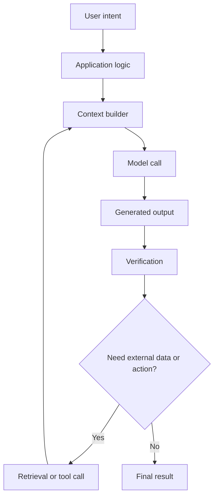
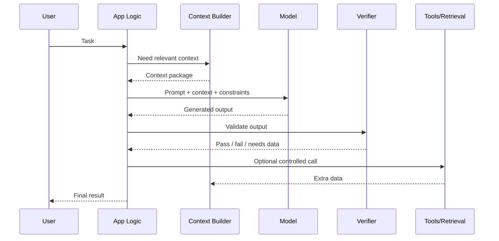

# AI Fundamentals: Big Picture

Ця сторінка не замінює deep dive у кожну тему. Її задача — дати **цілісну карту**, щоб слова `model`, `prompt`, `context`, `retrieval`, `tool-calling`, `MCP`, `skills`, `plugins` і `agents` не висіли в повітрі.

**AI-система** — це не “один хороший prompt”. Це набір компонентів, які разом перетворюють user intent на перевірений результат:

1. збирають вхідні дані;
2. формують context для моделі;
3. викликають model;
4. отримують generated output;
5. перевіряють результат;
6. за потреби викликають tools або retrieval;
7. повертають результат людині або іншій частині програми.

---

## Словник перед стартом

Ці слова будуть часто зустрічатися в блоці. Їх не треба одразу знати глибоко, але треба розуміти роль кожного терміна.

| Термін | Людською мовою | Навіщо тут потрібен |
| :--- | :--- | :--- |
| **Model** | система, яка генерує відповідь на основі input context | Центральний компонент, але не вся система. |
| **Prompt** | інструкція або запит до моделі | Передає task, context, constraints і expected output. |
| **Context** | усе, що модель бачить у конкретному виклику | Визначає, з чого модель може робити висновки. |
| **Tokens** | одиниці тексту, з якими працює модель | Впливають на вартість, довжину context і output. |
| **Generated Output** | відповідь моделі | Чернетка, яку треба перевіряти перед використанням. |
| **Structured Output** | відповідь у передбачуваному форматі | Потрібна, коли результат читає програма, а не людина. |
| **Embeddings** | числове представлення змісту | Дозволяє шукати схожі документи за сенсом. |
| **Retrieval** | підбір релевантних даних перед викликом моделі | Дає моделі правильні джерела замість здогадок. |
| **Tool** | контрольована зовнішня дія | Наприклад, прочитати файл, створити ticket, викликати API. |
| **Integration** | AI всередині існуючого інструмента | IDE, docs, Figma, Notion, GitHub, internal dashboards. |
| **Skill** | повторювана інструкція або workflow для AI | Дає агенту спеціалізовану поведінку для конкретного типу задач. |
| **Plugin** | пакет capabilities | Може містити skills, tools, connectors або app-specific workflows. |
| **MCP Connection** | standardized connection до зовнішньої системи | Дає AI доступ до ресурсів і tools у контрольованому форматі. |
| **Agent-like Flow** | цикл планування, дій, перевірки й продовження | Корисний для багатокрокових задач, але потребує меж і контролю. |

---

## I. Навіщо взагалі потрібен AI Fundamentals

Без базової карти AI виглядає як набір випадкових практик:

- “напиши prompt краще”;
- “додай RAG”;
- “дай агенту tools”;
- “зроби structured output”;
- “підключи knowledge base”;
- “не довіряй hallucinations”.

Але насправді це частини одного процесу:



Коротко:

> AI Fundamentals пояснює, **як AI-рішення працює як система**, а не просто як діалог із моделлю.

---

## II. Одна наскрізна історія

Будемо тримати в голові один приклад: AI-помічник для code review.

```text
User asks:
"Перевір цей pull request і знайди ризики."

System must:
1. отримати diff;
2. знайти пов'язані файли;
3. дати моделі чітку роль reviewer;
4. попросити findings у структурованому форматі;
5. перевірити, що findings прив'язані до реальних рядків;
6. відкинути слабкі або вигадані зауваження;
7. показати людині тільки корисний результат.
```

У цьому прикладі є весь AI Fundamentals:

- **model** генерує reasoning і текст findings;
- **prompt** задає роль, формат і критерії;
- **context** містить diff, files, tests, comments;
- **tokens** обмежують, скільки контексту можна передати;
- **retrieval** може підтягнути пов'язані файли;
- **structured output** робить findings машинно-читабельними;
- **tools** можуть читати файли або CI logs;
- **verification** відсікає invented або irrelevant output;
- **application logic** вирішує, що показувати користувачу.

---

## III. Карта тем блоку

### 1. [Models, Prompts, Context, Tokens, And Output](./01-models-prompts-context-tokens-and-output.md)

**Людська назва:** що реально відбувається під час одного model call.

**Що пояснює:**

- чому prompt — це не тільки “питання”;
- чому model бачить тільки поточний context;
- чому tokens обмежують і вартість, і довжину reasoning;
- чому generated output не дорівнює істині.

---

### 2. [AI Output Risk And Verification](./02-ai-output-risk-and-verification.md)

**Людська назва:** як не приймати красиву відповідь за правильну.

**Що пояснює:**

- чому AI може помилятися впевнено;
- як відрізняти plausible output від verified output;
- які checks потрібні для code, docs, data and workflow actions;
- чому human review і automated validation — частина системи.

---

### 3. [Engineering Tools, Integrations, And Ecosystem](./03-engineering-tools-integrations-and-ecosystem.md)

**Людська назва:** як AI підключається до реальної роботи інженера.

**Що пояснює:**

- direct chat usage vs AI inside tools;
- skills, plugins, MCP connections and agents;
- як AI отримує доступ до IDE, GitHub, Figma, docs and knowledge sources;
- чому integration boundary важливіша за “розумність” моделі.

---

### 4. [Structured Output, Embeddings, Retrieval, And Tools](./04-structured-output-embeddings-retrieval-and-tools.md)

**Людська назва:** як зробити AI-відповідь корисною для програми.

**Що пояснює:**

- structured output для predictable responses;
- embeddings для semantic search;
- retrieval для grounded answers;
- tool-calling для контрольованих дій.

---

### 5. [Components, Data Flow, Boundaries, And Constraints](./05-components-data-flow-boundaries-and-constraints.md)

**Людська назва:** як проєктувати AI-систему так, щоб її можна було дебажити.

**Що пояснює:**

- які компоненти є в AI-system;
- де проходять boundaries між model і code;
- як data flow допомагає знайти причину помилки;
- чому constraints зменшують ризик.

---

### 6. [Pattern Selection And Tradeoffs](./06-pattern-selection-and-tradeoffs.md)

**Людська назва:** коли який AI-патерн використовувати.

**Що пояснює:**

- prompting vs retrieval;
- structured output vs free-form text;
- tool-augmented flow vs agent-like flow;
- коли ecosystem components додають value, а коли створюють accidental complexity.

---

## IV. Як це відбувається в часі

Уявімо один запит до AI-помічника:

1. **User intent.** Людина формулює задачу.
2. **Task framing.** Application logic визначає тип задачі: explain, generate, review, extract, act.
3. **Context building.** Система збирає релевантні files, docs, examples, constraints.
4. **Prompt assembly.** Формується final input для model.
5. **Model call.** Модель генерує output на основі context.
6. **Validation.** Система перевіряє format, references, constraints, safety.
7. **Tool or retrieval loop.** Якщо бракує даних або треба дія, система викликає controlled tool.
8. **Final response.** Людина отримує відповідь, яку можна оцінити і використати.



---

## V. Коли відкривати яку тему

| Симптом / питання | Куди йти |
| :--- | :--- |
| Не розумієш, що таке model, context, tokens | [Models, Prompts, Context, Tokens, And Output](./01-models-prompts-context-tokens-and-output.md) |
| AI відповідає впевнено, але ти не знаєш, чи це правда | [AI Output Risk And Verification](./02-ai-output-risk-and-verification.md) |
| Треба підключити AI до IDE, docs, GitHub, Figma або internal tools | [Engineering Tools, Integrations, And Ecosystem](./03-engineering-tools-integrations-and-ecosystem.md) |
| Треба JSON, schema, search over docs або API calls | [Structured Output, Embeddings, Retrieval, And Tools](./04-structured-output-embeddings-retrieval-and-tools.md) |
| Система стала недебажною: незрозуміло, хто винен | [Components, Data Flow, Boundaries, And Constraints](./05-components-data-flow-boundaries-and-constraints.md) |
| Не знаєш, чи потрібен agent, retrieval, tool або простий prompt | [Pattern Selection And Tradeoffs](./06-pattern-selection-and-tradeoffs.md) |

---

## VI. Edge Cases / Підводні камені

### 1. Model стає відповідальною за все

Поганий AI-design часто виглядає так:

```text
User input -> model -> final answer/action
```

У такій схемі model одночасно має зрозуміти задачу, знайти факти, перевірити себе, прийняти рішення і виконати дію. Це робить систему недебажною.

Краще розділяти responsibility:

```text
user intent -> task framing -> context -> model -> validation -> action boundary
```

### 2. Prompt приховує відсутність product logic

Якщо business rule важливий, його не варто тримати тільки в prompt.

Наприклад:

```text
"Never send refunds above $100 without approval."
```

Це правило має бути enforced у code або permission layer. Prompt може дублювати його як instruction, але не має бути єдиним захистом.

### 3. Retrieval додають без питання "яке джерело істини?"

Якщо knowledge base містить старі docs, retrieval може принести застарілий chunk і зробити відповідь більш переконливою, але не правильнішою.

### 4. Agent-like flow використовують як default

Agent доречний, коли задача реально потребує cycles of action and observation. Якщо задача проста, agent loop додає latency, cost, logs, permissions and failure modes без достатньої користі.

---

## Self-Check Questions

1. Чому AI-рішення не варто описувати як “один prompt”?
2. Яка різниця між model output і verified result?
3. Для чого потрібен context builder?
4. Чому retrieval і tools не є взаємозамінними?
5. Коли agent-like flow може бути зайвою складністю?

## Short Answers / Hints

1. Бо real system містить input, context, model call, validation, tools, fallback і human boundary.
2. Model output — це згенерована відповідь. Verified result — це output, який пройшов перевірки.
3. Щоб передати моделі релевантні дані, а не весь світ.
4. Retrieval приносить інформацію, tools виконують контрольовані дії або отримують structured data.
5. Коли задача коротка, одноразова, low-risk і не потребує планування або зовнішніх дій.

## Common Misconceptions

- **“AI знає мій проєкт.”** Ні. Модель бачить тільки context, який їй передали в конкретному виклику.
- **“Якщо відповідь звучить впевнено, вона правильна.”** Ні. Упевненість тексту не є доказом.
- **“RAG вирішує hallucinations.”** Ні. Retrieval зменшує частину ризиків, але не замінює verification.
- **“Agent завжди краще за prompt.”** Ні. Agent-like flow додає state, tools, loops і нові точки відмови.

## When This Matters / When It Doesn't

**Важливо**, коли AI впливає на code, docs, decisions, user-facing behavior, security або workflow automation.

**Менш важливо**, коли AI використовується як одноразовий brainstorming tool і результат не потрапляє в production без людської перевірки.

## Suggested Practice

Візьми будь-який AI workflow, яким ти вже користуєшся, і розклади його на компоненти:

```text
User intent:
Input data:
Context:
Prompt:
Model output:
Verification:
Tools / retrieval:
Final result:
Failure modes:
```
