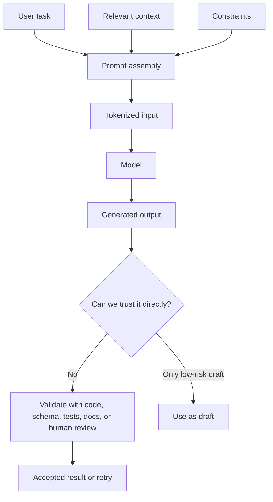

# Models, Prompts, Context, Tokens, And Output

## Теза

Один AI-виклик — це контрольований runtime step: система збирає **prompt**, додає **context**, передає це **model**, модель обробляє input як **tokens** і повертає **generated output**.

Ключова думка: модель не “пам'ятає все” і не “знає правду”. Вона генерує відповідь на основі того, що доступно в конкретному context.

---

## Приклад

```text
Task:
"Поясни, чому ця React-компонента ререндериться занадто часто."

Context sent to model:
- component code
- parent component
- hook dependencies
- profiler note: "ListItem renders 300 times"

Expected output:
- root cause
- risky assumptions
- concrete fix
- verification steps
```

### Що тут відбувається?

Модель не аналізує весь repository. Вона бачить тільки те, що система поклала в context. Якщо в context немає parent component або profiler data, модель може дати загальну відповідь, яка звучить правильно, але не пояснює конкретний bug.

---

## Просте пояснення

Уяви AI-виклик як функцію:

```text
output = model(prompt + context + constraints)
```

Тут важливі всі частини:

- **model** визначає загальні capabilities;
- **prompt** пояснює задачу;
- **context** дає факти для цієї задачі;
- **constraints** задають межі: формат, стиль, заборони, критерії;
- **tokens** визначають, скільки input/output можна вмістити;
- **output** треба сприймати як draft, а не як істину.

Якщо context слабкий, модель часто заповнює прогалини припущеннями. Це не “поганий настрій AI”, а нормальна поведінка генеративної системи: вона має продовжити відповідь навіть тоді, коли даних мало.

---

## Структурна модель

Один model call можна описати як data object:

```javascript
const modelCall = {
  model: "chosen-capability-profile",
  input: {
    systemInstruction: "Act as a careful code reviewer.",
    userTask: "Find regressions in this diff.",
    context: {
      diff: "...",
      relatedFiles: ["router.ts", "auth.ts"],
      constraints: ["Only report issues grounded in the diff."]
    }
  },
  limits: {
    contextWindow: "finite",
    outputBudget: "finite"
  },
  output: {
    type: "generated_text_or_structured_data",
    confidence: "not_a_source_of_truth"
  }
};
```

Важливо: `confidence` тут не означає фактичну правильність. Це лише те, наскільки переконливо output виглядає для читача або наскільки модель “стабільно” його генерує.

---

## Технічне пояснення

### 1. Model

**Model** — це компонент, який отримує sequence of tokens і генерує наступні tokens відповідно до learned patterns, поточного context і decoding settings.

Для інженера важливо не “що модель думає”, а які властивості вона має:

- reasoning ability;
- instruction following;
- coding ability;
- context handling;
- latency and cost profile;
- structured output reliability;
- tool-use behavior;
- safety and refusal behavior.

### 2. Prompt

**Prompt** — це не тільки user question. У production flow prompt часто складається з кількох шарів:

```text
System instruction:
  роль, правила, межі

Developer / workflow instruction:
  формат, критерії, project conventions

User task:
  конкретний запит

Context:
  файли, docs, examples, data, previous state
```

Поганий prompt часто не задає:

- expected output;
- constraints;
- definition of done;
- what not to do;
- how to handle missing information.

### 3. Context

**Context** — це фактична робоча пам'ять конкретного виклику. Якщо документ, файл або вимога не потрапили в context, модель не може надійно ними користуватися.

Context має бути:

- relevant;
- small enough to fit;
- ordered by importance;
- labeled clearly;
- stripped from secrets;
- connected to task.

### 4. Tokens

**Tokens** — це одиниці, на які модель розбиває input і output. Вони впливають на:

- максимальну довжину context;
- вартість виклику;
- latency;
- скільки прикладів можна передати;
- чи поміститься повний output.

Token limit — це архітектурне обмеження. Не можна просто “передати весь repo” без tradeoffs.

### 5. Generated Output

**Generated output** — це результат model call. Він може бути:

- plain text;
- markdown;
- JSON;
- code patch;
- list of findings;
- tool call proposal;
- intermediate reasoning summary.

Output не стає правильним автоматично. Його треба перевіряти через tests, schemas, references, type checks, human review або domain rules.

---

## Візуалізація



---

## Edge Cases / Підводні камені

### 1. Контекст є, але погано підписаний

Якщо передати 10 фрагментів без назв, модель може переплутати source, test, generated file і docs.

Гірше:

```text
Here are files:
<file 1>
<file 2>
<file 3>
```

Краще:

```text
File: src/auth/tokenStore.ts
Role: production code
Relevant because: stores refresh token
```

### 2. Prompt просить “зроби краще”, але не каже, що таке краще

“Покращ код” може означати performance, readability, security, architecture, tests або style. Без criteria модель оптимізує за власним implicit pattern.

### 3. Token budget з'їдається шумом

Long logs, generated files, duplicated docs і irrelevant code зменшують місце для важливого context.

### 4. Output виглядає завершеним, але має hidden assumptions

Наприклад, AI пропонує `useMemo`, але не перевіряє, що проблема в expensive calculation, а не в unstable props.

---

## Self-Check Questions

1. Чому model call схожий на функцію, але не є звичайною deterministic function?
2. Що станеться, якщо потрібний файл не потрапив у context?
3. Чому tokens — це engineering constraint?
4. Яка різниця між prompt і context?
5. Чому generated output треба перевіряти?

## Short Answers / Hints

1. Вхід схожий на function input, але generation може бути probabilistic і залежить від model behavior.
2. Модель або не згадає про нього, або зробить припущення.
3. Вони обмежують довжину input/output, cost and latency.
4. Prompt каже, що робити. Context дає факти, з якими працювати.
5. Бо output може бути правдоподібним, але фактично неправильним.

## Common Misconceptions

- **“Prompt engineering — це магічні слова.”** Ні. Це task framing, context selection, constraints і verification design.
- **“Більше context завжди краще.”** Ні. Більше context може додати шум і погіршити focus.
- **“Модель бачить усе, що було в попередніх чатах.”** Ні. Вона бачить тільки context, який переданий у поточному виклику.
- **“Якщо model сильна, prompt неважливий.”** Ні. Навіть сильна model потребує правильного task framing.

## When This Matters / When It Doesn't

**Важливо**, коли AI використовується для code changes, review, legal/security-sensitive docs, data extraction або automated workflows.

**Менш важливо**, коли ти просиш brainstorming, rough explanation або чернетку, яку точно будеш переписувати самостійно.

## Suggested Practice

Візьми одну задачу з реального проєкту і напиши для неї model call spec:

```text
Task:
Expected output:
Context needed:
Context not needed:
Constraints:
Validation:
Fallback if context is missing:
```

