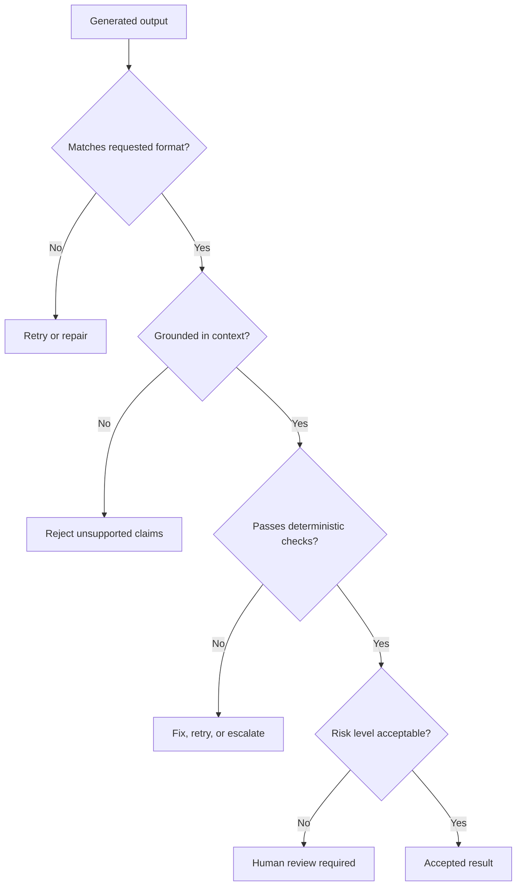

# AI Output Risk And Verification

## Теза

AI output може бути **правильним**, **частково правильним**, **неповним**, **неактуальним**, **вигаданим** або **переконливо неправильним**. Тому AI-відповідь треба сприймати як candidate result, який проходить verification.

Ключова думка: проблема не в тому, що AI “іноді бреше”. Проблема в тому, що generated text може виглядати однаково переконливо і для правильних, і для неправильних тверджень.

---

## Приклад

```text
Prompt:
"Знайди bug у цьому фрагменті."

Code:
function getUserLabel(user) {
  return user.profile.name.toUpperCase();
}

AI output:
"The function is fine. It simply returns the user's uppercase name."
```

### Що пропущено?

Функція може впасти, якщо:

- `user` is null;
- `profile` is missing;
- `name` is undefined;
- `name` is not a string.

AI output не обов'язково “вигаданий”, але він **неповний**: він не перевірив failure cases.

---

## Просте пояснення

AI добре генерує plausible continuation. Але software engineering вимагає не plausible answer, а **correct under constraints** answer.

Для інженера корисна така різниця:

| Тип результату | Що це означає |
| :--- | :--- |
| **Generated output** | Модель щось відповіла. |
| **Plausible output** | Відповідь звучить нормально. |
| **Grounded output** | Відповідь спирається на наданий context. |
| **Verified output** | Відповідь пройшла перевірку. |
| **Accepted result** | Людина або система вирішила, що результат можна застосувати. |

AI output не треба відкидати автоматично. Але його треба довести до стану `verified`, якщо він впливає на код, рішення або користувача.

---

## Структурна модель

```javascript
const aiResultPipeline = {
  rawOutput: "generated by model",
  checks: {
    format: "matches expected schema",
    grounding: "claims are supported by context",
    correctness: "passes tests or domain rules",
    relevance: "answers the actual task",
    safety: "does not expose secrets or unsafe actions"
  },
  decision: "accept | revise | retry | reject | ask_human"
};
```

Це важливо: verification — не фінальний “ручний погляд”, а окремий stage у pipeline.

---

## Технічне пояснення

### 1. Чому AI output може бути неправильним

Основні причини:

- **Insufficient context.** У моделі немає потрібних фактів.
- **Ambiguous task.** Prompt не визначає критерії правильності.
- **Conflicting context.** Передані дані суперечать одне одному.
- **Outdated or missing knowledge.** Модель може не знати актуальний стан світу або project-specific behavior.
- **Overgeneralization.** Модель застосовує популярний pattern там, де локальний контекст інший.
- **Format pressure.** Модель намагається заповнити schema навіть тоді, коли інформації недостатньо.

### 2. Типи перевірок

Для різних output потрібні різні checks:

| Output type | Verification |
| :--- | :--- |
| Code patch | tests, type-check, lint, review, runtime check |
| Explanation | compare with source code, docs, examples |
| JSON / structured data | schema validation, required fields, enum checks |
| Summary | source coverage, quote/reference check |
| Security advice | trusted docs, threat model, human review |
| Tool action | permissions, dry-run, confirmation, audit log |

### 3. Grounding vs correctness

**Grounding** означає: “відповідь спирається на надані джерела”.

**Correctness** означає: “відповідь правильна для задачі”.

Grounded output може бути неправильним, якщо source data неповна або застаріла. Correct output може бути ungrounded, якщо модель вгадала. У workflow потрібні обидва рівні, але вони різні.

### 4. Verification boundaries

Не кожну перевірку має робити модель. Частину краще віддати deterministic systems:

- JSON schema validator;
- TypeScript compiler;
- test runner;
- linter;
- static analyzer;
- database constraints;
- permission layer;
- human reviewer.

Модель сильна в interpretation and generation. Deterministic tools сильні в exact validation.

---

## Візуалізація



---

## Edge Cases / Підводні камені

### 1. Перевірка тільки стилю, а не істини

Можна перевірити, що JSON valid, але не перевірити, що values правильні.

```json
{
  "severity": "critical",
  "file": "src/auth.ts",
  "line": 9999
}
```

Schema може пропустити це, якщо не перевірити, що line exists.

### 2. AI сам себе “верифікує”

Попросити модель “перевір свою відповідь” корисно як heuristic, але це не заміна tests, source references або deterministic validation.

### 3. Hidden missing context

Модель може не сказати “мені бракує даних”, якщо prompt не дозволяє або не вимагає цього.

Краще явно додавати правило:

```text
If the context is insufficient, say what is missing instead of guessing.
```

### 4. Automation без confirmation

AI може правильно сформувати дію, але дія все одно risky:

- видалити файл;
- змінити permission;
- закрити issue;
- відправити email;
- deploy to production.

Для таких дій потрібні permission boundary, dry-run або human confirmation.

---

## Self-Check Questions

1. Чому plausible output не дорівнює verified output?
2. Яка різниця між grounding і correctness?
3. Чому schema validation недостатньо для повної перевірки?
4. Коли human review обов'язковий?
5. Які deterministic tools можна використати для AI output?

## Short Answers / Hints

1. Plausible output тільки звучить правдоподібно. Verified output пройшов checks.
2. Grounding — опора на context. Correctness — правильність для задачі.
3. Schema перевіряє форму, але не завжди фактичну істину.
4. Коли результат high-risk, security-sensitive або має незворотні наслідки.
5. Tests, compiler, linter, schema validator, static analyzer, permission checks.

## Common Misconceptions

- **“AI помиляється тільки тоді, коли не знає відповіді.”** Ні. Він може помилитися через ambiguity, missing context або wrong assumptions.
- **“Можна просто попросити AI бути точним.”** Це допомагає, але не замінює verification.
- **“Structured output гарантує правильність.”** Ні. Він гарантує тільки кращу форму для перевірки.
- **“Human review завжди достатній.”** Ні. Людина теж пропускає помилки; краще комбінувати automated checks and review.

## When This Matters / When It Doesn't

**Важливо**, коли output змінює код, впливає на security, формує документацію, запускає tools або приймає decisions.

**Менш важливо**, коли output — disposable draft: brainstorming names, rough outline, list of ideas.

## Suggested Practice

Візьми AI-відповідь, яку ти отримав раніше, і класифікуй її:

```text
Output:
Claims:
What context supports each claim:
What is unverified:
Which checks can verify it:
Accept / retry / reject:
```

