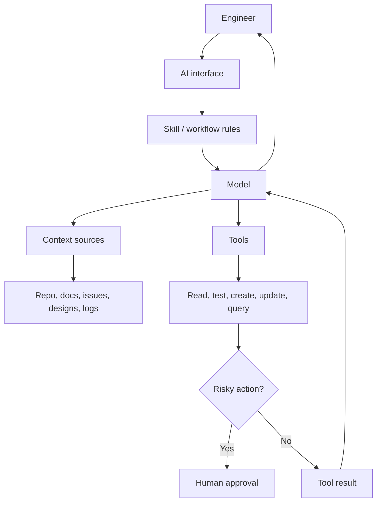

# Engineering Tools, Integrations, And Ecosystem

## Теза

AI в engineering workflow може існувати як direct chat, IDE assistant, documentation helper, design integration, GitHub reviewer, internal tool, MCP-connected agent або plugin-based workflow.

Ключова думка: цінність AI часто визначається не тільки моделлю, а тим, **до яких даних і дій вона підключена** та які boundaries її обмежують.

---

## Приклад

Одна й та сама задача може виглядати по-різному:

```text
Task:
"Допоможи розібратися, чому CI падає."

Direct chat:
- user manually pastes error logs
- AI explains likely cause
- user manually checks files

Integrated workflow:
- AI reads failing GitHub check
- fetches job logs
- finds related test file
- proposes patch
- runs tests locally
- summarizes verification
```

У другому варіанті model не стала “магічно розумнішою”. Система дала їй controlled access до потрібних context sources and tools.

---

## Просте пояснення

Direct AI usage — це коли ти сам переносиш context у chat і сам застосовуєш результат.

AI through integrations — це коли AI вбудований у робоче середовище:

- IDE;
- terminal;
- GitHub;
- Figma;
- Notion;
- documentation system;
- issue tracker;
- internal admin panel;
- CI/CD dashboard.

Різниця практична:

| Підхід | Хто збирає context | Хто виконує дію | Основний ризик |
| :--- | :--- | :--- | :--- |
| Direct chat | Людина | Людина | Missing або wrong context |
| IDE assistant | Tooling | Людина або tool | Неправильна зміна коду |
| MCP/tool integration | System | Controlled tool | Permission and boundary errors |
| Agent-like workflow | Agent loop | Multiple tools | Accidental complexity and runaway behavior |

---

## Структурна модель

AI ecosystem можна описати як capabilities graph:

```javascript
const aiEngineeringSystem = {
  model: "language/reasoning engine",
  interfaces: ["chat", "IDE", "CLI", "web app"],
  contextSources: ["repo files", "docs", "issues", "designs", "logs"],
  capabilities: {
    skills: ["review PR", "write docs", "debug CI"],
    plugins: ["GitHub", "Figma", "Notion"],
    mcpConnections: ["filesystem", "database", "tool server"],
    tools: ["read_file", "run_tests", "fetch_pr", "create_ticket"]
  },
  boundaries: {
    permissions: "what can be read or changed",
    confirmation: "what requires human approval",
    audit: "what must be logged"
  }
};
```

Це не список buzzwords. Це карта того, **що система може бачити**, **що може робити** і **де має зупинятися**.

---

## Технічне пояснення

### 1. Tools

**Tool** — це зовнішня функція, яку AI-system може викликати в контрольований спосіб.

Приклади:

- read file;
- search repository;
- fetch GitHub PR;
- run test command;
- query database;
- create issue;
- update document;
- call internal API.

Tool має мати:

- чіткий input schema;
- predictable output;
- permissions;
- error handling;
- auditability;
- confirmation rules для risky actions.

### 2. Integrations

**Integration** — це вбудовування AI у конкретне середовище. Наприклад, AI в IDE має доступ до файлів і diagnostics, а AI в Figma може працювати з components and design nodes.

Хороша integration зменшує manual context transfer. Погана integration непомітно додає неправильний context або дозволяє небезпечні дії.

### 3. Skills

**Skill** — це reusable workflow instruction. Skill не обов'язково додає новий API. Часто він додає спеціалізований спосіб думати:

```text
When reviewing a PR:
- inspect diff first
- prioritize bugs over style
- cite file/line
- verify claims
- avoid broad refactors
```

Skill корисний, коли задача повторюється і має стабільний standard of work.

### 4. Plugins

**Plugin** — це package capabilities. Він може містити:

- one or more skills;
- connectors;
- tools;
- templates;
- domain-specific workflows.

Plugin робить capability portable: не треба щоразу з нуля пояснювати, як працювати з GitHub, Figma або Notion.

### 5. MCP Connections

**MCP connection** — це standardized спосіб підключити AI до external resources and tools. Його роль — дати моделі не “вільний доступ до всього”, а структурований канал:

- які ресурси можна читати;
- які tools можна викликати;
- які schemas мають inputs/outputs;
- які permissions діють.

### 6. Agents

**Agent-like flow** — це коли AI не просто відповідає один раз, а проходить цикл:

```text
plan -> act -> observe -> revise -> continue or stop
```

Це корисно для багатокрокових задач, але потребує:

- max steps;
- tool boundaries;
- stopping conditions;
- logs;
- rollback plan;
- human escalation.

---

## Візуалізація



---

## Edge Cases / Підводні камені

### 1. Integration дає занадто багато context

Якщо AI автоматично читає сотні файлів, воно може втратити focus або підхопити irrelevant patterns.

### 2. Skill застарів

Workflow instruction може містити правила, які більше не відповідають codebase або team standards.

### 3. Plugin приховує complexity

Plugin може виглядати як simple button, але всередині робити багато дій: читати дані, викликати model, змінювати state. Це потребує logs.

### 4. MCP/tool permissions занадто широкі

Якщо tool може і читати secrets, і пушити зміни, і деплоїти без confirmation, це architectural risk.

### 5. Agent loop без stop condition

Agent може продовжувати “покращувати” результат, поки не витратить багато часу або не зламає scope задачі.

---

## Self-Check Questions

1. Чим direct chat відрізняється від AI integration?
2. Для чого потрібен skill?
3. Чим plugin відрізняється від окремого prompt?
4. Навіщо MCP connection має permissions and schemas?
5. Чому agent-like flow потребує stop conditions?

## Short Answers / Hints

1. У direct chat context переносить людина. В integration context and tools часто підключені системно.
2. Щоб зробити повторюваний workflow стабільним.
3. Plugin пакує capabilities, а prompt тільки інструктує один виклик.
4. Щоб AI мав контрольований доступ, а не необмежені дії.
5. Бо loop може піти за межі task, time або safety.

## Common Misconceptions

- **“Tool access робить AI автономним без ризику.”** Ні. Tool access збільшує power і risk одночасно.
- **“Integration завжди краще за chat.”** Ні. Для простих задач direct chat може бути швидшим і прозорішим.
- **“Skill — це те саме, що prompt.”** Skill зазвичай reusable and workflow-specific; prompt може бути одноразовим.
- **“Agent — це просто AI з tools.”** Ні. Agent-like flow має loop, state, observations and stopping logic.

## When This Matters / When It Doesn't

**Важливо**, коли AI має доступ до repo, design files, docs, GitHub, CI, tickets, databases або write actions.

**Менш важливо**, коли AI використовується тільки як isolated explanation assistant без доступу до external state.

## Suggested Practice

Опиши один свій workflow як integration map:

```text
Task:
Current tool:
Context sources:
Useful AI skill:
Needed tools:
Read permissions:
Write permissions:
Actions requiring approval:
Logs needed:
```

