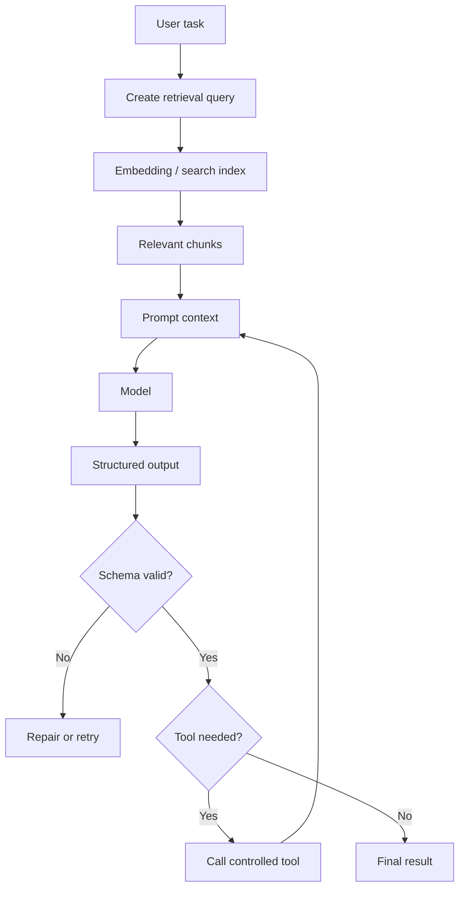

# Structured Output, Embeddings, Retrieval, And Tools

## Теза

Якщо AI має бути частиною software system, free-form text часто недостатньо. Потрібні patterns, які роблять output and actions контрольованими: **structured output**, **embeddings**, **retrieval** and **tool-calling**.

Ключова думка: ці механізми вирішують різні проблеми. Structured output керує формою відповіді, retrieval додає релевантні знання, embeddings допомагають шукати за сенсом, tools виконують зовнішні дії.

---

## Приклад

```text
Task:
"Проаналізуй support ticket і створи routing decision."

Free-form output:
"This looks like a billing problem. Send it to billing team."

Structured output:
{
  "category": "billing",
  "priority": "medium",
  "needsHumanReview": false,
  "reason": "Ticket mentions failed invoice payment.",
  "confidence": "medium"
}
```

Другий варіант може прочитати програма. Його можна валідовувати, логувати, агрегувати і передавати в наступний system step.

---

## Просте пояснення

Є чотири різні задачі:

| Механізм | Для чого потрібен | Приклад |
| :--- | :--- | :--- |
| **Structured output** | Отримати відповідь у передбачуваній формі | JSON для routing decision |
| **Embeddings** | Перетворити text/data на semantic vector | знайти схожі docs |
| **Retrieval** | Дістати релевантні джерела перед відповіддю | додати policy doc у context |
| **Tools** | Виконати контрольовану зовнішню дію | створити ticket або прочитати файл |

Не треба змішувати їх:

- retrieval не гарантує правильний format;
- structured output не дає нових знань;
- embeddings самі не відповідають на питання;
- tools не замінюють reasoning.

---

## Структурна модель

```javascript
const aiWorkflow = {
  userTask: "Route support ticket",
  retrieval: {
    query: "failed invoice payment",
    sources: ["billing_policy.md", "support_routing.md"]
  },
  prompt: {
    instruction: "Classify the ticket using retrieved policy.",
    outputSchema: {
      category: "billing | technical | account | other",
      priority: "low | medium | high",
      needsHumanReview: "boolean",
      reason: "string"
    }
  },
  toolCalls: [
    {
      name: "createRoutingRecord",
      input: "validated structured output"
    }
  ]
};
```

---

## Технічне пояснення

### 1. Structured Output

**Structured output** — це відповідь моделі у формі, яку може надійно обробити код.

Типові формати:

- JSON object;
- array of findings;
- enum decision;
- table-like records;
- command plan;
- patch metadata.

Structured output має сенс, коли:

- результат читає програма;
- потрібна schema validation;
- треба сортувати, фільтрувати або зберігати output;
- downstream system очікує конкретні поля.

Підводний камінь: valid JSON не означає correct JSON.

### 2. Embeddings

**Embedding** — це vector representation змісту. Він дозволяє порівнювати тексти за semantic similarity.

Спрощено:

```javascript
const document = "Refresh tokens must be stored in HttpOnly cookies.";
const vector = embed(document);

// vector is not readable text.
// It is a numerical representation used for similarity search.
```

Embeddings корисні для:

- semantic search;
- finding related docs;
- clustering;
- duplicate detection;
- retrieval pipelines.

Embeddings не “розуміють істину”. Вони допомагають знайти схожий content.

### 3. Retrieval

**Retrieval** — це процес пошуку релевантних джерел і додавання їх у context перед model call.

Типовий retrieval flow:

1. User asks question.
2. System creates query.
3. Search finds relevant chunks.
4. Chunks are ranked and filtered.
5. Selected chunks are added to prompt context.
6. Model answers using those sources.

Retrieval допомагає, коли model не має project-specific knowledge або коли відповідь має спиратися на конкретні docs.

### 4. Tool-calling

**Tool-calling** — це коли model пропонує або викликає зовнішню function через controlled schema.

Наприклад:

```json
{
  "tool": "getPullRequestFiles",
  "input": {
    "repo": "team/app",
    "prNumber": 42
  }
}
```

Tool result повертається в system, а потім може стати частиною нового context.

Tools корисні для:

- reading fresh state;
- performing exact calculations;
- writing to external systems;
- running deterministic checks;
- fetching data unavailable in prompt.

---

## Візуалізація



---

## Edge Cases / Підводні камені

### 1. Retrieval приносить неправильний chunk

Semantic search може знайти схожий, але не релевантний документ. Наприклад, old policy замість current policy.

Mitigation:

- source ranking;
- recency filters;
- metadata filters;
- citation checks;
- human review for high-risk answers.

### 2. Chunk є релевантним, але вирваний із контексту

Один абзац може залежати від попереднього section або exception list.

Mitigation:

- chunk overlap;
- include section title;
- include source path;
- retrieve neighboring chunks.

### 3. Structured output змушує модель вигадати поле

Якщо schema вимагає `rootCause`, але context не містить достатньо даних, модель може вигадати root cause.

Mitigation:

```json
{
  "rootCause": null,
  "missingEvidence": ["Need logs from failed request"]
}
```

### 4. Tool виконує дію до validation

Не можна створювати ticket, пушити commit або змінювати permission тільки тому, що model сформувала tool call.

Mitigation:

- validate tool input;
- enforce permissions;
- require confirmation;
- log every action;
- use dry-run for risky changes.

---

## Self-Check Questions

1. Яку проблему вирішує structured output?
2. Чим embeddings відрізняються від retrieval?
3. Чому retrieval не гарантує correctness?
4. Коли потрібен tool-calling?
5. Чому valid JSON може бути неправильним результатом?

## Short Answers / Hints

1. Передбачувану форму відповіді для programmatic use.
2. Embeddings — representation/search mechanism. Retrieval — process of selecting context.
3. Можна знайти неправильні, неповні або застарілі джерела.
4. Коли треба отримати fresh data або виконати controlled external action.
5. Schema перевіряє форму, але не завжди фактичну правильність values.

## Common Misconceptions

- **“RAG означає, що AI більше не hallucinate.”** Ні. RAG дає джерела, але output все одно треба перевіряти.
- **“Embeddings — це база знань.”** Ні. Це спосіб індексувати і шукати зміст.
- **“Tool call — це доказ правильності.”** Ні. Tool може бути викликаний з неправильним input.
- **“JSON output готовий для production.”** Ні. Його треба validate and sanitize.

## When This Matters / When It Doesn't

**Важливо**, коли AI output іде в downstream systems: routing, automation, dashboards, tickets, code review findings, data extraction.

**Менш важливо**, коли результат читає тільки людина і він не має бути machine-readable.

## Suggested Practice

Спроєктуй маленький retrieval + structured output flow:

```text
Question:
Documents needed:
Retrieval query:
Output schema:
Validation rules:
Tool action, if any:
What requires human review:
```

