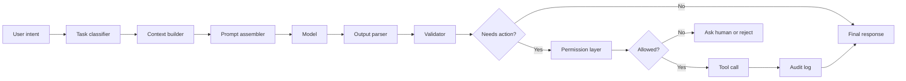

# Components, Data Flow, Boundaries, And Constraints

## Теза

AI-систему треба проєктувати як набір компонентів із явним **data flow**, **boundaries** and **constraints**. Інакше незрозуміло, де виникла помилка: у prompt, context, retrieval, model, tool, validation або user expectation.

Ключова думка: модель — це тільки один вузол у системі. Надійність залежить від усього pipeline.

---

## Приклад

```text
Feature:
"AI assistant creates release notes from merged PRs."

Naive design:
User asks model: "Write release notes."

System design:
1. Fetch merged PRs.
2. Filter by release tag.
3. Group by feature/fix/internal.
4. Retrieve linked issues.
5. Ask model to draft notes from structured data.
6. Validate that every bullet maps to a real PR.
7. Human approves final text.
```

У naive design будь-яка помилка виглядає як “AI погано написав”. У system design можна знайти конкретний failing component.

---

## Просте пояснення

Якщо AI-відповідь неправильна, причина може бути не в моделі:

- неправильно сформували task;
- дали не той context;
- retrieval знайшов старі docs;
- tool повернув неповні дані;
- schema дозволила invalid values;
- verification була занадто слабка;
- human reviewer не побачив assumption.

Тому треба бачити систему як pipeline:

```text
input -> context -> model -> output -> validation -> action/result
```

---

## Структурна модель

```javascript
const aiSystem = {
  inputLayer: {
    userIntent: "what the user wants",
    rawData: "files, logs, docs, issues"
  },
  preparationLayer: {
    taskClassifier: "what kind of task is this",
    contextBuilder: "what data is relevant",
    promptAssembler: "how to frame the model call"
  },
  modelLayer: {
    modelCall: "generate or transform",
    output: "candidate result"
  },
  controlLayer: {
    schemaValidation: "shape and required fields",
    groundingCheck: "claims supported by sources",
    permissionCheck: "can this action happen",
    humanReview: "required for high-risk output"
  },
  actionLayer: {
    tools: "controlled external actions",
    finalResponse: "what user sees"
  }
};
```

---

## Технічне пояснення

### 1. Components

Типові компоненти AI-системи:

| Component | Responsibility |
| :--- | :--- |
| Input normalizer | Перетворити user input на зрозумілу task structure |
| Task classifier | Визначити тип задачі and risk level |
| Context builder | Зібрати релевантні дані |
| Retriever | Знайти потрібні docs/chunks/examples |
| Prompt assembler | Об'єднати instruction, context, schema, constraints |
| Model | Згенерувати candidate output |
| Output parser | Перетворити raw output на usable structure |
| Validator | Перевірити format, grounding, correctness signals |
| Tool router | Вирішити, які tools можна викликати |
| Permission layer | Заборонити unsafe reads/writes |
| Human review | Дати judgment там, де automation недостатньо |

### 2. Data Flow

Data flow має відповідати на питання:

- звідки прийшли дані;
- хто їх змінив;
- що було передано моделі;
- які source references підтримують output;
- які checks пройшов result;
- яка дія була виконана після output.

Без цього debugging перетворюється на здогадки.

### 3. Boundaries

**Boundary** — це межа відповідальності.

Приклади:

- model can suggest, but cannot deploy;
- retrieval can read docs, but cannot edit them;
- tool can fetch PR data, but cannot merge PR;
- structured output can describe action, but permission layer decides if action is allowed;
- human reviewer approves high-risk changes.

### 4. Constraints

**Constraint** — це правило, яке звужує поведінку системи.

Типи constraints:

- format constraints;
- source constraints;
- time constraints;
- permission constraints;
- domain constraints;
- safety constraints;
- cost constraints;
- step limits.

Constraints не роблять систему “тупішою”. Вони роблять її debuggable and safe.

---

## Візуалізація



---

## Edge Cases / Підводні камені

### 1. Model робить те, що мав робити code

Погано:

```text
Ask model to calculate exact invoice totals.
```

Краще:

```text
Use code to calculate totals.
Ask model to explain billing result in user-friendly language.
```

Модель не має заміняти deterministic logic там, де потрібна точність.

### 2. Немає audit trail

Якщо AI створив ticket або змінив document, треба знати:

- хто ініціював дію;
- який input був переданий;
- який output привів до дії;
- який tool був викликаний;
- який result повернувся.

### 3. Boundary захований у prompt

Правило “не видаляй файли” в prompt корисне, але недостатнє. Справжній boundary має бути в tool permissions.

### 4. Один компонент має занадто багато responsibility

Якщо один prompt одночасно:

- шукає context;
- аналізує;
- приймає рішення;
- викликає action;
- верифікує себе;

система стає недебажною.

---

## Self-Check Questions

1. Чому model — це тільки один компонент AI-системи?
2. Які компоненти відповідають за context quality?
3. Чим boundary відрізняється від prompt instruction?
4. Чому deterministic logic краще для exact calculations?
5. Що треба логувати в AI workflow?

## Short Answers / Hints

1. Бо навколо неї є input, context, validation, tools, permissions and review.
2. Task classifier, retriever, context builder, prompt assembler.
3. Boundary enforce-иться системою; prompt instruction тільки просить модель поводитись певним чином.
4. Code gives exact reproducible results; model generation may be approximate.
5. Inputs, context sources, model output, validation results, tool calls, decisions.

## Common Misconceptions

- **“Достатньо добре написати prompt.”** Ні. Prompt не замінює permissions, validation and logging.
- **“Модель сама зрозуміє, які дані важливі.”** Тільки якщо система дала їй правильні дані або tools для пошуку.
- **“Constraints обмежують якість.”** Хороші constraints зменшують ambiguity and risk.
- **“Human approval можна додати в кінці.”** Review має бути вбудований у risk model, а не приклеєний після.

## When This Matters / When It Doesn't

**Важливо**, коли AI workflow повторюваний, automated, multi-step або має write actions.

**Менш важливо**, коли задача одноразова, manual, low-risk і результат не використовується без людини.

## Suggested Practice

Візьми AI feature idea і зроби system breakdown:

```text
Input:
Context sources:
Components:
Model responsibility:
Code responsibility:
Validation:
Permission boundaries:
Human review points:
Failure modes:
Logs:
```

