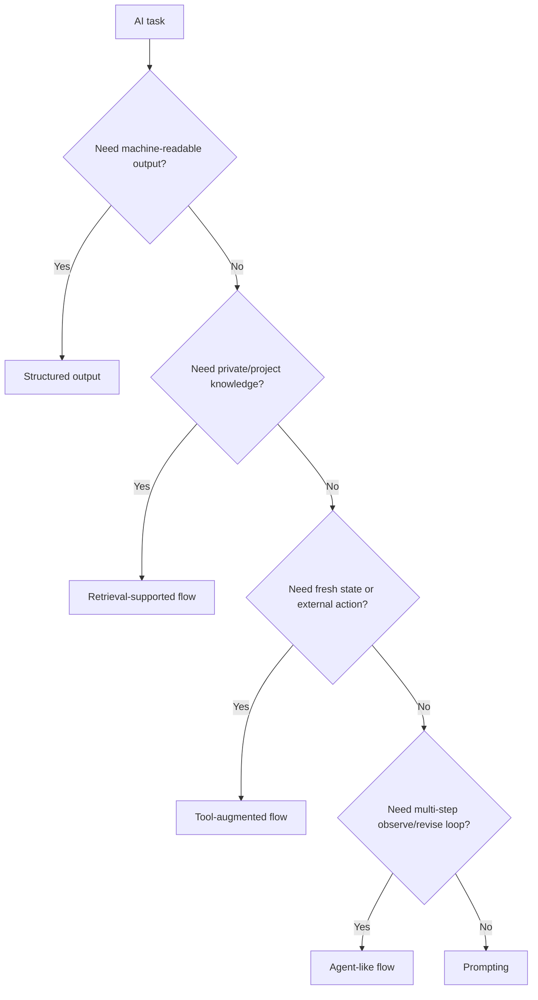

# Pattern Selection And Tradeoffs

## Теза

Не кожна AI-задача потребує agent, retrieval, tools або складного workflow. Правильний pattern залежить від context availability, risk level, output format, need for external actions and verification cost.

Ключова думка: хороший AI engineering — це не “додати максимум AI-компонентів”, а вибрати найменшу систему, яка надійно вирішує задачу.

---

## Приклад

```text
Task A:
"Поясни цей TypeScript error."
Best fit:
Prompt + local code context.

Task B:
"Відповідай на питання по внутрішній документації."
Best fit:
Retrieval-supported flow.

Task C:
"Витягни з invoice номер, дату і суму."
Best fit:
Structured output + validation.

Task D:
"Знайди причину падіння CI і запропонуй fix."
Best fit:
Tool-augmented or agent-like flow with logs, tests and review.
```

Одна модель може брати участь у всіх задачах, але architecture pattern різний.

---

## Просте пояснення

Починай із найпростішого pattern:

1. Якщо треба **пояснити або згенерувати draft** — часто достатньо prompting.
2. Якщо треба відповідати по **specific knowledge base** — потрібен retrieval.
3. Якщо результат читає **програма** — потрібен structured output.
4. Якщо треба **дістати fresh data або виконати дію** — потрібні tools.
5. Якщо задача **багатокрокова і змінюється після кожного observation** — може знадобитися agent-like flow.

---

## Структурна модель

```javascript
function chooseAiPattern(task) {
  if (task.requiresMachineReadableOutput) {
    return "structured_output";
  }

  if (task.requiresPrivateOrProjectKnowledge) {
    return "retrieval_supported_flow";
  }

  if (task.requiresExternalActionOrFreshState) {
    return "tool_augmented_flow";
  }

  if (task.requiresMultiStepPlanningAndObservation) {
    return "agent_like_flow";
  }

  return "prompting";
}
```

Це не production algorithm, а mental model. У реальності умови комбінуються.

---

## Технічне пояснення

### 1. Prompting

**Prompting** — найпростіший pattern: task + context + constraints -> output.

Добре підходить для:

- explanation;
- brainstorming;
- draft writing;
- small refactoring suggestions;
- summarization of provided context;
- code snippets with human review.

Tradeoffs:

- швидко стартує;
- мало infrastructure;
- сильно залежить від manual context;
- слабко підходить для fresh/private knowledge without context.

### 2. Retrieval-supported flow

**Retrieval-supported flow** додає пошук релевантних sources перед model call.

Добре підходить для:

- internal docs Q&A;
- product policy answers;
- codebase explanation;
- support knowledge base;
- design system guidance.

Tradeoffs:

- grounded in sources;
- потребує indexing/chunking/ranking;
- може принести wrong or stale chunks;
- потребує citation/grounding checks.

### 3. Structured output flow

**Structured output flow** змушує output відповідати schema.

Добре підходить для:

- data extraction;
- classification;
- routing;
- review findings;
- form filling;
- workflow decisions.

Tradeoffs:

- machine-readable;
- easy to validate shape;
- може forced-fill missing facts;
- schema evolution потребує discipline.

### 4. Tool-augmented flow

**Tool-augmented flow** дозволяє AI-system викликати controlled external tools.

Добре підходить для:

- reading files;
- fetching PRs/issues/logs;
- running tests;
- querying APIs;
- creating records;
- checking current state.

Tradeoffs:

- can use fresh data;
- can perform actions;
- needs permissions and error handling;
- risky actions need confirmation.

### 5. Agent-like design

**Agent-like design** додає loop:

```text
plan -> act -> observe -> revise -> stop
```

Добре підходить для:

- debugging multi-step failures;
- codebase migration;
- research with many sources;
- CI fix workflows;
- tasks where next step depends on observation.

Tradeoffs:

- flexible;
- handles uncertainty;
- harder to test;
- needs step limits, logs, boundaries and review;
- може бути overkill для simple task.

---

## Візуалізація



---

## Pattern Comparison

| Pattern | Strength | Cost | Main risk |
| :--- | :--- | :--- | :--- |
| Prompting | Fast and simple | Low | Missing context |
| Retrieval | Grounded in docs/data | Medium | Wrong chunks |
| Structured output | Programmatic use | Medium | Valid shape, wrong facts |
| Tool-augmented | Fresh state and actions | Medium/High | Permission/action risk |
| Agent-like | Multi-step autonomy | High | Hard to bound and debug |

---

## Edge Cases / Підводні камені

### 1. RAG там, де достатньо prompt

Якщо задача: “переформулюй цей paragraph”, retrieval не потрібен. Він тільки додає latency and complexity.

### 2. Agent там, де достатньо tool call

Якщо треба “отримати status PR”, не потрібен agent loop. Достатньо one tool call + formatted response.

### 3. Structured output без downstream consumer

Якщо output читає тільки людина, strict schema може зробити відповідь менш корисною.

### 4. Tool access без permission model

Tool-augmented flow без boundaries гірший за manual workflow, бо помилка може одразу стати дією.

### 5. Retrieval без source display

Якщо user не бачить, на які джерела спирається answer, важче оцінити correctness.

---

## Self-Check Questions

1. Коли prompting достатній?
2. Коли потрібен retrieval?
3. Чому structured output не завжди потрібен?
4. Який головний ризик tool-augmented flow?
5. Чому agent-like flow має бути останнім кроком, а не default?

## Short Answers / Hints

1. Для low-risk задач із достатнім context in prompt.
2. Коли відповідь має спиратися на private/project-specific sources.
3. Якщо результат читає тільки людина і не потрібен downstream parsing.
4. Неконтрольована або неправильна external action.
5. Бо він додає loop, state, tools, boundaries and debugging complexity.

## Common Misconceptions

- **“Складніша AI-архітектура завжди краща.”** Ні. Complexity має окупатися.
- **“Agent вирішить проблему поганого context.”** Ні. Agent без якісних tools and boundaries просто робить більше кроків із поганими даними.
- **“Retrieval потрібен для будь-якого питання.”** Ні. Він потрібен, коли відповідь залежить від external/private knowledge.
- **“Structured output робить workflow production-ready.”** Ні. Потрібні validation, permissions, logging and fallback.

## When This Matters / When It Doesn't

**Важливо**, коли ти будуєш internal AI tool, automation, knowledge assistant, code agent або product feature.

**Менш важливо**, коли ти просто одноразово просиш AI пояснити concept або допомогти з чернеткою.

## Suggested Practice

Візьми 5 задач і вибери pattern для кожної:

```text
Task:
Risk level:
Needs private knowledge:
Needs machine-readable output:
Needs external action:
Needs multi-step loop:
Chosen pattern:
Why not a more complex pattern:
Verification:
```

