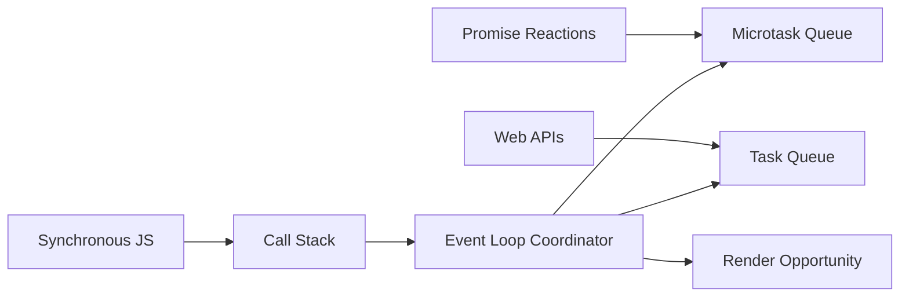

# Browser Runtime Architecture

Ця тема пояснює не просто "що таке event loop", а **де саме живуть async-механізми** у браузері: що належить JavaScript engine, що належить browser runtime, куди потрапляють callbacks і коли вони взагалі мають шанс виконатися.

---

## I. Core Mechanism

**Теза:** JavaScript у браузері виконується на **одному main thread для JS-коду**, але сам runtime складається не лише зі стеку. Є **Heap**, **Call Stack**, **Web APIs**, **Task Queue**, **Microtask Queue** і **rendering pipeline**, а **event loop** лише координує їхню взаємодію.

### Приклад
```javascript
console.log("A");

setTimeout(() => {
  console.log("timeout");
}, 0);

Promise.resolve().then(() => {
  console.log("promise");
});

console.log("B");
```

### Просте пояснення
Коли код виконується, синхронні рядки йдуть у **Call Stack** і виконуються одразу. `setTimeout` не ставить callback у стек — він передає його в **Web API timers**. `Promise.then` теж не виконується одразу — його continuation потрапляє в **Microtask Queue**. Після завершення поточного синхронного коду event loop дивиться, що можна виконати далі.

### Технічне пояснення
У браузері треба розрізняти:

| Частина | За що відповідає |
| :--- | :--- |
| **Call Stack** | Поточні execution contexts JavaScript |
| **Heap** | Об'єкти, функції, promise state, closure environments |
| **Web APIs** | Timers, DOM events, fetch, rAF, observers, network |
| **Task Queue** | Готові tasks: timer callbacks, DOM events, message events |
| **Microtask Queue** | Promise reaction jobs, `queueMicrotask`, `MutationObserver` |
| **Rendering Pipeline** | Style, layout, paint, compositing |
| **Event Loop** | Вибирає, коли брати task, коли дренувати microtasks, коли давати шанс на render |

Event loop **не є окремим магічним "JS thread"**, який виконує код паралельно. Він лише перевіряє стан черг і стека. Новий callback може стартувати лише тоді, коли стек порожній.

### Покроковий Runtime Walkthrough
1. Синхронний код `console.log("A")` виконується одразу.
2. `setTimeout(..., 0)` реєструє timer у Web API. Це не означає "виконати зараз".
3. `Promise.resolve().then(...)` створює promise reaction job, який потрапляє в **Microtask Queue**.
4. `console.log("B")` виконується в тому ж поточному turn.
5. Поточний stack очищається.
6. Event loop спочатку дренує **Microtask Queue**, тому `promise` виконається раніше за `timeout`.
7. Лише після цього може бути взятий наступний task із **Task Queue**.

> [!TIP]
> **[▶ Запустити інтерактивну візуалізацію Browser Runtime Architecture](../../visualisation/asynchrony-and-event-loop/01-browser-runtime-architecture/runtime-architecture/index.html)**

### Візуалізація


### Edge Cases / Підводні камені
- `setTimeout(fn, 0)` означає **мінімальну затримку**, а не негайний запуск.
- Callback не "сидить у стеку" і не "чекає там своєї черги".
- Promise handlers не проходять через timers queue; вони потрапляють у microtask machinery.
- Render не гарантується після кожного task. Browser **може** малювати, але не зобов'язаний.
- Якщо поточний task довгий, ні timers, ні input, ні paint не зможуть пробитися всередину нього.

---

## II. Common Misconceptions

> [!IMPORTANT]
> **Event loop** — це не окремий фоновий JavaScript interpreter. Це координаційний цикл runtime.

> [!IMPORTANT]
> **Web APIs** не є частиною ECMAScript. Це host environment поверх JS engine.

> [!IMPORTANT]
> Promise callback не "обходить" event loop. Він просто потрапляє у **microtask queue**, яка має вищий пріоритет, ніж task queue.

---

## III. When This Matters / When It Doesn't

- **Важливо:** UI responsiveness, trace-order задачі, async debugging, розуміння fetch/timers/Promises, performance analysis.
- **Менш важливо:** дрібні скрипти без DOM, timers, promises і heavy UI work.

---

## IV. Self-Check Questions

1. Які частини runtime належать JS engine, а які — browser host environment?
2. Чому callback із `setTimeout` не виконується прямо в місці виклику `setTimeout`?
3. Де фізично "чекає" callback таймера до моменту виконання?
4. Чим `Task Queue` відрізняється від `Microtask Queue`?
5. Чому Promise continuation не потрапляє в queue таймерів?
6. Яка умова має виконатися, щоб event loop узяв наступний callback у стек?
7. Коли браузер отримує шанс намалювати UI?
8. Чому довгий синхронний цикл ламає і timers, і input responsiveness?
9. Чому не можна казати, що event loop — це "другий потік для async-коду"?
10. Де живуть об'єкти, closures і promise state: у stack чи heap?
11. Чому `setTimeout(fn, 0)` не гарантує негайне виконання?
12. Яка різниця між "callback ready" і "callback actually running"?

---

## V. Short Answers / Hints

1. Stack/heap — engine; timers, fetch, DOM events, paint — host runtime.
2. Бо `setTimeout` лише реєструє timer у host API.
3. Спочатку в Web API timers, потім у task queue.
4. Microtasks дренуються раніше за наступний task.
5. Бо це інший механізм: promise reaction jobs.
6. Поточний stack має спорожніти.
7. Після task і після дренування microtasks, якщо runtime дає render opportunity.
8. Main thread зайнятий і не yield-ить.
9. Бо JS callback не виконується паралельно з поточним JS кодом.
10. У heap.
11. Бо є minimum delay, current task, other queues і render budget.
12. Ready означає "можна поставити в чергу"; running означає "взяли в stack".

---

## VI. Suggested Practice

1. Намалюй схему: `click handler -> Promise.then -> setTimeout -> render`.
2. Візьми будь-який UI баг зі "завислою" кнопкою і поясни, який task не дає main thread звільнитися.
3. Після цієї статті переходь у [02 Microtasks vs Macrotasks](../02-microtasks-vs-macrotasks/README.md), бо саме там стає зрозуміло, чому порядок логів часто контрінтуїтивний.
