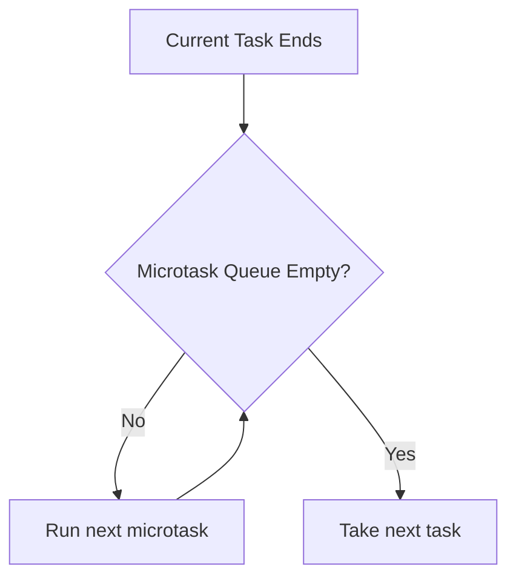

# Microtasks vs Macrotasks

Ця тема закриває головну практичну пастку асинхронності: **чому `Promise.then` випереджає `setTimeout`**, хоча обидва здаються "асинхронними".

---

## I. Core Mechanism

**Теза:** Після завершення поточного task browser спочатку **повністю дренує microtask queue**, і лише потім бере наступний task. Саме тому promise handlers, `queueMicrotask` і `MutationObserver` мають вищий пріоритет, ніж `setTimeout`.

### Приклад
```javascript
console.log("start");

setTimeout(() => console.log("timeout"), 0);

queueMicrotask(() => console.log("microtask"));

Promise.resolve().then(() => console.log("promise"));

console.log("end");
```

### Просте пояснення
Синхронний код виконується першим: `start`, `end`. Далі runtime дивиться на microtasks і виконує їх усі. Лише після цього доходить до timer callback.

### Технічне пояснення
У browser runtime є дві важливі категорії черг:

| Категорія | Типові джерела | Коли виконується |
| :--- | :--- | :--- |
| **Task / Macrotask** | `setTimeout`, `setInterval`, DOM events, `postMessage` | Кожен раз по одному task |
| **Microtask** | `Promise.then/catch/finally`, `queueMicrotask`, `MutationObserver` | Повне дренування після поточного task |

Ключове правило: **microtask queue drain is exhaustive**. Якщо під час виконання microtask додається ще одна microtask, вона теж буде виконана до переходу до наступного task.

### Покроковий Runtime Walkthrough
1. `console.log("start")` виводиться синхронно.
2. `setTimeout` ставить callback у timer subsystem.
3. `queueMicrotask` і `Promise.then` ставлять jobs у microtask queue.
4. `console.log("end")` завершує sync part.
5. Поточний task закінчився, stack порожній.
6. Runtime дренує microtasks: спершу `microtask`, потім `promise` у порядку постановки.
7. Лише після повного спорожнення microtask queue бере timer task: `timeout`.

> [!TIP]
> **[▶ Запустити інтерактивний Scheduler Visualizer](../../visualisation/asynchrony-and-event-loop/02-microtasks-vs-macrotasks/microtask-vs-task-scheduler/index.html)**

> [!TIP]
> **[▶ Запустити інтерактивний Order Prediction Debug Board](../../visualisation/asynchrony-and-event-loop/11-practice-lab/order-prediction-debug-board/index.html)**

### Візуалізація


### Edge Cases / Підводні камені
- `queueMicrotask` і `Promise.then` не є взаємозамінними по error semantics, але по пріоритету обидва йдуть у microtask phase.
- Вкладені `Promise.then(...then(...))` можуть тримати main thread зайнятим довше, ніж очікуєш.
- `MutationObserver` теж працює через microtask timing і може втручатися в порядок.
- Microtasks не дають UI автоматично шанс перемалюватися між собою.

---

## II. Common Misconceptions

> [!IMPORTANT]
> "Macrotask" — популярний термін, але важлива не назва, а правило: **microtasks drain before next task**.

> [!IMPORTANT]
> `Promise.then` не є "швидшим таймером". Це інша черга з іншими гарантіями.

> [!IMPORTANT]
> Якщо одна microtask ставить наступну microtask, browser все одно продовжить drain, а не піде малювати UI.

---

## III. When This Matters / When It Doesn't

- **Важливо:** trace order, UI bugs, starvation, async control flow, library internals.
- **Менш важливо:** коли ти не працюєш з promises, timers, observers або не аналізуєш порядок виконання.

---

## IV. Self-Check Questions

1. Чому `Promise.then` випереджає `setTimeout(..., 0)`?
2. Що таке microtask queue?
3. Які API зазвичай ставлять jobs саме в microtask queue?
4. Що означає "дренування microtasks"?
5. Чому order між двома microtasks зазвичай FIFO?
6. Що станеться, якщо microtask породжує ще одну microtask?
7. Чи може render статися між двома microtasks одного drain-cycle?
8. Чим `queueMicrotask` концептуально відрізняється від timer callback?
9. Чому зловживання microtasks може робити UI менш responsive?
10. Який порядок логів у прикладі цієї статті і чому?
11. Чи можна використовувати microtask як заміну `requestAnimationFrame`?
12. Чому timer із нульовою затримкою все одно може відставати помітно?
13. У якому місці lifecycle виконається `MutationObserver` callback?
14. Що важливіше для розуміння: назва "macro" чи правило scheduling priority?

---

## V. Short Answers / Hints

1. Бо microtasks виконуються перед наступним task.
2. Черга continuation jobs високого пріоритету після task.
3. Promise reactions, `queueMicrotask`, `MutationObserver`.
4. Виконати всі доступні microtasks до переходу далі.
5. Бо вони стають у чергу в певному порядку.
6. Вона теж виконається в тому ж drain-cycle.
7. Зазвичай ні.
8. Microtask виконується до next task; timer — це окремий task.
9. Бо main thread не yield-ить до render/task queue.
10. `start`, `end`, `microtask`, `promise`, `timeout`.
11. Ні, бо microtask не синхронізована з paint.
12. Бо перед ним є current task, microtasks, інші tasks і render policy.
13. У microtask timing.
14. Правило пріоритету.

---

## VI. Suggested Practice

1. Прогнозуй порядок логів у 10 варіантах з `Promise`, `queueMicrotask`, `setTimeout`.
2. Спробуй переписати мікроланцюжок так, щоб він yield-ив у task queue.
3. Після цієї статті переходь у [07 Microtask Starvation](../07-microtask-starvation/README.md), щоб побачити найнебезпечнішу сторону цього механізму.
