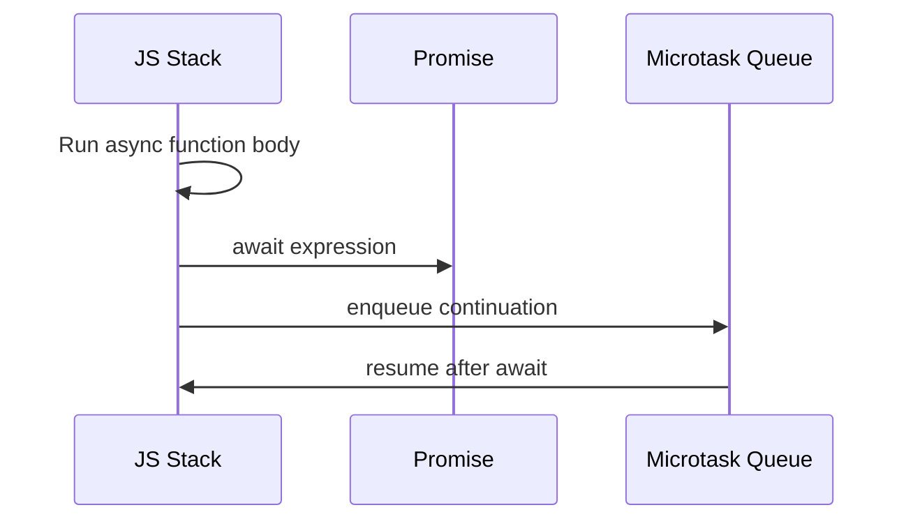

# Async/Await Under the Hood

`async/await` робить асинхронний код читабельним, але за зручним синтаксисом легко втратити реальну модель. Тут важливо зрозуміти, **де саме відбувається пауза, що таке continuation і чому `await` не блокує thread**.

---

## I. Core Mechanism

**Теза:** `async` function **завжди повертає Promise**, а `await` не зупиняє runtime. Він лише **розбиває виконання функції на дві частини**: до `await` і continuation після нього, яка буде відновлена через **microtask**.

### Приклад
```javascript
async function main() {
  console.log("before await");
  const value = await Promise.resolve(42);
  console.log("after await", value);
}

main();
console.log("outside");
```

### Просте пояснення
`main()` стартує синхронно. До `await` все виконується одразу. Коли runtime доходить до `await`, він "відкладає" продовження функції. Пізніше, коли awaited value готове, решта функції запускається як microtask.

### Технічне пояснення
Ключові правила:

| Механіка | Що реально відбувається |
| :--- | :--- |
| `async function` | Створює function, яка при виклику повертає Promise |
| `return x` | Еквівалентно `Promise.resolve(x)` для зовнішнього спостерігача |
| `throw err` | Еквівалентно rejected promise |
| `await expr` | `Promise.resolve(expr)` + постановка continuation в promise reaction job |

`async/await` **концептуально** нагадує генератори + promises: є pause point і resume point. Але не треба плутати це з буквальним spec rule "async function = generator". У специфікації це окремі механізми.

### Покроковий Runtime Walkthrough
1. Викликається `main()`, створюється її promise result.
2. `before await` виконується синхронно.
3. `await Promise.resolve(42)` приводить значення до promise-capable форми.
4. Поточне виконання `main` зупиняється, continuation зберігається.
5. `outside` виконується синхронно, бо main thread не заблокований.
6. Коли promise ready, continuation ставиться в microtask queue.
7. Runtime дренує microtasks і виконує `after await 42`.

> [!TIP]
> **[▶ Запустити інтерактивну візуалізацію Async/Await Resume Flow](../../visualisation/asynchrony-and-event-loop/03-async-await-under-the-hood/async-await-resume-flow/index.html)**

> [!TIP]
> **[▶ Запустити інтерактивний Order Prediction Debug Board](../../visualisation/asynchrony-and-event-loop/11-practice-lab/order-prediction-debug-board/index.html)**

### Візуалізація


### Edge Cases / Підводні камені
- `await 123` теж створює async boundary через `Promise.resolve(123)`.
- `try/catch` ловить rejection лише якщо ти **дійсно чекаєш** її через `await`.
- Забутий `await` часто означає "виніс помилку за межі поточного try/catch".
- `await` всередині циклу може бути правильною або неправильною ідеєю залежно від того, чи тобі потрібна послідовність.

---

## II. Common Misconceptions

> [!IMPORTANT]
> `await` не блокує thread. Він блокує лише **логічне продовження конкретної async function**.

> [!IMPORTANT]
> `async function` не повертає "звичайне значення, якщо все добре". Вона завжди повертає Promise.

> [!IMPORTANT]
> `await` не робить код автоматично послідовно безпечним. Race conditions нікуди не зникають.

---

## III. When This Matters / When It Doesn't

- **Важливо:** async error handling, cancellation, sequential vs parallel flows, code review, trace-order debugging.
- **Менш важливо:** дуже дрібні приклади, де async function лише один раз робить `return await` без складної логіки.

---

## IV. Self-Check Questions

1. Що `async function` повертає завжди?
2. Чи виконується код до першого `await` синхронно?
3. Що означає `await` для runtime model?
4. Чому `await` не блокує main thread?
5. Що відбувається, якщо await-ити не-Promise значення?
6. Чому `console.log("outside")` в прикладі виконується раніше за `after await`?
7. Як `throw` всередині async function спостерігається зовні?
8. Чому forgotten `await` часто ламає `try/catch`?
9. У чому conceptual similarity між async/await і generators?
10. Коли `await` у циклі є свідомим вибором, а коли bottleneck?
11. Де виконується continuation після `await`: у task queue чи microtask queue?
12. Чому `return await value` не завжди потрібний?
13. Що означає resume point після await?
14. Чим відрізняється pause of function від pause of thread?

---

## V. Short Answers / Hints

1. Promise.
2. Так.
3. Split execution into now + continuation later.
4. Бо runtime просто відкладає продовження функції.
5. Воно проходить через `Promise.resolve`.
6. Бо continuation піде в microtask після завершення поточного sync turn.
7. Як rejected promise.
8. Бо помилка вже виникає в іншому async boundary.
9. Є pause/resume semantics.
10. Коли потрібен strict order; інакше це може бути повільно.
11. У microtask queue.
12. Часто достатньо `return value`; окремі кейси — try/catch/finalization boundaries.
13. Точка, з якої функція продовжить виконання.
14. Thread вільний, а конкретна async function — ні.

---

## VI. Suggested Practice

1. Перепиши 5 async-прикладів у `.then(...).catch(...)` вручну.
2. Познач у коді всі resume points після `await`.
3. Після цього переходь у [05 Async Error Handling & Stack Traces](../05-async-error-handling-and-stack-traces/README.md), бо саме там видно реальну ціну forgotten `await`.
