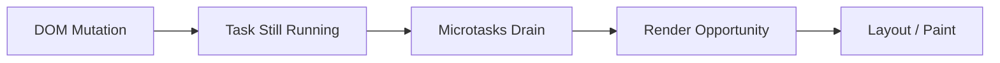

# Rendering and Event Loop

Більшість фронтенд-багів з формулюванням "DOM оновився, але користувач нічого не побачив" — це не про React, Vue чи CSS. Це про **render opportunity** і те, що browser **не малює UI посеред довгого task**.

---

## I. Core Mechanism

**Теза:** Browser не зобов'язаний малювати UI відразу після зміни DOM. Зазвичай paint може статися лише **після завершення поточного task і після дренування microtasks**, коли runtime має вільне вікно для rendering pipeline.

### Приклад
```javascript
spinner.style.display = "block";

heavyWork();
```

### Просте пояснення
Ти змінив DOM, але потім одразу зайняв main thread важкою синхронною роботою. Browser фізично не має коли перемалювати екран. У результаті spinner у DOM уже є, але користувач його ще не бачить.

### Технічне пояснення
Rendering pipeline спрощено виглядає так:

1. Style recalculation
2. Layout
3. Paint
4. Composite

Але browser запускає цей pipeline не довільно, а в моменти, коли main thread звільняється і є render opportunity. Якщо task довгий або microtasks безкінечно дренуються, paint відкладається.

### Покроковий Runtime Walkthrough
1. JS робить mutation DOM: `spinner.style.display = "block"`.
2. Browser позначає, що потрібне оновлення рендеру.
3. Той самий task продовжується і входить у `heavyWork()`.
4. Поки task не завершиться, ні input, ні render не стартують.
5. Коли task закінчиться і microtasks спорожніють, browser **може** перейти до render pipeline.
6. Лише після цього користувач реально бачить spinner.

> [!TIP]
> **[▶ Запустити інтерактивну візуалізацію Rendering Timeline](../../visualisation/asynchrony-and-event-loop/04-rendering-and-event-loop/rendering-timeline/index.html)**

> [!TIP]
> **[▶ Відкрити Render-Yield Lab](../13-render-yield-lab/README.md)**

> [!TIP]
> **[▶ Відкрити Render-Yield Debug Board](../../visualisation/asynchrony-and-event-loop/13-render-yield-lab/render-yield-debug-board/index.html)**

### Візуалізація


### Edge Cases / Підводні камені
- Promise loop може блокувати paint майже так само, як довгий sync loop, якщо microtask queue не відпускає main thread.
- Навіть короткі tasks можуть збивати input responsiveness, якщо їх занадто багато підряд.
- Render frequency залежить від display refresh rate, visibility tab, CPU pressure і внутрішньої політики browser.
- `setTimeout(..., 0)` іноді достатньо, щоб дати браузеру шанс намалювати, але для animation це слабка модель.

---

## II. Common Misconceptions

> [!IMPORTANT]
> Зміна DOM ≠ миттєвий paint на екрані.

> [!IMPORTANT]
> Browser не "малює після кожного рядка JS".

> [!IMPORTANT]
> Якщо UI не перемальовується, проблема часто не в CSS, а в scheduling і blocking main thread.

---

## III. When This Matters / When It Doesn't

- **Важливо:** loaders, animations, input lag, performance profiling, long tasks, UI scheduling.
- **Менш важливо:** маленькі sync snippets без UI, де немає значущого blocking work.

---

## IV. Self-Check Questions

1. Чому spinner може не з'явитися, хоча DOM уже змінено?
2. Що таке render opportunity?
3. Яка роль current task у затримці paint?
4. Чи може browser paint-ити посеред довгого sync loop?
5. Чому microtasks теж можуть заважати rendering?
6. Які кроки має rendering pipeline на високому рівні?
7. Чому input lag пов'язаний з event loop, а не лише з CSS/rendering engine?
8. Чому `Promise.then`-ланцюжок іноді теж "морозить" UI?
9. Коли browser отримує шанс обробити input події?
10. Чому "DOM updated" і "user sees it" — різні події?
11. Який зв'язок між long tasks і dropped frames?
12. Чому `requestAnimationFrame` краще узгоджений з paint, ніж `setTimeout`?
13. Чи гарантує `setTimeout(..., 0)` render до callback?
14. Де шукати цю проблему в DevTools?

---

## V. Short Answers / Hints

1. Бо paint ще не відбувся.
2. Момент, коли browser може перейти до rendering pipeline.
3. Поки task живий, paint чекає.
4. Ні.
5. Бо вони дренуються до render.
6. Style, layout, paint, composite.
7. Input callbacks теж чекають main thread.
8. Бо microtasks можуть не yield-ити до render.
9. Коли main thread звільняється.
10. Одне — DOM state, друге — rendered pixels.
11. Long task з'їдає frame budget.
12. Бо rAF прив'язаний до paint cycle.
13. Ні.
14. Performance panel, long tasks, frames, flame chart.

---

## VI. Suggested Practice

1. Зроби приклад "show loader -> heavy work" трьома способами: погано, трохи краще, правильно.
2. Поясни, чому `await Promise.resolve()` не завжди достатній для paint.
3. Пройди [13 Render-Yield Lab](../13-render-yield-lab/README.md), якщо хочеш окремо добити UI responsiveness bugs.
4. Далі переходь у [06 requestAnimationFrame vs setTimeout](../06-requestanimationframe-vs-settimeout/README.md), щоб закрити правильну модель UI scheduling.
