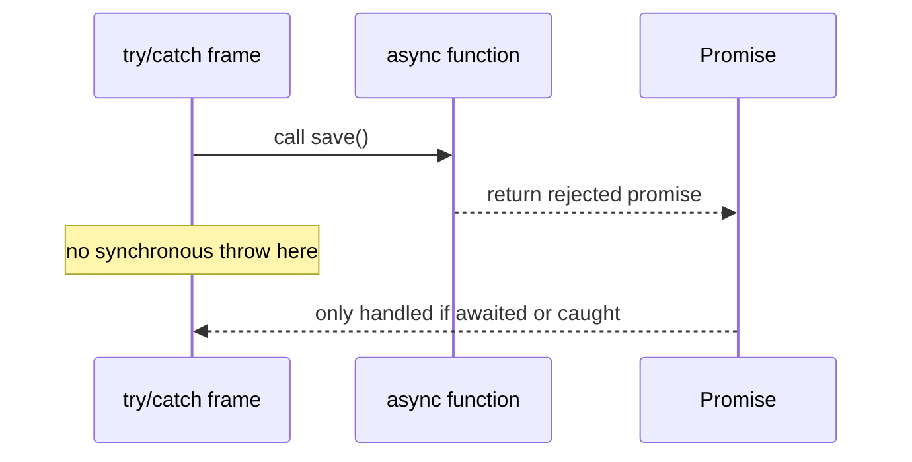

# Async Error Handling and Stack Traces

Асинхронні помилки здаються схожими на синхронні лише на поверхні. Насправді тут дуже легко **втратити rejection, промахнутись `try/catch` або неправильно зрозуміти stack trace**.

---

## I. Core Mechanism

**Теза:** У async-коді потрібно чітко розрізняти **sync throw** і **promise rejection**. `try/catch` ловить те, що відбувається в його execution path, але якщо помилка "вилетіла" в інший async boundary без `await`, ти вже працюєш не з throw, а з rejected promise.

### Приклад
```javascript
async function save() {
  throw new Error("boom");
}

async function main() {
  try {
    save();
    console.log("after save");
  } catch (err) {
    console.log("caught", err.message);
  }
}

main();
```

### Просте пояснення
На вигляд здається, що `try/catch` має спрацювати. Але `save()` повертає rejected promise, а не кидає синхронну помилку в поточний стек. Через відсутність `await` цей rejection не проходить через поточний `catch`.

### Технічне пояснення
Потрібно розрізняти:

| Сценарій | Що реально відбувається |
| :--- | :--- |
| `throw` у звичайній function | Синхронне виняткове завершення поточного stack frame |
| `throw` в `async function` | Rejected promise result |
| `await somePromise` | Якщо promise rejected, current async function resume-иться через throw semantics |
| Забутий `await` | Помилка лишається у зовнішньому promise chain, а не в локальному try/catch |

Async stack traces у сучасних runtimes часто намагаються показати логічний ланцюг `await`, але це **best-effort tooling feature**, а не буквальний фізичний стек, який безперервно існував увесь час.

### Покроковий Runtime Walkthrough
1. `main()` входить у `try` block.
2. `save()` запускається і одразу повертає rejected promise.
3. Синхронного throw у `main` не стається.
4. `console.log("after save")` виконується.
5. Потім runtime бачить unhandled rejection, якщо ніхто не обробить promise.
6. Якби був `await save()`, rejection потрапив би в `catch` як throw during resume.

> [!TIP]
> **[▶ Запустити інтерактивну візуалізацію Async Error Propagation](../../visualisation/asynchrony-and-event-loop/05-async-error-handling-and-stack-traces/async-error-propagation/index.html)**

> [!TIP]
> **[▶ Відкрити Async Error Propagation Debug Board](../../visualisation/asynchrony-and-event-loop/05-async-error-handling-and-stack-traces/async-error-debug-board/index.html)**

### Візуалізація


### Edge Cases / Підводні камені
- `.catch(...)` перетворює chain на handled path, якщо не rethrow-нути.
- `Promise.all` fail-fast: одна rejection валить весь outer promise.
- Unhandled rejection може проявитися пізніше, ніж місце логічної помилки.
- Stack trace через кілька async boundaries часто неповний або важче читається, ніж sync trace.

---

## II. Common Misconceptions

> [!IMPORTANT]
> `try/catch` не ловить "усе асинхронне автоматично".

> [!IMPORTANT]
> Rejected promise — це не те саме, що synchronous throw в поточному frame.

> [!IMPORTANT]
> Красивий async stack trace у devtools — це корисна реконструкція, а не доказ того, що stack фізично не розмотувався.

---

## III. When This Matters / When It Doesn't

- **Важливо:** production debugging, API layers, retry logic, logging, unhandled rejections, error boundaries.
- **Менш важливо:** навчальні приклади без real async boundaries.

---

## IV. Self-Check Questions

1. Чим sync throw відрізняється від rejected promise?
2. Чому forgotten `await` ламає `try/catch`?
3. Що в прикладі статті стане unhandled rejection і чому?
4. Коли `try/catch` всередині async function працює як очікується?
5. Що робить `.catch` для promise chain?
6. Чому async stack traces важчі для читання, ніж sync?
7. Що означає, що tooling reconstructs async call chain?
8. Чому `throw` всередині async function не поводиться як throw у sync function для зовнішнього виклику?
9. Коли краще обробляти помилки локально, а коли пробрасывати вище?
10. Що таке unhandled rejection?
11. Як `await` змінює семантику обробки помилки?
12. Чому лог "after save" у прикладі все ж виводиться?
13. Чим небезпечне тихе поглинання помилки в `.catch(() => {})`?
14. Як би ти задебажив втрачений rejection у великому async flow?

---

## V. Short Answers / Hints

1. Throw б'є поточний stack; rejection живе в promise chain.
2. Бо помилка вже не проходить через локальний resume point.
3. Promise, який повернув `save()`.
4. Коли є `await` або локальний `.catch`.
5. Робить rejection handled path, якщо не rethrow.
6. Бо між частинами логічного шляху є async gaps.
7. Devtools добудовує логічний шлях очікувань.
8. Бо назовні async function повертає promise.
9. Локально — коли є recovery; вище — коли це policy-level decision.
10. Rejection без обробника.
11. Перетворює rejection на throw у точці resume.
12. Бо sync throw не стався.
13. Втрачається сигнал про реальний баг.
14. Логувати boundaries, await consistently, дивитися promise chain origin.

---

## VI. Suggested Practice

1. Візьми 5 broken examples із forgotten `await` і виправ їх.
2. Порівняй `try/catch`, `.catch`, `Promise.all`, `Promise.allSettled` в одному сценарії.
3. Програй кілька сценаріїв у [Async Error Propagation Debug Board](../../visualisation/asynchrony-and-event-loop/05-async-error-handling-and-stack-traces/async-error-debug-board/index.html), щоб руками побачити різницю між `throw`, `reject`, forgotten `await`, `.catch` і unhandled path.
4. Далі переходь у [08 AbortController & Cancellation](../08-abortcontroller-and-cancellation/README.md), бо реальний async control — це не лише обробка помилок, а й контроль життєвого циклу операцій.
