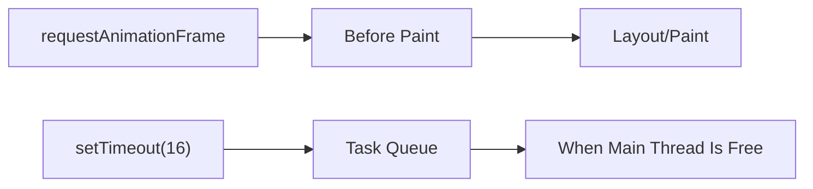

# requestAnimationFrame vs setTimeout

Ця тема потрібна, щоб не лікувати UI scheduling таймерами. `setTimeout(fn, 16)` і `requestAnimationFrame(fn)` **не еквівалентні**, навіть якщо на поверхні обидва дають "щось приблизно по кадрах".

---

## I. Core Mechanism

**Теза:** `requestAnimationFrame` синхронізований з **наступною можливістю paint**, а `setTimeout` — це просто task після мінімальної затримки. Для animation, visual sync і frame-aligned work це різні моделі.

### Приклад
```javascript
function tickWithTimeout() {
  box.style.transform = `translateX(${x}px)`;
  x += 2;
  setTimeout(tickWithTimeout, 16);
}

function tickWithRAF() {
  box.style.transform = `translateX(${x}px)`;
  x += 2;
  requestAnimationFrame(tickWithRAF);
}
```

### Просте пояснення
`requestAnimationFrame` викликає callback тоді, коли browser готується малювати наступний кадр. `setTimeout(16)` лише просить: "запусти не раніше, ніж через ~16ms", але callback все одно залежить від завантаження main thread, черг і tab throttling.

### Технічне пояснення
Порівняння:

| API | Scheduling Model | Коли підходить |
| :--- | :--- | :--- |
| `requestAnimationFrame` | Перед наступним repaint | Animation, visual interpolation, DOM writes перед paint |
| `setTimeout` | Наступний task після мінімальної затримки | Debounce, polling, delayed work, coarse scheduling |

`rAF` callback зазвичай отримує timestamp кадру і узгоджується з refresh cycle. `setTimeout` такої гарантії не має, тому може легко накопичувати jitter і пропускати frame budget.

### Покроковий Runtime Walkthrough
1. `requestAnimationFrame` реєструє callback у browser rendering scheduler.
2. Browser чекає наступного render opportunity.
3. Перед paint він викликає rAF callback.
4. JS оновлює DOM/CSSOM state.
5. Browser іде в layout/paint з уже підготовленими змінами.
6. `setTimeout` працює окремо: timer ready -> task queue -> callback коли main thread звільниться.

> [!TIP]
> **[▶ Запустити інтерактивну візуалізацію rAF vs setTimeout Timeline](../../visualisation/asynchrony-and-event-loop/06-requestanimationframe-vs-settimeout/raf-vs-timeout-frame-timeline/index.html)**

> [!TIP]
> **[▶ Відкрити Scheduler Comparison Board](../../visualisation/asynchrony-and-event-loop/06-requestanimationframe-vs-settimeout/scheduler-comparison-board/index.html)**

> [!TIP]
> **[▶ Відкрити Render-Yield Lab](../13-render-yield-lab/README.md)**

> [!TIP]
> **[▶ Відкрити Render-Yield Debug Board](../../visualisation/asynchrony-and-event-loop/13-render-yield-lab/render-yield-debug-board/index.html)**

### Візуалізація


### Edge Cases / Підводні камені
- У background tabs `rAF` часто сповільнюється або паузиться — це очікувана поведінка.
- `setTimeout` у background tabs теж зазнає clamping/throttling.
- Для non-visual work `rAF` — поганий вибір, бо ти прив'язуєш логіку до paint.
- Для animation важливіший не nominal delay, а **frame alignment**.

---

## II. Common Misconceptions

> [!IMPORTANT]
> `setTimeout(fn, 16)` — це не "poor man's rAF".

> [!IMPORTANT]
> `requestAnimationFrame` не робить код автоматично плавним; heavy callback усе одно може з'їсти frame budget.

> [!IMPORTANT]
> Якщо задача не пов'язана з візуальним циклом, `rAF` може бути неправильним API.

---

## III. When This Matters / When It Doesn't

- **Важливо:** animations, sliders, drag interactions, scroll-linked effects, canvas, frame budgeting.
- **Менш важливо:** звичайні delayed callbacks, debounce, retry timers, backoff strategies.

---

## IV. Self-Check Questions

1. Чому `rAF` краще підходить для animation, ніж `setTimeout`?
2. Яка головна різниця в scheduling model між цими API?
3. Що таке frame alignment?
4. Чому `setTimeout(16)` не гарантує 60fps?
5. Коли `setTimeout` усе ж правильніший за `rAF`?
6. Що буде з `rAF` у background tab?
7. Чому heavy rAF callback теж може ламати плавність?
8. Яку користь дає timestamp у rAF callback?
9. Чому animation через task queue схильна до jitter?
10. Чим polling відрізняється від animation scheduling?
11. Чому `rAF` краще узгоджується з paint lifecycle?
12. Які UI-задачі не варто підвішувати на `rAF`?
13. Чому dropped frames — це не лише проблема CSS?
14. Як би ти пояснив junior-розробнику різницю між цими API одним реченням?

---

## V. Short Answers / Hints

1. Бо callback іде перед paint.
2. rAF = visual scheduler, timeout = delayed task.
3. Потрапляння callback у правильний кадр перед малюванням.
4. Бо є main-thread load, queues, throttling.
5. Для debounce, delays, retries, polling.
6. Часто пауза або сильне сповільнення.
7. Бо він теж займає main thread.
8. Для time-based animation, а не frame-count-based.
9. Бо tasks не синхронізовані з paint.
10. Polling не потребує frame sync.
11. Бо браузер сам викликає callback у render phase.
12. Network retries, background bookkeeping.
13. JS scheduling теж з'їдає budget.
14. rAF — для наступного кадру, timeout — для неранішого запуску.

---

## VI. Suggested Practice

1. Напиши одну animation через `setTimeout`, одну через `rAF` і порівняй поведінку під CPU load.
2. Випиши 5 задач і для кожної вибери: `Promise`, `setTimeout`, `requestAnimationFrame`, `Worker`.
3. Відкрий [Scheduler Comparison Board](../../visualisation/asynchrony-and-event-loop/06-requestanimationframe-vs-settimeout/scheduler-comparison-board/index.html) і програй окремо сценарії `visual`, `yield`, `retry`.
4. Після цього переходь у [04 Rendering and Event Loop](../04-rendering-and-event-loop/README.md) або [09 Web Workers](../09-web-workers/README.md), якщо проблема вже не в scheduling, а в CPU cost.
