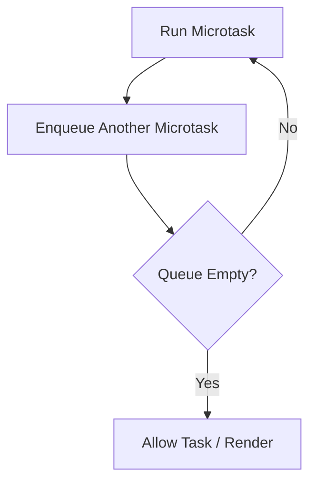

# Microtask Starvation

Це одна з найнеприємніших пасток асинхронності: код формально "асинхронний", але UI все одно зависає. Причина — **microtask starvation**, коли runtime ніколи не доходить до tasks і render.

---

## I. Core Mechanism

**Теза:** Якщо microtask під час свого виконання постійно додає нові microtasks, runtime продовжує drain-cycle і не переходить до **task queue** та **render opportunity**. У результаті browser може виглядати "замороженим" без жодного довгого sync loop.

### Приклад
```javascript
function loop() {
  queueMicrotask(loop);
}

loop();
setTimeout(() => console.log("timeout"), 0);
```

### Просте пояснення
На вигляд ти "віддав керування" runtime, бо використовуєш microtask. Але microtasks мають високий пріоритет і дренуються повністю. Якщо кожна microtask створює наступну, черга ніколи не спорожнюється.

### Технічне пояснення
Модель starvation тут проста:

1. Поточний task закінчився.
2. Runtime почав drain microtask queue.
3. Поточна microtask під час виконання enqueue-ить нову microtask.
4. Queue все ще не порожня.
5. Event loop не переходить до next task і не дає render opportunity.

Це не deadlock у класичному сенсі. Це scheduling pathology: main thread зайнятий безперервним microtask draining.

### Покроковий Runtime Walkthrough
1. `loop()` ставить microtask.
2. Поточний sync turn закінчується.
3. Runtime виконує microtask `loop`.
4. Усередині неї ставиться ще одна `loop` microtask.
5. Queue залишається непорожньою.
6. `setTimeout` callback ready, але не може виконатися.
7. UI не отримує render chance.

> [!TIP]
> **[▶ Запустити інтерактивну візуалізацію Microtask Starvation](../../visualisation/asynchrony-and-event-loop/07-microtask-starvation/microtask-starvation/index.html)**

### Візуалізація


### Edge Cases / Підводні камені
- Promise recursion створює ту саму проблему, навіть якщо код виглядає "чистіше" за `queueMicrotask`.
- `await Promise.resolve()` не допомагає, якщо ти знову повертаєшся в microtask-only chain.
- Аналогічні starvation patterns існують і в Node.js через `process.nextTick`.
- Browser може виглядати живим на рівні вкладки, але input і render все одно будуть blocked.

---

## II. Common Misconceptions

> [!IMPORTANT]
> Microtask — це не "легка безпечна асинхронність". У неї дуже агресивний пріоритет.

> [!IMPORTANT]
> Якщо код асинхронний, це ще не означає, що він yield-ить достатньо для UI.

> [!IMPORTANT]
> `Promise.resolve().then(loop)` — це не безпечніше за `queueMicrotask(loop)` у питанні starvation.

---

## III. When This Matters / When It Doesn't

- **Важливо:** scheduler design, framework internals, UI responsiveness, promise-heavy code, debugging "browser froze".
- **Менш важливо:** прості async flows без recursive scheduling.

---

## IV. Self-Check Questions

1. Що таке microtask starvation?
2. Чому timer callback може ніколи не дійти до виконання в такому сценарії?
3. Чим starvation відрізняється від довгого sync loop?
4. Чому `queueMicrotask(loop)` небезпечний?
5. Чому promise recursion створює той самий клас проблеми?
6. Який ресурс starved першим: task queue, input чи render?
7. Чому `await Promise.resolve()` не рятує, якщо chain лишається microtask-only?
8. Як свідомо yield-нути з microtask pressure назад у task queue?
9. Чому browser може не малювати UI в такому сценарії?
10. Який symptom користувач побачить у реальному продукті?
11. Чому цей баг часто маскується під "браузер тупо завис"?
12. Як знайти його в profiling?
13. Яка різниця між "високий пріоритет" і "хороший інструмент для всього"?
14. Коли microtasks корисні, а коли вони стають токсичними?

---

## V. Short Answers / Hints

1. Нескінченне або занадто довге дренування microtasks.
2. Бо до next task runtime не доходить.
3. Тут нема одного великого sync block; є нескінченний scheduling loop.
4. Бо він може сам себе відтворювати без yield.
5. Бо promise reaction jobs теж microtasks.
6. Усі три страждають; але task/render не отримують шанс.
7. Бо ти все одно лишаєшся в microtask semantics.
8. Через task boundary: `setTimeout`, `MessageChannel`, інший yield strategy.
9. Бо render теж чекає після drain.
10. Frozen UI, delayed clicks, spinner not painting.
11. Бо call stack у кожен момент короткий, але runtime never yields.
12. Performance timeline, long chains of microtasks, no frames.
13. Високий пріоритет — це небезпека зловживання.
14. Корисні для short continuation; токсичні для recursive loops.

---

## VI. Suggested Practice

1. Перепиши starvation loop так, щоб він yield-ив кожні N ітерацій.
2. Порівняй `queueMicrotask`, `Promise.then`, `setTimeout` у циклі 10k кроків.
3. Далі переходь у [11 Practice Lab](../11-practice-lab/README.md), бо ця тема найкраще засвоюється на order/debug задачах.
