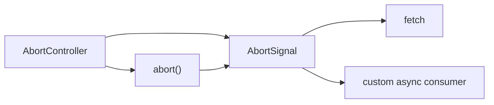

# AbortController and Cancellation

Асинхронний код без cancellation живе занадто довго. Він продовжує оновлювати UI після unmount, приносить stale data, витрачає мережу й пам'ять. `AbortController` — це базовий механізм, який дозволяє **припиняти актуальність async-операції**, а не просто ігнорувати її результат.

---

## I. Core Mechanism

**Теза:** `AbortController` створює **signal**, який можна передати в abort-aware API. Коли controller абортується, signal переходить у стан `aborted`, і споживачі цього signal можуть **достроково завершити операцію або cleanup path**.

### Приклад
```javascript
let controller;

async function search(query) {
  controller?.abort();
  controller = new AbortController();

  const response = await fetch(`/api/search?q=${query}`, {
    signal: controller.signal
  });

  return response.json();
}
```

### Просте пояснення
Коли користувач вводить новий пошуковий запит, старий запит уже неактуальний. `AbortController` дозволяє не чекати, поки він просто повернеться, а явно сказати: "ця операція більше не потрібна".

### Технічне пояснення
Ключові елементи:

| Сутність | Роль |
| :--- | :--- |
| `AbortController` | Джерело керування скасуванням |
| `AbortSignal` | Read-only канал стану скасування |
| `signal.aborted` | Поточний статус |
| `abort` event | Нотифікація підписникам signal |
| `fetch(..., { signal })` | Abort-aware consumer |

Важливо: cancellation тут означає **скасування локального очікування / споживання ресурсу**, а не гарантію того, що remote side "відмотала все назад".

### Покроковий Runtime Walkthrough
1. Створюється `AbortController`.
2. Його `signal` передається в `fetch`.
3. Користувач вводить новий запит або закриває modal.
4. Викликається `controller.abort()`.
5. `signal.aborted` стає `true`, спрацьовує abort notification.
6. `fetch` завершується помилкою abort-type замість звичайного result path.
7. Код у `catch` або guard-логіці вирішує, що це не "справжня" помилка продукту, а контрольований cancellation path.

> [!TIP]
> **[▶ Запустити інтерактивну візуалізацію AbortController Signal Flow](../../visualisation/asynchrony-and-event-loop/08-abortcontroller-and-cancellation/abortcontroller-signal-flow/index.html)**

> [!TIP]
> **[▶ Відкрити Cancellation + Stale Request Board](../../visualisation/asynchrony-and-event-loop/08-abortcontroller-and-cancellation/cancellation-stale-request-board/index.html)**

### Візуалізація


### Edge Cases / Підводні камені
- Скасування `fetch` не означає, що сервер обов'язково перестав робити роботу в той самий момент.
- Якщо ти не відрізняєш abort-path від реальної помилки, UI починає показувати фальшиві error toasts.
- Одна controller може керувати кількома пов'язаними операціями, якщо це справді одна lifetime boundary.
- Cancellation без cleanup discipline не дає повного ефекту: listeners, timers, UI state ще треба акуратно знімати.

---

## II. Common Misconceptions

> [!IMPORTANT]
> "Ми і так ігноруємо старий результат" — це не те саме, що справжнє cancellation.

> [!IMPORTANT]
> `AbortController` не є лише для `fetch`. Це загальний сигнал життєвого циклу async-операції.

> [!IMPORTANT]
> Abort — це не обов'язково error case продукту. Часто це нормальний control-flow path.

---

## III. When This Matters / When It Doesn't

- **Важливо:** search-as-you-type, route changes, unmount cleanup, streaming, long requests, race prevention.
- **Менш важливо:** короткі локальні async snippets, які гарантовано завершуються швидко і не мають UI lifetime concerns.

---

## IV. Self-Check Questions

1. Навіщо потрібен `AbortController`?
2. Чим cancellation відрізняється від "просто не використовувати результат"?
3. Що таке `AbortSignal`?
4. Що стається з `signal`, коли викликають `abort()`?
5. Чому старий запит у search UI краще abort-ити, а не просто чекати?
6. Чому abort-path не слід показувати як звичайну помилку користувачу?
7. Як `AbortController` допомагає боротися зі stale-request race?
8. Чи можна використати один signal для кількох пов'язаних операцій?
9. Що треба чистити окрім самої мережевої операції?
10. Чому cancellation — це питання lifecycle, а не тільки network?
11. Яка межа між реальним error case і контрольованим abort case?
12. Чому guard `if (signal.aborted) return;` іноді потрібен навіть після await?
13. Як би ти зв'язав controller з життєвим циклом модалки або сторінки?
14. Чому stale-request race — це не лише проблема швидкості мережі?

---

## V. Short Answers / Hints

1. Щоб достроково завершувати вже неактуальні async operations.
2. Cancellation зупиняє flow раніше, а не лише ігнорує кінець.
3. Read-only канал стану скасування.
4. `aborted = true` і спрацьовує abort event.
5. Бо старий flow інакше може витратити ресурси і повернути stale data.
6. Бо це очікувана керована гілка.
7. Старі flows припиняються раніше.
8. Так, якщо це одна lifetime boundary.
9. Listeners, timers, UI subscriptions, local state.
10. Бо операція може пережити компонент/екран.
11. Abort — контрольований stop; error — небажана поломка.
12. Бо між await і state update ситуація могла вже змінитися.
13. Створювати на mount/open і abort на unmount/close.
14. Бо проблема в ordering і життєвому циклі відповідей.

---

## VI. Suggested Practice

1. Реалізуй cancellable search input.
2. Додай abort до modal upload / route transition scenario.
3. Програй кілька сценаріїв у [Cancellation + Stale Request Board](../../visualisation/asynchrony-and-event-loop/08-abortcontroller-and-cancellation/cancellation-stale-request-board/index.html), щоб руками побачити різницю між `abort`, latest-only guard і reused signal bug.
4. Після цього переходь у [12 Bug Lab](../12-bug-lab/README.md), де stale request overwrite буде розібраний як реальний production bug.
