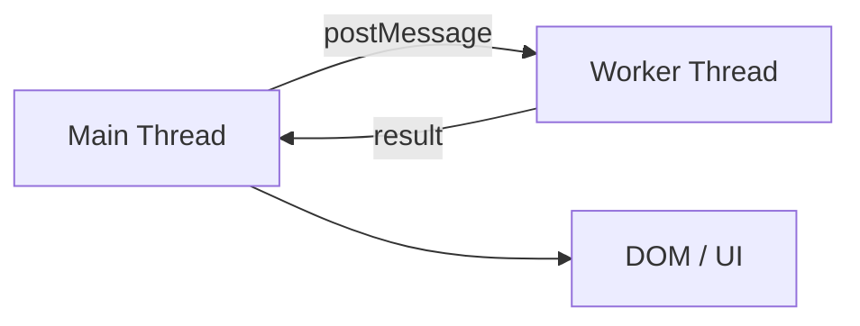

# Web Workers

Коли задача реально CPU-heavy, ні `Promise`, ні `setTimeout`, ні `await` не дадуть справжнього паралелізму. Для цього потрібні **Web Workers** — окремі потоки виконання з власним event loop.

---

## I. Core Mechanism

**Теза:** `Web Worker` — це окремий JS context в **іншому thread**, який може виконувати обчислення паралельно з main thread. Спілкування йде через **message passing**, а не через спільний доступ до DOM-об'єктів.

### Приклад
```javascript
// main.js
const worker = new Worker("worker.js");
worker.postMessage({ type: "parse", payload: bigBlob });
worker.onmessage = (event) => {
  console.log("done", event.data);
};
```

### Просте пояснення
Main thread віддає важку роботу worker-у і продовжує обслуговувати UI. Worker рахує у своєму thread і потім повертає результат повідомленням.

### Технічне пояснення
Основні правила:

| Механізм | Що означає |
| :--- | :--- |
| Dedicated Worker | Окремий worker для одного owner context |
| `postMessage` | Передача даних між main thread і worker |
| Structured Clone | Копіювання сумісних значень між потоками |
| Transferable | Передача ownership без копіювання для деяких типів, напр. `ArrayBuffer` |
| No direct DOM access | Worker не може напряму змінювати DOM |

Worker має власний event loop і не ділить call stack з main thread. Але це не безкоштовно: є startup overhead, serialization/transfer overhead, coordination cost і фінальна ціна DOM commit на main thread.

### Покроковий Runtime Walkthrough
1. Main thread створює worker.
2. Browser запускає окремий JS context у worker thread.
3. Main thread відправляє повідомлення через `postMessage`.
4. Дані копіюються structured clone або передаються як transferable.
5. Worker виконує CPU-heavy код поза main thread.
6. Worker відправляє результат назад.
7. Main thread оновлює UI, не блокуючи користувача під час обчислень.

> [!TIP]
> **[▶ Запустити інтерактивну візуалізацію Web Workers Message Passing](../../visualisation/asynchrony-and-event-loop/09-web-workers/web-workers-message-passing/index.html)**

> [!TIP]
> **[▶ Відкрити Worker vs Main-Thread Cost Board](../../visualisation/asynchrony-and-event-loop/09-web-workers/worker-vs-main-thread-cost-board/index.html)**

### Візуалізація


### Edge Cases / Підводні камені
- Маленькі задачі можуть стати **повільнішими** у worker через startup + messaging overhead.
- Structured clone великих об'єктів коштує часу й пам'яті.
- Якщо можна використати transferable (`ArrayBuffer`), це часто різко дешевше.
- Worker не рятує, якщо bottleneck — не CPU, а network latency або DOM/layout.
- Worker не рятує, якщо фінальний DOM commit сам по собі занадто важкий.

---

## II. Common Misconceptions

> [!IMPORTANT]
> `await` не дорівнює multithreading. Main thread від цього не стає вільнішим для CPU-heavy JS.

> [!IMPORTANT]
> Worker — це не "швидший main thread". Це інший thread із власними costs і обмеженнями.

> [!IMPORTANT]
> Worker не має прямого доступу до DOM.

---

## III. When This Matters / When It Doesn't

- **Важливо:** parsing, compression, image/data processing, heavy transforms, large JSON/CSV work, crypto-like compute.
- **Менш важливо:** дрібні обчислення, мережеві задачі без CPU pressure, звичайний UI event handling.

---

## IV. Self-Check Questions

1. Що таке Web Worker на рівні runtime model?
2. Чому `await` не допомагає для CPU-heavy loop на main thread?
3. Як main thread і worker обмінюються даними?
4. Що таке structured clone?
5. Що таке transferable і чому це важливо?
6. Чому worker не може напряму змінити DOM?
7. Коли worker дає виграш, а коли ні?
8. Чому serialization overhead іноді вбиває користь worker-а?
9. Який тип задач найкраще підходить для worker?
10. Що маєш виміряти перед міграцією задачі у worker?
11. Чому worker — це про responsiveness, а не автоматично про lower total time?
12. Як би ти пояснив різницю між message passing і shared mutable state?
13. Чому `ArrayBuffer` часто фігурує в розмові про workers?
14. Які симптоми в UI кажуть, що задача проситься в worker?

---

## V. Short Answers / Hints

1. Окремий JS context в іншому thread.
2. Бо CPU код усе одно займає main thread.
3. Через `postMessage`.
4. Механізм копіювання сумісних значень між контекстами.
5. Передача ownership без копії для окремих типів.
6. DOM прив'язаний до main thread/browser rendering model.
7. Heavy compute з відносно чистими boundaries.
8. Бо копіювання великих payloads дороге.
9. Parsing, transforms, image/data processing.
10. CPU cost, payload size, message frequency, latency needs.
11. Main thread стає вільнішим, але загальна вартість може лишитися високою.
12. Один — через messages, другий — через спільні мутації.
13. Бо його можна transfer-ити ефективно.
14. Input lag, frozen UI, dropped frames during compute.

---

## VI. Suggested Practice

1. Винеси важкий `JSON.parse`/transform у worker.
2. Порівняй copy vs transfer для `ArrayBuffer`.
3. Програй кілька сценаріїв у [Worker vs Main-Thread Cost Board](../../visualisation/asynchrony-and-event-loop/09-web-workers/worker-vs-main-thread-cost-board/index.html), щоб окремо побачити `compute`, `structured clone`, `transferable` і `DOM commit` cost.
4. Після цього переходь у [10 Node.js Event Loop](../10-nodejs-event-loop/README.md), щоб не змішувати browser threading model з серверним runtime.
