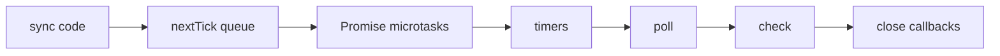

# Node.js Event Loop

У Node.js асинхронність виглядає схоже на browser лише на поверхні. Тут інший host runtime, інші фази loop і додаткові механізми на кшталт `process.nextTick` і `setImmediate`.

---

## I. Core Mechanism

**Теза:** Node.js event loop проходить через **фази**, серед яких найважливіші для ментальної моделі: **timers**, **pending callbacks**, **poll**, **check**, **close callbacks**. Поверх цього окремо існують **`process.nextTick` queue** і **promise microtasks**, які мають свій пріоритет.

### Приклад
```javascript
setTimeout(() => console.log("timeout"), 0);
setImmediate(() => console.log("immediate"));
Promise.resolve().then(() => console.log("promise"));
process.nextTick(() => console.log("nextTick"));
console.log("sync");
```

### Просте пояснення
На top-level спочатку виконується синхронний код. Потім Node обробляє `process.nextTick`, потім promise microtasks. Далі loop іде по фазах. `setTimeout` і `setImmediate` не є одним і тим самим, а їх порядок залежить від контексту.

### Технічне пояснення
Спрощена модель Node loop:

| Рівень | Роль |
| :--- | :--- |
| `process.nextTick` queue | Виконується раніше за інші microtasks у Node |
| Promise microtasks | Виконуються після `nextTick` queue |
| Timers phase | Готові `setTimeout` / `setInterval` |
| Poll phase | I/O callbacks, waiting for I/O |
| Check phase | `setImmediate` callbacks |
| Close callbacks | Напр. `'close'` events |

Важливо: порядок `setTimeout(0)` vs `setImmediate()` **не варто вчити як абсолютне правило для top-level коду**. У різних контекстах він може відрізнятися. Але після I/O callback `setImmediate` часто спостерігається раніше.

### Покроковий Runtime Walkthrough
1. Виконується sync частина: `sync`.
2. Node дренує `process.nextTick` queue.
3. Node дренує promise microtasks.
4. Event loop переходить у phases.
5. Timers phase може виконати `setTimeout` callback, якщо timer ready.
6. Check phase виконує `setImmediate` callbacks.
7. Конкретний порядок `timeout`/`immediate` залежить від контексту scheduling.

> [!TIP]
> **[▶ Запустити інтерактивну візуалізацію Node.js Event Loop Phases](../../visualisation/asynchrony-and-event-loop/10-nodejs-event-loop/nodejs-event-loop-phases/index.html)**

> [!TIP]
> **[▶ Відкрити Browser vs Node Order Board](../../visualisation/asynchrony-and-event-loop/12-bug-lab/browser-vs-node-order-board/index.html)**

### Візуалізація


### Edge Cases / Підводні камені
- `process.nextTick` теж може створювати starvation, якщо ним зловживати.
- Не копіюй browser mental model на Node 1:1.
- `setImmediate` не є просто "швидшим timeout".
- Після I/O callback order між `setImmediate` і `setTimeout(0)` часто відрізняється від top-level.

---

## II. Common Misconceptions

> [!IMPORTANT]
> `process.nextTick` — це не те саме, що Promise microtask, хоча обидва дуже "ранні".

> [!IMPORTANT]
> Browser event loop і Node event loop не можна змішувати як одну й ту саму таблицю правил.

> [!IMPORTANT]
> `setImmediate` не означає "виконати зараз".

---

## III. When This Matters / When It Doesn't

- **Важливо:** backend debugging, stream/I/O code, CLI tools, SSR runtimes, queue ordering bugs, interop with browser mental models.
- **Менш важливо:** чисто browser-only навчальні приклади без Node execution.

---

## IV. Self-Check Questions

1. Які фази Node event loop найважливіші для практичного ментального моделювання?
2. Де в цій моделі стоїть `process.nextTick`?
3. Чим `process.nextTick` відрізняється від promise microtasks?
4. Де виконується `setImmediate`?
5. Чому не варто вчити top-level order `setTimeout(0)` vs `setImmediate()` як абсолютний?
6. Що таке poll phase на високому рівні?
7. Як змінюється модель після I/O callback?
8. Чому nextTick може бути небезпечним при recursion?
9. Який порядок логів у базовому прикладі статті гарантований, а який — context-dependent?
10. Чим Node runtime принципово відрізняється від browser runtime в цій темі?
11. Чому обидва runtimes мають microtasks, але не тотожні scheduling semantics?
12. Як би ти пояснив `setImmediate` junior-розробнику без міфів?
13. Коли помилка в order є саме Node-specific, а не general async issue?
14. Як задебажити дивний порядок callbacks у Node-процесі?

---

## V. Short Answers / Hints

1. Timers, poll, check, close callbacks плюс nextTick/microtasks.
2. Поза звичайними phases, з дуже високим пріоритетом.
3. nextTick дренується раніше.
4. У check phase.
5. Бо контекст має значення.
6. Фаза I/O activity / waiting / callback processing.
7. `setImmediate` часто стає ближчим за timers.
8. Бо може не відпускати loop далі.
9. `sync`, `nextTick`, `promise` — стабільніше; `timeout` vs `immediate` залежить від контексту.
10. Інші host APIs і phases.
11. Бо scheduling policy відрізняється.
12. Callback для check phase, а не "негайний виклик".
13. Коли в коді є `nextTick`, `setImmediate`, I/O phases.
14. Логувати boundaries, мінімізувати приклад, дивитися context of scheduling.

---

## VI. Suggested Practice

1. Напиши 5 міні-прикладів з `nextTick`, `Promise.then`, `setTimeout`, `setImmediate`.
2. Окремо перевір top-level і inside-I/O ordering.
3. Далі переходь у [11 Practice Lab](../11-practice-lab/README.md), де browser і Node order traps будуть змішані навмисно.
4. Потім відкрий [Browser vs Node Order Board](../../visualisation/asynchrony-and-event-loop/12-bug-lab/browser-vs-node-order-board/index.html) і руками перемикай `Browser` / `Node.js`.
