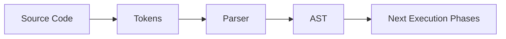

# Parsing & AST

Ця тема пояснює перший етап шляху JavaScript-коду: сирцевий текст ще не може виконуватися. Спочатку рушій має розбити його на syntax units, перевірити граматику й побудувати `AST`, з яким можна працювати далі.

---

## I. Core Mechanism

**Теза:** до runtime execution код спочатку проходить parsing pipeline. Якщо граматика не сходиться, програма падає ще до виконання першого meaningful instruction.

### Приклад
```javascript
const answer = 40 + 2;
```

### Просте пояснення
Рушій спочатку бачить не “змінну з числом”, а текст. Цей текст треба розбити на шматки на кшталт `const`, `answer`, `=`, `40`, `+`, `2`, `;`, а потім зібрати у структуру на кшталт “VariableDeclaration з BinaryExpression”.

### Технічне пояснення
Ментально pipeline виглядає так:

1. **Source text**.
2. **Tokenization / lexical analysis**.
3. **Parsing**.
4. **AST creation**.
5. Лише після цього наступні фази можуть готувати код до execution.

`AST` важливе тому, що рушій і tooling працюють не з сирим рядком, а зі структурою. Наприклад, `40 + 2` і `40 +` — це різний результат ще на parsing stage: перший код дає валідне дерево, другий дає syntax error.

### Mental Model
`AST` — це схема програми. Поки схеми нема, рушій не може надійно переходити до execution.

### Покроковий Walkthrough
1. Source code надходить у parser.
2. Parser читає token stream.
3. На основі grammar rules будується дерево вузлів.
4. Якщо grammar rule не виконується, виникає syntax error.
5. Валідне дерево переходить у наступні execution phases.

> [!TIP]
> **[▶ Відкрити Parsing AST Board](../../visualisation/compiler-pipeline-and-jit-internals/01-parsing-and-ast/parsing-ast-board/index.html)**

> [!TIP]
> **[▶ Відкрити Tokenization vs AST Board](../../visualisation/compiler-pipeline-and-jit-internals/01-parsing-and-ast/tokenization-vs-ast-board/index.html)**

### Візуалізація


### Edge Cases / Підводні камені
- Syntax error відбувається раніше за runtime error.
- Валідний syntax не гарантує валідну бізнес-логіку.
- Token stream і `AST` — не одне й те саме: tokens плоскі, дерево ієрархічне.
- AST важливе не лише для Babel/ESLint, а й для реального engine pipeline.

---

## II. Common Misconceptions

> [!IMPORTANT]
> “Код починає виконуватися одразу, як тільки рушій його читає” — неправильна ментальна модель.

> [!IMPORTANT]
> Syntax error — це не різновид runtime exception. Це інша стадія.

> [!IMPORTANT]
> AST — не лише tooling artifact. Це нормальна частина компіляційного pipeline.

---

## III. When This Matters / When It Doesn't

- **Важливо:** tooling, transpilation, syntax debugging, engine mental model, compiler literacy.
- **Менш важливо:** прості CRUD-задачі, де не треба заглиблюватися в pipeline, але навіть там корисно відрізняти syntax-stage від runtime-stage.

---

## IV. Self-Check Questions

1. Що таке token?
2. Що таке parser?
3. Що таке `AST`?
4. Чому AST не дорівнює plain text?
5. Чим tokenization відрізняється від parsing?
6. Чому syntax error виникає до runtime execution?
7. Яка користь від AST для рушія?
8. Яка користь від AST для tooling?
9. Чому валідний syntax ще не означає коректний runtime behavior?
10. Що ламається раніше: `const x = ;` чи `const x = foo();`, якщо `foo` не існує?
11. Чому parser працює зі структурою grammar, а не “загальним змістом програми”? 
12. Який smell підказує, що проблема в parsing stage, а не в execution stage?
13. Чому два схожих текстово вирази можуть дати різні AST?
14. Навіщо взагалі переходити до дерева, а не виконувати текст напряму?
15. Чому AST корисне навіть якщо ти не пишеш compiler tooling?
16. Як мислити різницю між syntax correctness і semantic correctness?

---

## V. Short Answers / Hints

1. Мінімальна syntax unit.
2. Будує структуру з token stream.
3. Дерево синтаксичної структури програми.
4. Бо дерево описує відношення між частинами коду.
5. Tokens — це елементи; parsing — це побудова дерева.
6. Бо не можна перейти до execution без валідної структури.
7. Дає придатну до аналізу структуру.
8. Дає базу для transform/analysis.
9. Бо логіка може бути неправильною при валідному syntax.
10. `const x = ;` — це syntax-stage проблема.
11. Бо parser перевіряє форму, а не бізнес-сенс.
12. Код узагалі не доходить до нормального execution.
13. Бо граматика визначає пріоритети й вкладеність вузлів.
14. Бо структурований код легше аналізувати й виконувати далі.
15. Щоб краще відрізняти класи проблем у runtime і tooling.
16. Перше — чи код можна розібрати; друге — чи він робить правильну річ.

---

## VI. Suggested Practice

1. Візьми 2-3 короткі вирази й словами опиши їхній AST shape.
2. Відокрем кілька syntax errors від runtime errors на прикладах.
3. Після цього переходь у [02 Ignition & TurboFan](../02-ignition-and-turbofan/README.md), щоб побачити, що відбувається з валідною програмою далі.
