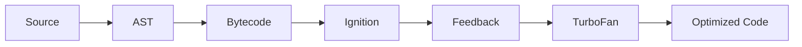

# Ignition & TurboFan

Ця тема пояснює high-level pipeline у V8. Назви `Ignition` і `TurboFan` важливі не самі по собі, а як спосіб зрозуміти, що швидкість JavaScript з'являється не в одну мить, а через interpreter, feedback і optimization.

---

## I. Core Mechanism

**Теза:** у V8 код не “одразу стає швидким native code”. Спочатку його виконує interpreter (`Ignition`), а потім hot paths можуть бути оптимізовані `TurboFan` на основі runtime feedback.

### Приклад
```javascript
function add(a, b) {
  return a + b;
}

for (let i = 0; i < 100000; i++) {
  add(i, i + 1);
}
```

### Просте пояснення
На старті рушій не знає, як реально поводитиметься твоя функція. Тому спочатку він виконує її більш загальним способом. Коли стає видно, що функція викликається часто й поводиться стабільно, рушій може зібрати feedback і згенерувати швидший specialized path.

### Технічне пояснення
Ментально pipeline V8 тут такий:

1. Parse / AST / initial preparation.
2. Bytecode generation.
3. `Ignition` виконує bytecode.
4. Runtime збирає feedback про реальні виклики й типи.
5. Hot code може піти в `TurboFan`.
6. Якщо assumptions ламаються, optimized path може бути скасований.

Важливо: це навчальна модель. Конкретні деталі pipeline можуть змінюватися між версіями V8, але поділ на interpreter + optimizing compiler + feedback loop — корисний і стабільний mental model.

### Mental Model
`Ignition` дає запуск і збирання фактів. `TurboFan` використовує факти для швидшого шляху, поки факти лишаються правдивими.

### Покроковий Walkthrough
1. Код стає валідною структурою.
2. Для нього готується bytecode.
3. `Ignition` виконує цей код.
4. Часті стабільні виклики накопичують feedback.
5. `TurboFan` може зібрати optimized version.
6. Якщо runtime shape міняється, може статися deopt.

> [!TIP]
> **[▶ Відкрити V8 Pipeline Board](../../visualisation/compiler-pipeline-and-jit-internals/02-ignition-and-turbofan/v8-pipeline-board/index.html)**

### Візуалізація


### Edge Cases / Підводні камені
- Не кожна функція стає hot enough для optimization.
- Hot code може перестати бути оптимізованим, якщо припущення зламалися.
- Назви `Ignition` і `TurboFan` — це V8-specific layer, а не універсальні назви для всіх рушіїв.
- “Функція працює швидко в benchmark” ще не означає, що ти правильно зрозумів pipeline.

---

## II. Common Misconceptions

> [!IMPORTANT]
> `TurboFan` не запускається миттєво для всього коду.

> [!IMPORTANT]
> Interpreter stage — не ознака “повільного JS”, а нормальна частина adaptive pipeline.

> [!IMPORTANT]
> Optimized once не означає optimized forever.

---

## III. When This Matters / When It Doesn't

- **Важливо:** performance reasoning, deopt literacy, engine mental model, hot-path debugging.
- **Менш важливо:** cold code, маленькі скрипти, де optimization details не мають практичного ефекту.

---

## IV. Self-Check Questions

1. Яку роль виконує `Ignition`?
2. Яку роль виконує `TurboFan`?
3. Чому interpreter stage потрібна навіть у сучасному швидкому JS?
4. Що таке runtime feedback?
5. Чому optimizer не може бездумно спеціалізувати весь код одразу?
6. Що таке hot code?
7. Чому стабільність runtime behavior важлива для optimization?
8. Чому `Ignition` і `TurboFan` — це V8-specific names, але корисна general model?
9. Що відбувається між bytecode execution і optimizing compilation?
10. Чому performance не можна пояснити лише словом “JIT”? 
11. Коли функція може так і не дійти до optimized state?
12. Чому deopt не означає “движок зламався”? 
13. Який smell показує, що код занадто нестабільний для aggressive optimization?
14. Чому benchmark без warm-up часто вводить в оману?
15. Яка головна різниця між interpreter path і optimized path?
16. Чому pipeline треба мислити як feedback loop, а не як одноразову компіляцію?

---

## V. Short Answers / Hints

1. Виконує bytecode і стартує execution.
2. Оптимізує hot code.
3. Бо рушію треба спочатку отримати runtime факти.
4. Дані про реальне виконання.
5. Бо assumptions можуть виявитися неправильними.
6. Код, який часто викликається.
7. Бо optimizer спирається на повторювані патерни.
8. Назви конкретні, а модель interpreter+optimizer загальніша.
9. Збір feedback і оцінка hotness.
10. Бо JIT — лише частина ширшого adaptive pipeline.
11. Якщо вона cold або занадто нестабільна.
12. Це штатний відкат до безпечнішого execution path.
13. Різні типи, shapes і непередбачуваний control flow.
14. Бо ти міряєш холодний старт, а не стабілізований режим.
15. Перший загальніший, другий спеціалізованіший.
16. Бо runtime постійно уточнює свої припущення.

---

## VI. Suggested Practice

1. Візьми дві функції: одну cold, одну hot, і поясни, як для них може відрізнятися pipeline.
2. Пов'яжи цю тему з deoptimization із блоку про memory/V8 performance.
3. Після цього переходь у [03 Bytecode Execution](../03-bytecode-execution/README.md), щоб побачити, що саме interpreter реально виконує.
