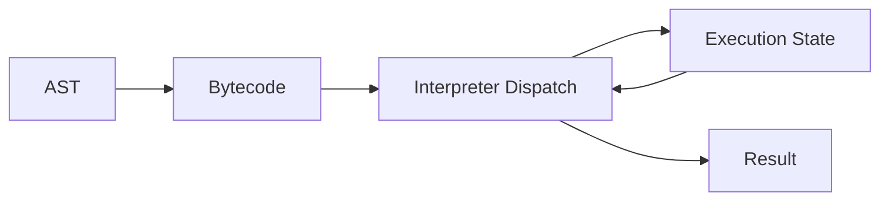

# Bytecode Execution

Ця тема пояснює, що між source code і machine code часто лежить ще один шар — bytecode. Саме його interpreter може виконувати крок за кроком, не генеруючи одразу fully optimized native code.

---

## I. Core Mechanism

**Теза:** bytecode — це проміжне представлення програми, зручне для interpreter execution. Воно абстрактніше за machine code, але структурованіше й ближче до execution, ніж source text або AST.

### Приклад
```javascript
function sum(a, b) {
  return a + b;
}
```

### Просте пояснення
Source code зручний для людини. Machine code — для CPU. Bytecode — це проміжний робочий формат для рушія: послідовність інструкцій на кшталт “завантаж значення”, “додай”, “поверни результат”.

### Технічне пояснення
Навчальна модель bytecode execution:

1. AST або інша внутрішня структура конвертується в instruction sequence.
2. Interpreter читає інструкції по черзі.
3. Кожна інструкція змінює internal execution state.
4. На цьому ж етапі можна збирати feedback для майбутньої optimization.

Ментально корисно думати про bytecode як про “assembly-like language для VM”, але не як про реальний CPU machine code.

### Mental Model
Bytecode — це мова, якою рушій говорить сам із собою перед тим, як вирішити, чи варто оптимізувати конкретний шматок коду далі.

### Покроковий Walkthrough
1. Функція має валідну syntax structure.
2. Рушій генерує bytecode sequence.
3. Interpreter бере першу інструкцію.
4. Dispatch loop визначає, що означає ця інструкція.
5. Execution state оновлюється.
6. Коли sequence завершено, функція повертає результат.

> [!TIP]
> **[▶ Відкрити Bytecode Stepper Board](../../visualisation/compiler-pipeline-and-jit-internals/03-bytecode-execution/bytecode-stepper-board/index.html)**

### Візуалізація


### Edge Cases / Підводні камені
- Bytecode — не machine code.
- Одне й те саме source expression може стати кількома bytecode instructions.
- Не треба заучувати конкретні opcode names, щоб мати корисну mental model.
- Bytecode intuition корисна для pipeline reasoning, але не означає, що треба мислити кожну функцію вручну як VM program.

---

## II. Common Misconceptions

> [!IMPORTANT]
> Bytecode — не “майже фінальний native code”.

> [!IMPORTANT]
> Interpreter не працює “з текстом напряму”, якщо ми вже дійшли до execution stage.

> [!IMPORTANT]
> Навіть проста функція може перетворюватися на кілька instruction-level кроків.

---

## III. When This Matters / When It Doesn't

- **Важливо:** engine literacy, bytecode inspection tooling, execution pipeline reasoning, optimization intuition.
- **Менш важливо:** everyday product code, якщо не стоїть задача зрозуміти performance pipeline глибше.

---

## IV. Self-Check Questions

1. Що таке bytecode?
2. Чим bytecode відрізняється від source code?
3. Чим bytecode відрізняється від machine code?
4. Навіщо interpreter-у bytecode?
5. Що таке dispatch loop на ментальному рівні?
6. Чому bytecode зручний як проміжний шар?
7. Чому AST і bytecode — це не одне й те саме?
8. Чи одна source-операція обов'язково означає одну bytecode instruction?
9. Чому bytecode execution корисне для збирання feedback?
10. Яка головна practical користь цієї теми для розробника?
11. Який smell показує, що людина плутає bytecode з native code?
12. Чому не треба зубрити реальні opcode names, щоб мати сильну модель?
13. Що відбувається між двома сусідніми bytecode instructions?
14. Чому VM-friendly representation корисне навіть без immediate optimization?
15. Як bytecode допомагає пов'язати parsing stage з JIT stage?
16. Коли bytecode intuition реально допомагає краще пояснити поведінку рушія?

---

## V. Short Answers / Hints

1. Проміжне представлення для execution.
2. Перше структуроване для VM, друге для людини.
3. Machine code йде прямо на CPU, bytecode — на interpreter/VM.
4. Щоб мати керований instruction stream.
5. Цикл читання й виконання інструкцій.
6. Баланс між абстракцією й виконуваністю.
7. AST описує syntax structure, bytecode — execution steps.
8. Ні, часто це кілька кроків.
9. Бо реальне виконання проходить через ці instruction paths.
10. Краще розуміння pipeline й profiling reasoning.
11. Вона думає, що interpreter вже працює з native instructions CPU.
12. Бо важливі концепції, а не назви конкретних opcode.
13. Interpreter читає opcode і оновлює стан.
14. Бо код уже можна виконувати й аналізувати.
15. Він є містком між структурою програми й runtime optimization.
16. Коли треба пояснити, чому execution не зводиться до “прочитав і виконав текст”.

---

## VI. Suggested Practice

1. Візьми простий вираз і розклади його словами на 3-5 можливих instruction-level кроків.
2. Поясни різницю між “дерево програми” і “послідовність execution instructions”.
3. Після цього переходь у [04 JIT Basics](../04-jit-basics/README.md), щоб побачити, що робить рушій після interpreter stage.
