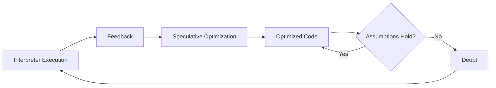

# JIT Basics

Ця тема пояснює, що `JIT` — це не магічна кнопка швидкості, а adaptive optimization strategy. Рушій дивиться на реальне виконання, робить припущення, спеціалізує код і відступає назад, якщо припущення виявляються хибними.

---

## I. Core Mechanism

**Теза:** `Just-In-Time` compilation базується на runtime feedback і speculative assumptions. Якщо код стабільний, optimizer може виграти в швидкості. Якщо стабільність зникає, доводиться deopt-итися.

### Приклад
```javascript
function readX(point) {
  return point.x;
}

readX({ x: 1 });
readX({ x: 2 });
readX({ x: 3 });
```

### Просте пояснення
Якщо рушій бачить, що функція багато разів читає `x` з об'єктів однакової форми, він може зробити швидший specialized path під це припущення. Але якщо потім прилітає об'єкт іншої форми, specialized path може стати небезпечним і доведеться відкотитися.

### Технічне пояснення
Базова модель JIT тут така:

1. Interpreter виконує код і збирає feedback.
2. Optimizer бачить стабільні патерни.
3. Створюється optimized machine code із припущеннями.
4. Поки припущення правдиві, execution швидший.
5. Якщо runtime порушує припущення, відбувається deoptimization.

Ця тема навмисно тримає фокус на базовому JIT reasoning. Деталі конкретних optimization passes можуть змінюватися, але логіка `feedback -> specialization -> deopt on invalid assumptions` дуже корисна для практичного розуміння.

### Mental Model
JIT — це ставка рушія на повторюваність твоєї програми.

### Покроковий Walkthrough
1. Код стартує в загальнішому execution path.
2. Runtime спостерігає за реальними значеннями й shapes.
3. Для hot stable path будується optimized version.
4. Ця версія працює доти, доки assumptions не порушені.
5. За потреби рушій відкачується на безпечніший path.

> [!TIP]
> **[▶ Відкрити JIT Feedback Board](../../visualisation/compiler-pipeline-and-jit-internals/04-jit-basics/jit-feedback-board/index.html)**

> [!TIP]
> **[▶ Відкрити Optimization Deopt Board](../../visualisation/compiler-pipeline-and-jit-internals/04-jit-basics/optimization-deopt-board/index.html)**

### Візуалізація


### Edge Cases / Підводні камені
- Не кожне прискорення варте complexity, якщо code path холодний.
- Спеціалізація під стабільний shape не працює, якщо inputs хаотичні.
- Deopt — це не баг, а safety mechanism.
- “JIT makes JS fast” — занадто грубе пояснення без feedback і assumptions.

---

## II. Common Misconceptions

> [!IMPORTANT]
> JIT не означає, що весь код компілюється в native code одразу після parse.

> [!IMPORTANT]
> Якщо код один раз оптимізувався, це не гарантує стабільної оптимізації назавжди.

> [!IMPORTANT]
> Deopt — це не proof of failure, а proof of adaptive runtime behavior.

---

## III. When This Matters / When It Doesn't

- **Важливо:** performance work, hot paths, benchmarking, deopt analysis, engine reasoning.
- **Менш важливо:** cold glue code, короткі utility scripts, місця, де продуктивність не bottleneck.

---

## IV. Self-Check Questions

1. Що таке JIT у практичному сенсі?
2. Чому JIT залежить від runtime feedback?
3. Що таке speculative optimization?
4. Чому assumptions потрібні optimizer-у?
5. Що таке deoptimization?
6. Чому optimized code не є гарантовано вічним станом?
7. Чому hotness важлива?
8. Чим cold code відрізняється від hot code для рушія?
9. Чому хаотичні inputs погіршують optimization potential?
10. Чому “JIT = fast” — слабке пояснення?
11. Як JIT пов'язаний із попереднім interpreter stage?
12. Який smell показує, що benchmark не відображає реальний optimized state?
13. Чому деякі optimization ideas не мають сенсу поза hot path?
14. Коли deopt треба сприймати як signal для розуміння, а не як паніку?
15. Чим відрізняється optimization policy від ручного micro-optimization cargo cult?
16. Яку одну головну ідею треба винести з JIT, якщо відкинути всі деталі рушія?

---

## V. Short Answers / Hints

1. Runtime-driven optimization strategy.
2. Бо треба бачити реальні патерни виконання.
3. Оптимізація на основі припущень.
4. Без них немає specialization.
5. Відкат optimized path.
6. Бо runtime behavior може змінитися.
7. Бо optimization коштує часу й має сенс не всюди.
8. Hot code часто викликається, cold — ні.
9. Бо важче утримати стабільні припущення.
10. Бо ігнорує interpreter, feedback і deopt.
11. Interpreter дає факти для optimizer-а.
12. Немає warm-up або inputs не схожі на production.
13. Бо cost optimization перевищить виграш.
14. Коли треба зрозуміти, яке припущення зламалося.
15. Перше опирається на evidence, друге — на міфи.
16. Рушій прискорює стабільне, але залишає шлях назад, якщо стабільність зникає.

---

## VI. Suggested Practice

1. Поясни один приклад, де stable inputs допомагають optimization, і один — де unstable inputs її зривають.
2. Пов'яжи цю тему з hidden classes і deoptimization з попередніх блоків.
3. Після цього переходь у [05 Practice Lab](../05-practice-lab/README.md), щоб закрити модуль задачами.
