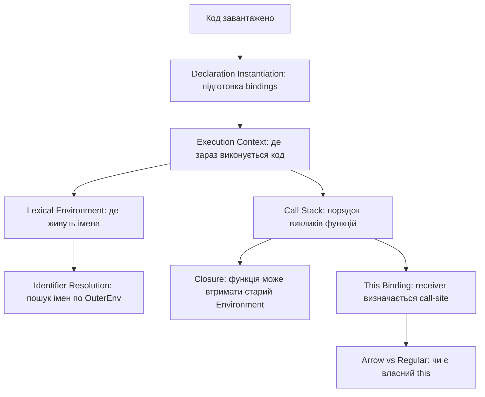

# Execution Model: Big Picture

Ця сторінка не замінює deep dive у кожну тему. Її задача — дати **цілісну карту**, щоб назви на кшталт `Declaration Instantiation`, `Lexical Environment` або `This Binding` не висіли в повітрі.

**Execution Model** — це набір правил, за якими JavaScript рушій:

1. готує declarations перед виконанням;
2. створює місця, де живуть імена та значення;
3. шукає змінні по scope chain;
4. керує порядком викликів функцій;
5. визначає `this` для конкретного виклику;
6. дозволяє функціям пам'ятати старі scope через closures.

## Словник перед стартом

Ці слова будуть часто зустрічатися в карті. Їх не треба одразу знати глибоко, але треба мати короткий переклад і роль.

| Термін | Людською мовою | Навіщо тут потрібен |
| :--- | :--- | :--- |
| **Execution** | виконання коду | Момент, коли рушій реально проходить рядки коду і виконує інструкції. |
| **Declaration** | оголошення | Запис у коді, який створює ім'я: `var`, `let`, `const`, `function`, `class`. |
| **Binding** | зв'язка “ім'я -> значення” | Не просто “змінна”, а запис, що ім'я `user` пов'язане з певним значенням або станом. |
| **Scope** | область видимості | Правило, де ім'я доступне, а де ні. |
| **Scope Chain** | ланцюжок областей видимості | Механізм пошуку імені: спочатку локально, потім вище, потім ще вище. |
| **Stack / Call Stack** | стек викликів | Структура, яка показує, яка функція зараз виконується і куди повернутися після `return`. |
| **Execution Context** | контекст виконання | “Капсула” для поточного виконання: що виконується, які environments доступні, який `this`. |
| **Lexical Environment** | лексичне середовище | Внутрішня структура, де зберігаються bindings і посилання на зовнішній scope. |
| **Closure** | замикання | Ситуація, коли функція пам'ятає environment, у якому була створена. |
| **`this`** | receiver поточного виклику | Значення, яке залежить від того, як саме викликали regular function. |
| **Arrow Function** | стрілкова функція | Функція без власного `this`; вона бере `this` із зовнішнього lexical scope. |

Коротко про підпис інтерактиву: **“підготовка bindings, scope, stack, closure, this і arrow functions”** означає:

- **bindings** — які імена JS підготував і з якими значеннями/станами;
- **scope** — де ці імена доступні;
- **stack** — який виклик функції зараз активний;
- **closure** — чому функція пам'ятає старі змінні;
- **`this`** — хто є receiver поточного виклику;
- **arrow functions** — чому стрілкова функція поводиться інакше з `this`.

> [!TIP]
> **[▶ Відкрити інтерактивну карту Execution Model](../../visualisation/execution-model/00-big-picture/execution-model-atlas/index.html)**

---

## I. Навіщо взагалі потрібен Execution Model

Без Execution Model окремі теми виглядають як випадковий список:

- hoisting;
- TDZ;
- scope;
- closure;
- call stack;
- `this`;
- arrow functions.

Але насправді це частини одного процесу:



Коротко:

> Execution Model пояснює, **чому JS-код поводиться саме так**, а не просто “як написати синтаксис”.

---

## II. Одна наскрізна історія

Будемо тримати в голові один приклад:

```javascript
const user = "Artur";

function createGreeter(prefix) {
  const label = "student";

  return function greet() {
    console.log(this.name, prefix, user, label);
  };
}

const person = { name: "A", greet: createGreeter("hi") };
person.greet();
```

Цей приклад маленький, але в ньому є весь Execution Model:

- `const user` і `function createGreeter` треба підготувати перед виконанням;
- глобальні імена живуть у Global Lexical Environment;
- виклик `createGreeter("hi")` створює новий Function Execution Context;
- `prefix` і `label` живуть у Function Lexical Environment;
- повернена `greet` тримає посилання на старий environment;
- `person.greet()` визначає `this` через call-site;
- якби `greet` була arrow function, `this` не взявся б із `person.greet()`.

---

## III. Карта тем блоку

### 1. [Declaration Instantiation](../01-declaration-instantiation/README.md)

**Людська назва:** підготовка змінних і функцій перед виконанням.

**Що пояснює:**

- чому function declaration можна викликати до рядка оголошення;
- чому `var` існує до assignment і має `undefined`;
- чому `let` / `const` існують, але до ініціалізації дають TDZ error;
- чому “hoisting” краще розуміти як підготовку bindings, а не фізичне переміщення коду.

**У прикладі:** рушій ще до виконання рядків знає про `user`, `createGreeter` і `person`, але їхній стан залежить від типу declaration.

---

### 2. [Lexical Environment](../02-lexical-environment/README.md)

**Людська назва:** таблиця імен + посилання на батьківський scope.

**Що пояснює:**

- де живуть `user`, `prefix`, `label`;
- як працює scope chain;
- чому внутрішня функція бачить зовнішні змінні;
- чому shadowing перекриває зовнішнє ім'я;
- як `let` / `const` створюють block scope.

**У прикладі:** `greet` не має `prefix`, `user` і `label` у своєму локальному environment, тому пошук іде через `[[OuterEnv]]`.

---

### 3. [Execution Context Stack](../03-execution-context-stack/README.md)

**Людська назва:** хто зараз виконується.

**Що пояснює:**

- чому функція зупиняє поточний код і стає активною;
- як працюють nested function calls;
- чому recursion може переповнити stack;
- чим call stack відрізняється від scope chain.

**У прикладі:** виклик `createGreeter("hi")` додає новий function context у stack, а після `return` цей context зникає зі stack.

---

### 4. [This Binding](../04-this-binding/README.md)

**Людська назва:** хто є receiver для поточного виклику.

**Що пояснює:**

- чому `obj.method()` дає `this === obj`;
- чому detached method втрачає receiver;
- як працюють `call`, `apply`, `bind`;
- що робить `new`;
- чому `this` не шукається через lexical scope chain у regular function.

**У прикладі:** `person.greet()` викликає `greet` як метод об'єкта, тому `this.name` читається з `person`.

---

### 5. [Arrow vs Regular Functions](../05-arrow-vs-regular/README.md)

**Людська назва:** чи функція має власний `this`.

**Що пояснює:**

- чому arrow function не має власного `this`;
- чому arrow добре працює в callback-сценаріях;
- чому arrow method в object часто не те, що очікуєш;
- чому regular function і arrow function не є просто двома стилями синтаксису.

**У прикладі:** якщо `greet` зробити arrow function, `person.greet()` не зможе задати їй `this` через call-site.

---

## IV. Як це відбувається в часі

1. **Код завантажено.** Рушій ще не виконав бізнес-логіку.
2. **Declaration Instantiation.** Створюються bindings для declarations.
3. **Global Execution Context.** Починається виконання глобального коду.
4. **Global Lexical Environment.** Глобальні імена мають місце для зберігання.
5. **Function Call.** `createGreeter("hi")` створює новий Function Execution Context.
6. **Function Lexical Environment.** `prefix` і `label` живуть у environment цього виклику.
7. **Closure.** `greet` повертається і тримає посилання на environment `createGreeter`.
8. **Method Call.** `person.greet()` визначає `this` через call-site.
9. **Identifier Resolution.** `prefix`, `user`, `label` шукаються по lexical chain.
10. **Arrow Difference.** Arrow function не мала б власного `this`, тому receiver з `person.greet()` не спрацював би.

---

## V. Коли відкривати яку тему

| Симптом / питання | Куди йти |
| :--- | :--- |
| Бачиш `undefined` до assignment | [Declaration Instantiation](../01-declaration-instantiation/README.md) |
| Бачиш TDZ або `Cannot access before initialization` | [Declaration Instantiation](../01-declaration-instantiation/README.md) + [Lexical Environment](../02-lexical-environment/README.md) |
| Не розумієш, чому змінна знайдена або не знайдена | [Lexical Environment](../02-lexical-environment/README.md) |
| Плутаєш scope chain і call stack | [Lexical Environment](../02-lexical-environment/README.md) + [Execution Context Stack](../03-execution-context-stack/README.md) |
| Не розумієш порядок вкладених викликів | [Execution Context Stack](../03-execution-context-stack/README.md) |
| Замикання “пам'ятає” стару змінну | [Lexical Environment](../02-lexical-environment/README.md) |
| `this` став `undefined`, `window` або не тим object | [This Binding](../04-this-binding/README.md) |
| Callback втратив `this` | [This Binding](../04-this-binding/README.md) + [Arrow vs Regular Functions](../05-arrow-vs-regular/README.md) |
| Object method написаний arrow і поводиться дивно | [Arrow vs Regular Functions](../05-arrow-vs-regular/README.md) |

---

## VI. Що варто запам'ятати, а що ні

**Варто запам'ятати як карту:**

1. Спочатку JS готує bindings.
2. Потім код виконується в Execution Context.
3. Кожен context має Lexical Environment.
4. Імена шукаються через `[[OuterEnv]]`.
5. Function call додає новий context у stack.
6. Function може втримати старий environment через closure.
7. `this` визначається call-site, а не scope chain.
8. Arrow function не має власного `this`.

**Не треба зубрити з першого разу:**

- усі назви abstract operations;
- усі типи Environment Records;
- усі edge cases non-strict mode;
- дрібні відмінності специфікації, поки немає базової карти.

Спочатку потрібна **орієнтація**, потім deep dive.

---

## VII. Learning Route

1. Пройди цю Big Picture сторінку.
2. Відкрий [інтерактивну карту](../../visualisation/execution-model/00-big-picture/execution-model-atlas/index.html).
3. Закрий усе і пройди [RECALL.md](./RECALL.md) без підглядання.
4. Лише після цього йди в [01 Declaration Instantiation](../01-declaration-instantiation/README.md).
5. Після кожного deep dive повертайся сюди й оновлюй карту в голові.
