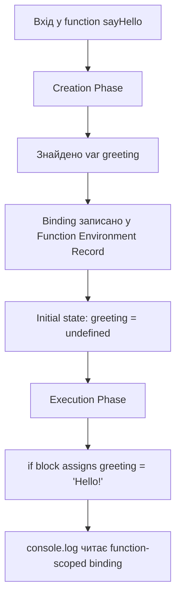
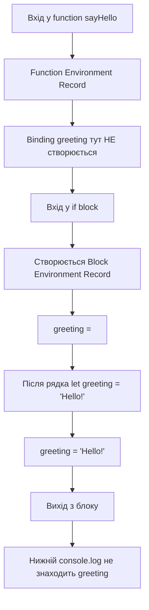
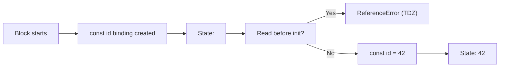
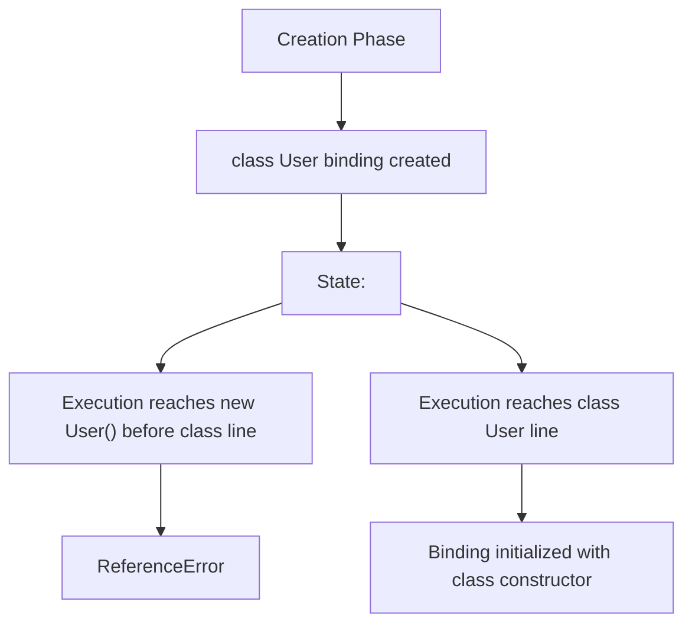
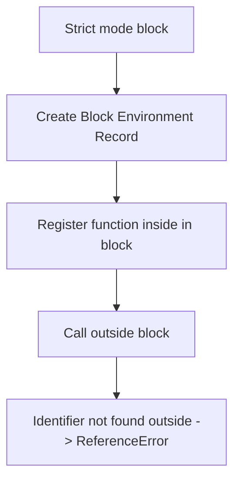

## Declaration instantiation (Підготовка / Створення)

**Declaration instantiation** - це внутрішній механізм(алгоритм) в JS.

Це процес **реєстрації**.
Двигун запускає цей алгоритм, щоб просканувати увесь код, 
знайти всі імена змінних та функцій і створити для них записи в пам'яті.

Це потрібно щоб розуміти імена змінних до того,
як виконання дійде до рядка з їх оголошенням.

Цей механізм існує для підтримки ***нелінійності*** коду.
Дозволяє функціям знати про існування одна одної, незалежно від того, в якому порядку вони записані


Приклад:
```
console.log(a);
let a = 5;
```
### Що поверне цей код?
Цей код поверне помилку: \
`ReferenceError: Cannot access 'a' before initialization`

### Просте пояснення
Ми намагаємося використати змінну `a` до того, як вона була створена.

Двигун JS просканував код і знає про інстування змінної `a`.\
Але використовуючи `let` для оголошення змінної, заборонено використовувати змінну, до її оголошення.

Якщо звернутися до змінної до того як її було оголошено,
ми отримаємо пимилку - це називається ***TDZ***(*Тимчасова мертва зона*).

### Більш технічне пояснення
Розкладемо роботу двигуна на дві фази:

#### Етап 1. Фаза Створення (Creation Phase)

До виконання першого рядка, двигун сканує увесь код.

1. Двигун бачить `let a = 5;`
2. Двигун створює ідентифікатор `a` в пам'яті (Enviroment Record)
3. Потім позначає цю комірку як ***Uninitialized*** тобто неініціалізована.

#### Приблизна візулізація того, як це виглядає після першої фази
```
Stack {
	"a": <uninitialized>
}
```

#### Етап 2. Фаза Виконання (Execution Phase)

Двигун починає виконувати команди.

1. Двигун бачить `console.log(a);`.
2. Двигун йде в ***Memory***(приклад вище) шукати змінну `a`.
3. Двигун знаходить ідентифікатор `a` в ***Memory***.
4. Двигун бачить стан ***Uninitialized***.
5. Двигун бачить заборонений стан та кидає помилку `ReferenceError`.
6. Виконання коду зупиняється.


Праклад з `var`

```
console.log(b);
var b = 2;
```

### Що поверне цей код?

Цей код не впаде з помилкою.
Цей код поверне: `undefined` 

### Просте пояснення
Двигун JavaScript бачить змінну `b` ще до початку виконання коду.
Чому повернулось значення змінної `undefined`?
Бо двигун за правилом, якщо бачить `var` створюю ідентифікатор і відразу кладу туди значення `undefined`.

Тому нам і повертається значення `undefined`.

### Більш технічне пояснення
Аналогічного до попереднього пояснення, розкладемо роботу механізму на два етапи

#### Етап 1. Фаза Створення (Creation Phase)

Рушій сканує код і знаходить `var b = 2;`.

1. **Створення(Creation)**: Двигун створює ідентифікатор в пам'яті(Environment Record)
2. **Ініціалізація(Initialization)**: На відміну від `let`, для `var` рушій одразу виконує ініціалізацію значення `undefined`.

#### Приблизна візулізація того, як це виглядає після першої фази
```
Memory {
	"b": undefined
}
```

Тут немає стану "uninitialized" (TDZ). Змінна готова до читання.

#### Етап 2. Фаза Виконання (Execution Phase)

Двигун починає виконувати команди.

1. Двигун бачить `console.log(b);`.
2. Двигун йде в ***Memory***(приклад вище) шукати змінну `b`.
3. Двигун знаходить ідентифікатор `b` в ***Memory***.
4. Двигун знаходить значення `undefined`.
5. Двигун виводить його в консоль.
6. Виконання коду продовжується.

#### Чому це так працює?

1. **Стійкість до помилок**
На почаотку створення вебу вважалось, що скрипт не повинен падати через порядок рядків.
Повернення `undefined` дозволяє коду працювати далі.

2. **Простото реалізації двигуна**
Простіше виділити пам'ять і занулити її(`undefined`) для всіх змінних на старті,
ніж відстежувати **TDZ** для кожної змінної.


#### Приклад з Function Declaration
Це єдиний випадок у JS, коли можно використовувати сутність повністю до того, як оголосили її.

```
console.log(jump());

function jump() {
	return "Jumping...";
}
```

### Що поверне цей код?

Цей код не впаде з помилкою.
Цей код поверне: `Jumping...`


#### Технічне пояснення

На етапі Creation Phase рушій бачить ключове слово `function`.
1. **Creation**: Він реєструє ім'я `jump`.
2. **Initialization**: Він не чекає. Одразу створює об'єкт функції в купі(Heap). Та записує посилання на нього в змінну `jump`.


На момент виконання коду змінана `jump` вже містить готовий код.

Технічно для двигуна:
1. `jump` - це просто ідентифікатор(ім'я змінної)
2. Сама функція - це спеціальний об'єкт(Function Object).
3. Змінна `jump` зберігає посилання на цей об'єкт.

#### Етап 1. Фаза Створення (Creation Phase)
1. У Heap: Двигун виділяє місце і створює обє'кт функції. Приклад адреси `@829321`.
2. У Stack: Двигун реєструє змінну `jump`.
3. Двигун записує адресу `@829321` у змінну `jump`.

#### Стан пам'яті перед виконанням
```
Stack {
	"jump": <посилання на @829321>
}

Heap {
	@829321: { code: "return 'Jumping...'", type: "function" }
}
```

`Function declaration` — це просто автоматизоване створення змінної, яка містить посилання на об'єкт.

`Creation Phase` робить для неї виняток і заповнює це посилання ще до того, як почнеться виконання.


#### Приклад з Function Expression
Спробуємо записати функцію всередину змінної `var`.

```
console.log(run());

var run = function() {
   return "Running";
};
```

### Що поверне цей код?

Цей код впаде з помилкою.
Цей код поверне: `TypeError: run is not a function`


#### Технічне пояснення
Розкладемо роботу двигуна на дві фази:

#### Етап 1. Фаза Створення (Creation Phase)

На етапі Creation Phase рушій бачить `var run`.
Він ігнорує те що написано праворуч.

1. **Creation**: Він реєструє ім'я `run`.
2. **Initialization**: Оскільки це `var`, він записує туди `undefined`.

#### Етап 2. Фаза Виконання (Execution Phase)
Двигун починає виконання.

1. Намагається викликати `run()`.
2. У пам'яті `run` - це `undefined`.
3. Виклик `undefined()` неможливий - **TypeError**.

#### Стан пам'яті перед виконанням
```
Stack {
	"jump": undefined
}

```

Якщо використати змінну `let`

```
console.log(run());

let run = function() {
  return "Running";
};
```

То буде стандартна для `let` помилка. 

`ReferenceError: Cannot access 'run' before initialization`

## Області видимості: `var` vs `let` / `const`

**Теза:** Declaration Instantiation не можна зрозуміти без **Scope**. Саме scope відповідає на питання, **куди саме** буде записаний binding: у середовище функції чи в окремий блок `{ ... }`.

У JavaScript існує важлива різниця:

- `var` бачить **function scope**;
- `let` і `const` бачать **block scope**.

Це означає, що один і той самий код у `if`, `for` або простому блоці `{ ... }` може створювати bindings у різних контейнерах залежно від типу declaration.

---

### I. Function Scope для `var`

**Теза:** Для `var` справжнім кордоном є лише **функція**. Блоки `if`, `for`, `while` і просто `{ ... }` для нього прозорі.

#### Приклад
```javascript
function sayHello() {
  if (true) {
    var greeting = "Hello!";
  }

  console.log(greeting);
}

sayHello(); // "Hello!"
```

#### Просте пояснення
Хоча змінна `greeting` написана всередині `if`, для `var` це не має значення. Рушій реєструє її не в блоці `if`, а в області видимості всієї функції `sayHello`.

Тому після виходу з `if` змінна не зникає. Вона все ще належить функції і доступна нижче.

#### Технічне пояснення
Під час **Creation Phase** для `sayHello` рушій аналізує все тіло функції та збирає всі `var` declarations у **Function Environment Record**.

Що відбувається:

1. Рушій заходить у тіло функції `sayHello`.
2. Він знаходить `var greeting`.
3. Він **не створює окремий block binding** для `if`.
4. Він реєструє `greeting` у середовищі самої функції.
5. Оскільки це `var`, binding одразу ініціалізується як `undefined`.

Після Creation Phase стан приблизно такий:

```javascript
FunctionEnvironmentRecord(sayHello) = {
  greeting: undefined
}
```

Під час **Execution Phase**:

1. Умова `if (true)` проходиться.
2. Виконується assignment `greeting = "Hello!"`.
3. `console.log(greeting)` читає вже той самий function-scoped binding.

#### Візуалізація


#### Edge Cases / Підводні камені
> **Найчастіша помилка:** новачок бачить `var` всередині `if` і думає, що змінна “належить” цьому `if`. Для `var` це неправда. Блок не створює новий контейнер для такого binding.

> **Цикли `for`:** `var i` у циклі теж належить усій функції, а не окремій ітерації. Саме це породжує класичні баги зі старим значенням `i` у колбеках.

---

### II. Block Scope для `let`

**Теза:** Для `let` кожен блок `{ ... }` створює власний контейнер. Binding живе тільки всередині цього блоку й недоступний зовні.

#### Приклад
```javascript
function sayHello() {
  if (true) {
    let greeting = "Hello!";
  }

  console.log(greeting);
}

sayHello(); // ReferenceError
```

#### Просте пояснення
Тут `greeting` справді належить блоку `if`. Після виходу з блоку цей binding більше не видно. Функція `sayHello` зовні цього імені не має.

#### Технічне пояснення
На відміну від `var`, `let` не потрапляє в основний function-scoped контейнер. Для блоку `if` рушій створює **окремий Block Environment Record**.

Що відбувається:

1. Під час входу в `sayHello` у Function Environment Record binding `greeting` **не створюється**.
2. Коли виконання доходить до блоку `if`, рушій створює нове block lexical environment.
3. Усередині цього block environment створюється binding `greeting`.
4. До рядка `let greeting = "Hello!"` binding перебуває в стані `uninitialized` (TDZ).
5. Після виконання рядка binding отримує значення `"Hello!"`.
6. Після виходу з блоку цей block environment більше не бере участі в identifier resolution для коду нижче.

#### Візуалізація


#### Edge Cases / Підводні камені
> **TDZ всередині блоку:** навіть усередині правильного блоку `let` не можна читати до рядка ініціалізації.

> **Не плутай “binding знищується” і “ім'я невидиме”:** для практичного мислення достатньо вважати, що після виходу з блоку цей binding більше не бере участі в пошуку імені.

---

### III. `const`: те саме block scope, але без переприсвоєння

**Теза:** `const` поводиться так само, як `let`, з погляду Declaration Instantiation: він теж є block-scoped і теж проходить через TDZ. Головна різниця з'являється вже після ініціалізації — `const` не можна переприсвоїти.

#### Приклад
```javascript
{
  console.log(id);
  const id = 42;
}
```

#### Просте пояснення
`const` не є “безпечнішим `var`”. Це блокова змінна, яка до рядка оголошення також недоступна. Тому ми знову отримуємо TDZ-помилку.

#### Технічне пояснення
Під час входу в block scope:

1. Рушій створює binding `id`.
2. Стан binding — `uninitialized`.
3. Спроба читання `id` до виконання рядка `const id = 42` кидає `ReferenceError`.
4. Після ініціалізації binding уже має конкретне значення.
5. Подальша спроба `id = 100` дасть `TypeError`, бо const binding не допускає переприсвоєння.

#### Візуалізація


#### Edge Cases / Підводні камені
> **`const` не робить значення immutable.** Він лише забороняє переприсвоїти сам binding. Якщо всередині лежить object, його внутрішній стан все ще можна мутувати.

---

### IV. `class` теж проходить через TDZ

**Теза:** Оголошення класу (`class`) поводиться ближче до `let` / `const`, ніж до function declaration. Binding класу створюється заздалегідь, але до ініціалізації недоступний.

#### Приклад
```javascript
const user = new User();

class User {
  constructor() {
    this.name = "Artur";
  }
}
```

#### Просте пояснення
Хоча клас схожий на “велике оголошення функції”, використовувати його до рядка `class User {}` не можна. Рушій знає, що таке ім'я існує, але ще не дозволяє читати його.

#### Технічне пояснення
Під час Declaration Instantiation:

1. Рушій створює binding `User`.
2. Стан binding — `uninitialized`.
3. Спроба `new User()` до виконання class declaration читає цей binding занадто рано.
4. Результат — `ReferenceError`, а не `TypeError`.

Це важлива різниця:

- **Function Declaration** -> одразу function object.
- **Class Declaration** -> binding існує, але перебуває в TDZ до моменту ініціалізації.

#### Візуалізація


#### Edge Cases / Підводні камені
> **Часте когнітивне викривлення:** “клас же компілюється у функцію, отже має поводитися як function declaration”. На рівні runtime binding semantics це не так.

---

### V. Function Declaration у блоках

**Теза:** Оголошення функції всередині блоку — одна з найбільш заплутаних частин старого JavaScript. У **Strict Mode** воно поводиться приблизно як block-scoped binding; у **Non-Strict Mode** браузери історично додавали сумісні, але менш чисті правила.

#### Приклад
```javascript
"use strict";

if (true) {
  function inside() {
    return "ok";
  }
}

inside(); // ReferenceError
```

#### Просте пояснення
У strict mode функція `inside` належить блоку `if`, а не зовнішньому scope. Тому за межами блоку її не видно.

#### Технічне пояснення
У сучасному strict-mode мисленні declaration функції в блоці поводиться як окремий block-level binding. Тобто:

1. Для блоку створюється власний Environment Record.
2. Ім'я `inside` реєструється саме там.
3. Поза блоком identifier resolution цього binding не бачить.

У non-strict mode історично існували web-compat винятки, через які браузери могли частково “підіймати” такі функції назовні. Саме тому ця тема довго вважалася джерелом плутанини.

#### Візуалізація


#### Edge Cases / Підводні камені
> **Практична рекомендація:** не покладайся на function declarations усередині блоків для складної логіки. Якщо потрібна передбачуваність, використовуй `const fn = function () {}` або `const fn = () => {}` у чітко видимому scope.

---

### VI. Підсумок: що саме треба винести з цієї статті

| Конструкція | Де створюється binding | Стартовий стан | Чи можна читати до рядка оголошення? |
| :--- | :--- | :--- | :--- |
| `var` | Function scope / global scope | `undefined` | Так |
| `let` | Block scope | `uninitialized` | Ні, TDZ |
| `const` | Block scope | `uninitialized` | Ні, TDZ |
| `function declaration` | Поточний scope | function object | Так |
| `class declaration` | Block або поточний lexical scope | `uninitialized` | Ні, TDZ |

**Головна ідея:** Declaration Instantiation — це не “магічне переміщення коду вверх”. Це підготовчий етап, де рушій створює bindings і задає їм початковий стан. Саме тип declaration визначає:

1. **де** житиме binding;
2. **у якому стані** він стартує;
3. **чи можна** читати його до execution line.
