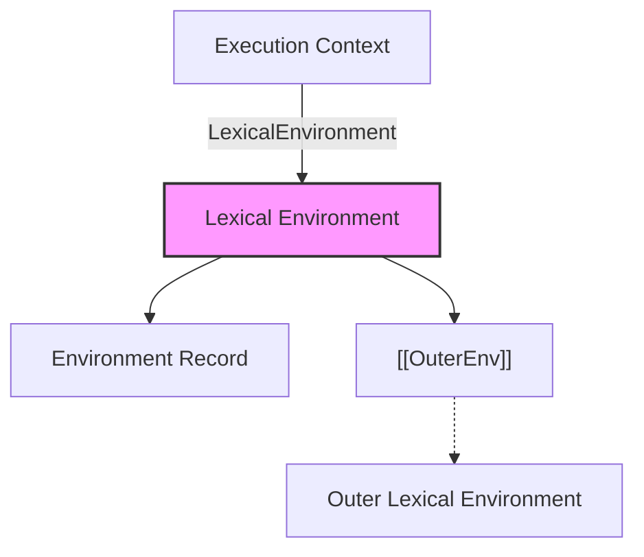

# Lexical Environment 

## I. Що таке Lexical Environment?

**Теза:** Lexical Environment (Лексичне середовище) — це структура даних, яку рушій JavaScript створює для кожного блоку коду, що виконується. Вона виконує три завдання: **зберігає поточний стан** (значення змінних і функцій), **фіксує зв'язки між іменами та значеннями** і **визначає, які імена взагалі видимі** в поточній точці виконання.

### Приклад
```javascript
let appName = 'MyApp'; // (1) LexicalEnvironment зберігає зв'язок: appName → 'MyApp'

function greet() {
  // (2) Тут є власне LexicalEnvironment для функції greet.
  //     Воно не знає про appName напряму.
  let message = `Hello from ${appName}`; // (3) Ім'я appName не знайдено в грeet-середовищі,
                                          //    тому рушій піднімається вверх і знаходить його
                                          //    в зовнішньому (глобальному) середовищі.
  return message;
}

greet(); // 'Hello from MyApp'
```
> **Що тут відбувається:** `greet` має своє LexicalEnvironment з одним записом — `message`. Коли вона звертається до `appName`, його там немає → рушій переходить до **зовнішнього** LexicalEnvironment (глобального) → знаходить `appName → 'MyApp'`. Саме цей трирівневий механізм (стан + зв'язки + скоуп) і є LexicalEnvironment у дії.

### Просте пояснення
Це **закрита структура даних рушія JavaScript**, недоступна з коду напряму — ви не можете написати `lexicalEnv.appName` чи якось звернутися до неї через JS. Рушій управляє нею автоматично. Але розуміння її будови критично важливе, бо саме вона пояснює:
- чому замикання (closures) "пам'ятають" змінні після завершення функції;
- як і чому виникає Temporal Dead Zone для `let`/`const`;
- чому `var` поводиться інакше за `let` у блоках `{}`.

### Технічне пояснення
Lexical Environment — це абстракція рівня специфікації (ECMAScript), яка складається з двох внутрішніх частин (у специфікації їх називають "слотами"). Якщо навести просту аналогію з JavaScript об'єктом, то Lexical Environment — це звичайний об'єкт, а його "внутрішні слоти" — це просто його властивості (ключі), де міститься відповідна інформація. 

Ось як би цей "об'єкт" приблизно виглядав у коді:
```javascript
const LexicalEnvironment = {
  EnvironmentRecord: { ... }, // Перший внутрішній слот
  OuterEnv: <reference>       // Другий внутрішній слот
};
```

Ці два слоти (властивості) відповідають за наступне:
1. **EnvironmentRecord** — це сховище, де реєструються **всі** локальні ідентифікатори поточного скоупу. До ідентифікаторів належать: імена змінних (що містять як примітиви, так і складні об'єкти), імена функцій, параметри/аргументи функцій, класи тощо. Тобто тут лежать самі назви цих сутностей та їхні поточні значення (або посилання на пам'ять).
2. **`[[OuterEnv]]`** — посилання на зовнішнє (батьківське) лексичне середовище. У глобального середовища це значення завжди **гарантовано** дорівнює `null` — це означає, що ми знаходимося на самому верху ієрархії, і обгортаючого (зовнішнього) середовища вище просто немає. Для всіх інших (вкладених) середовищ тут буде посилання на батьківський `LexicalEnvironment`.

**Створення та прив'язка до Execution Context**
*Контекст Виконання (Execution Context)* — це системна "капсула", що створюється рушієм для управління процесом виконання ділянки коду (наприклад, під час кожного виклику функції). Контекст відслідковує, на якому рядку зараз виконання, та іншу внутрішню метаінформацію.
Що саме відбувається під час його ініціалізації: 
- **Створення екземпляра Lexical Environment:** Для кожного нового Контексту Виконання (тобто при кожному виклику функції) створюється абсолютно новий, унікальний об'єкт LexEnv.
- **Прив'язка до контексту:** Новостворений об'єкт LexEnv зв'язується з Контекстом Виконання. Тобто Контекст зберігає всередині себе посилання на цей LexEnv. Тепер, коли коду всередині потрібна змінна, Контекст знає, що її треба шукати у своєму локальному LexEnv.
- **Зв'язок з `this`:** Значення `this` також визначається при створенні Контексту Виконання. У сучасних специфікаціях ECMAScript це значення технічно прив'язується і зберігається саме всередині `EnvironmentRecord` для функції.

### Приблизна візуалізація механізму
Для кращого розуміння, розглянемо простий фрагмент коду та те, як створюються під капотом середовища і контексти.

```javascript
let globalName = "App";

function run(user) {
  let isAdmin = true;
  // (1) Виконання зупинилося тут
}

run("Artur");
```

Ось як виглядають внутрішні структури на моменті **(1)**:

```javascript
// 1. Спочатку (при старті скрипта) створюється Глобальне Середовище
const GlobalLexicalEnvironment = {
  EnvironmentRecord: {
    globalName: "App",
    run: <function object>
  },
  OuterEnv: null // Це найвищий рівень, далі нічого немає
};

// ... Після цього створюється Global Execution Context, який пов'язаний з цим середовищем ...

// 2. Коли викликається функція run("Artur")
// Створюється нове середовище спеціально для цього виклику run
const RunLexicalEnvironment = {
  EnvironmentRecord: {
    user: "Artur",    // аргументи/параметри
    isAdmin: true     // локальні змінні
  },
  OuterEnv: GlobalLexicalEnvironment // посилання на середовище, де функція була ОГОЛОШЕНА
};

// 3. Створюється Контекст Виконання для run та встановлюється зв'язок:
const RunExecutionContext = {
  LexicalEnvironment: RunLexicalEnvironment, // Прив'язка до створеного LexEnv
  // ... у сучасних стандартах this зберігається у самому EnvironmentRecord
  // ... інша інформація (поточний рядок виконання коду тощо)
};
```

### Візуалізація


### Edge Cases / Підводні камені
> **Temporal Dead Zone (TDZ) та Hoisting:** Змінні, оголошені через `let` або `const`, зберігаються в `Environment Record` на етапі створення середовища, але їх первинний стан встановлюється як `uninitialized`. Будь-яке звернення до них до моменту виконання рядка з їх оголошенням призводить до генерації `ReferenceError`. Натомість змінні, створені через `var`, також записуються в Environment Record під час його створення, але відразу ініціалізуються значенням `undefined` (що є суттю механізму "підйому" або Hoisting).

---

## II. Складові частини (The Components)

**Теза:** Будь-який об'єкт Lexical Environment складається з Environment Record, що відповідає за зберігання, та Outer Reference, що виступає в ролі вказівника на батьківську структуру.

### Приклад
```javascript
function init(config) {
  var mode = 'production';
  let retries = 3;
  
  function doWork() {}
}
```

### Просте пояснення
Функція створює власне локальне середовище, коли виконується. `mode`, `retries` та `doWork` зберігаються в локальному записі (Record). Якщо всередині `init` викличеться інша функція, для неї внутрішній Outer Reference вказуватиме на середовище `init`.

### Технічне пояснення
Існує строга ієрархія типів записів у специфікації:
- **Declarative Environment Record:** Зберігає ідентифікатори (змінні, класи), безпосередньо визначені в коді. Його нащадками є два критичні типи:
  - **Function Environment Record:** Обов'язкова структура для всіх нормальних функцій. Саме вона містить логіку та поля для збереження стану абстракцій `this`, `super` та `new.target`.
  - **Module Environment Record:** Використовується для ES-модулів (зберігає розрізнення імпортів).
- **Object Environment Record:** Динамічно зв'язує ідентифікатори з властивостями існуючого об'єкта (Binding Object). Використовується для глобального об'єкта.
- **Global Environment Record:** Композитний рекорд, який об'єднує Object ER (для `window`/`globalThis`) та Declarative ER (для глобальних `let`/`const`).

### Візуалізація
> 🎮 **Інтерактивна схема:** ми перенесли цю діаграму у повноцінний інтерактивний формат для глибокого структурного аналізу.  
> [👉 **Відкрити візуалізатор ієрархії Environment Record (HTML)**](../../visualisation/lex-env-components/index.html)

### Edge Cases / Підводні камені
> **with та catch:** Конструкція `with(obj)` створює новий тимчасовий **Object Environment Record**, що обертає `obj`. Це уповільнює роботу компілятора, тому `with` суворо заборонено у Strict Mode. Водночас блок `catch(e)` створює власний мінімалістичний **Declarative Environment Record** лише для ізоляції ідентифікатора помилки `e`.

---

## III. Статична (Лексична) область видимості

**Теза:** Область видимості ідентифікаторів у JavaScript визначається лексично (Static Scope), тобто під час парсингу коду на основі його **фізичної (текстової) вкладеності**, а не під час його виклику (Dynamic Scope).

### Приклад
```javascript
function createCounter() {
  let count = 0;
  
  return function increment() {
    count++;
    console.log(`Current: ${count}`);
  };
}

const counter = createCounter();
counter(); // 1
counter(); // 2
```

### Просте пояснення
Мова працює так, що кожна функція ніби "фотографує" своє оточення в момент свого створення. Навіть якщо ми повернемо функцію `increment` зсередини `createCounter`, покладемо її у змінну `counter` і викличемо десь в іншому місці (хоч в іншому файлі!), вона назавжди "пам'ятатиме", де саме була написана. Вона шукатиме змінну `count` не там, де її викликали, а лише там, де вона фізично народилася. Це дозволяє безпечно зберігати і змінювати приватні дані між численними викликами (цей ефект і називається **замиканням**).

### Технічне пояснення
Як саме рушій V8 та специфікація ECMAScript забезпечують цю "статичну та завжди правильну пам'ять"? Під капотом працює геніально простий механізм внутрішніх прихованих слотів:
1. **Етап створення функції (Function Creation Phase):** Коли парсер зустрічає декларацію функції (або створюється function expression), створюється `Function Object` у купі (Heap). На цьому об'єкті рушій ініціалізує прихований статичний слот **`[[Environment]]`**, куди міцно записується посилання на *поточний* активний Lexical Environment, що працював у момент створення об'єкта функції.
2. **Етап виконання (Function Execution Phase):** Згодом, коли функцію нарешті викликають і для неї потрібно створити новий власний Lexical Environment, рушій дістає значення зі збереженого слота **`[[Environment]]`** та копіює його у свій динамічний вказівник **`[[OuterEnv]]`** нового середовища. 

Завдяки цьому ланцюжок видимості Scope Chain завжди жорстко зафіксований моментом *створення*, і ніколи не залежить від непередбачуваного динамічного Call Stack. Це рятує нас від критичної проблеми глобального втручання в змінні, яка постійно зустрічається в мовах з Dynamic Scope.

### Візуалізація
> 🎮 **Інтерактивна схема:** ми підготували детальну анімацію життєвого циклу замикання (Closures) та внутрішнього слота `[[Environment]]` у V8.  
> [👉 **Відкрити візуалізатор статичної області видимості (HTML)**](../../visualisation/execution-model/02-lexical-environment/lex-env-static-scope/index.html)

### Edge Cases / Підводні камені
> - **Життєвий цикл пам'яті (Memory Leak potential):** Коли `createCounter` закінчує роботу, її контекст виконання знищується та гарантовано вичищається зі стека. Однак її Lexical Environment (із змінною `{ count: 0 }`) **не буде** видалений Garbage Collector'ом. Чому? Тому що повернутий у глобальну область об'єкт функції `increment` все ще "тримає" цей Lexical Environment через своє посилання в `[[Environment]]`. Він продовжує автономно ізольовано "жити" на купі (Heap). Середовище буде знищене GC тільки тоді, коли зникне сама змінна `counter`. Якщо таких замикань багато, можливий витік пам'яті.
> - **`new Function()`:** Це єдиний унікальний виняток із загального правила лексичності! Якщо функція динамічно конструюється через `new Function('code')`, рушій ігнорує поточне середовище, де це сталося, і її слот `[[Environment]]` **завжди** жорстко ініціалізується посиланням на **Global Environment**. Вона не може утворити локального замикання.

---

## IV. Алгоритм пошуку (Resolution)

**Теза:** Identifier Resolution (пошук ідентифікатора) здійснюється рекурсивно — він завжди починається знизу і підіймається вгору по ланцюжку Outer References.

### Приклад
```javascript
var val = 'global';
let out = 'outer';

function shadowTest() {
  const val = 'local';
  
  console.log(val);     // 'local' (Затінення/Shadowing)
  console.log(out);     // 'outer' (Знаходить рекурсивно вище)
  console.log(missing); // ReferenceError (Ніде не знайдено)
}

shadowTest();
```

### Просте пояснення
Коли рушію потрібно дізнатись значення змінної `val`, він спочатку перевіряє поточне середовище (досить часто це внутрішня функція). Якщо запису немає, він переходить до зовнішнього середовища і повторює перевірку. Цей процес триває, поки змінна не знайдеться, або не закінчаться середовища.

### Технічне пояснення
Згідно ECMA-262, алгоритм `GetIdentifierReference(env, name, strict)` працює за таким принципом:
1. Якщо `env` — це `null`, алгоритм повертає структуру **Reference Record** з позначкою "unresolvable", що згодом генерує `ReferenceError`.
2. Перевіряється `HasBinding(name)` в `env.EnvironmentRecord`.
3. Якщо ідентифікатор знайдений, повертається **Reference Record**.
4. Якщо ні, рекурсивно викликається `GetIdentifierReference(env.[[OuterEnv]], name, strict)`.

### Візуалізація
> 🎮 **Інтерактивна схема:** ми підготували покрокову анімацію алгоритму `GetIdentifierReference(env, name)` для глибокого розуміння підйому по ланцюжку (Scope Chain).  
> [👉 **Відкрити візуалізатор алгоритму пошуку (HTML)**](../../visualisation/execution-model/02-lexical-environment/lex-env-resolution/index.html)

### Edge Cases / Підводні камені
> - **Точність контексту `this`:** Алгоритм `ResolveThisBinding()` викликає абстрактну операцію `GetThisEnvironment()`, яка рекурсивно йде вгору по всьому ланцюжку `[[OuterEnv]]`, ігноруючи `Block ER` чи стрілкові функції (де `HasThisBinding()` дорівнює `false`), поки не знайде найближчий `Function Environment Record` (звичайної функції) або `Global Environment Record`. Саме тому стрілкові функції прозорі для `this`.
> - **Shadowing (Втрата доступу):** Якщо ви викликали затінення (наприклад, `const val = 'local'`), оригінальний зовнішній ідентифікатор `val` більше недоступний за прямим ім'ям через Lexical Environment. Але якщо затінена глобальна змінна була оголошена через `var`, її все ще можна прочитати як властивість глобального об'єкта: `globalThis.val`. Для глобальних `let` / `const` такий обхідний шлях не діє.
> - **Перформанс у V8:** Рекурсивний підйом по ланцюжку вгору (Runtime Resolution) — це декларація специфікації. У реальних рушіях на кшталт V8 пошук змінних на рівні V8 відносно Scope Chain повністю статично аналізується і компілюється під час парсингу (Static Scope Mapping). Під час швидкого виконання V8 уже знає точну фізичну адресу (register або context heap allocation) цієї змінної і забирає її на етапі O(1), без жодних рекурсій.

---

## V. Порівняння: Lexical vs Variable Environment

**Теза:** Для підтримки зворотної сумісності (`var`) та безпеки блочного коду (`let`/`const`) один Execution Context використовує два окремі вказівники: **Lexical Environment** та **Variable Environment**.

### Приклад
```javascript
function executionContextDemo() {
  var funcScoped = 1;
  {
    let blockScoped = 2;
    var hoistedVar = 3;
  }
}
```

### Просте пояснення
Рушій розділяє збереження старих (function-scoped `var`) та нових (block-scoped `let`/`const`) змінних. Коли код входить у блок `{ ... }`, створюється тимчасове середовище лише для блочних змінних. Всі `var` з цього ж блоку зберігатимуться не в ньому, а в основному середовищі функції.

### Технічне пояснення
Як рушій V8 змусив працювати старий код з `var` (який ігнорує блоки) та новий код з `let`/`const` (який їх поважає) в межах однієї функції? До специфікації ES6 було додано архітектурне роздвоєння покажчиків всередині Execution Context:
- **VariableEnvironment (Статичний вказівник):** Фіксований лінк на базове середовище функції (Function ER), який створюється при її запуску. Він залишається **нерухомим** протягом всього виконання функції. У нього записуються виключно `var` та Function Declarations (через механізм Hoisting).
- **LexicalEnvironment (Динамічний вказівник):** На старті дублює `VariableEnvironment`. Але коли потік коду заходить у будь-який блок `{...}`, створюється тимчасовий Block Environment Record. У цей момент `LexicalEnvironment` динамічно **перемикається** на нього. У новому рекорді осідають блочні `let` та `const`. Після виходу з блоку вказівник перемикається назад. 

Саме тому, якщо ви напишете `var y = 2` всередині блоку `{...}`, рушій свідомо проігнорує тимчасовий `LexicalEnvironment` рекорду та напряму відправить змінну у `VariableEnvironment` (Function ER).

### Візуалізація
> 🎮 **Інтерактивна схема:** ми наочно візуалізували динамічне перемикання (роздвоєння вказівників) LexicalEnvironment та стаціонарність VariableEnvironment у момент входу в блочну структуру `{...}` за допомогою SVG-анімації.  
> [👉 **Відкрити візуалізатор вказівників (HTML)**](../../visualisation/execution-model/02-lexical-environment/lex-env-vs-var-env/index.html)

### Edge Cases / Підводні камені
> **Function Declaration в блоках:** Згідно специфікації Strict Mode, оголошення функції `{ function foo() {} }` поводиться як `let` і зв'язується з блочним **LexicalEnvironment**. Проте в Non-Strict Mode вона частково "підіймається" і прив'язується також до **VariableEnvironment** (з міркувань зворотної сумісності для старого веб-коду), що спричиняє плутанину. Тому рекомендовано завжди використовувати Strict Mode та `const foo = function() {}`.

## Фінальний підсумок (Mastery)

> 🎓 **Masterclass Візуалізація:** Ми зібрали всі 5 концепцій з цієї статті (від створення Global Environment до замикань, поділу VE/LE та алгоритму пошуку Resolution) в одну загальну динамічну візуалізацію життєвого циклу пам'яті V8. 
> [👉 **Відкрити підсумковий магістерський візуалізатор (HTML)**](../../visualisation/execution-model/02-lexical-environment/master-lifecycle/index.html)


