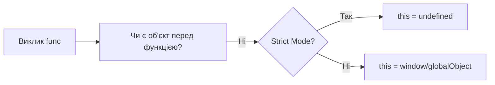
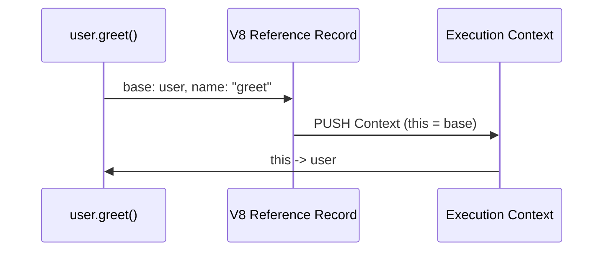
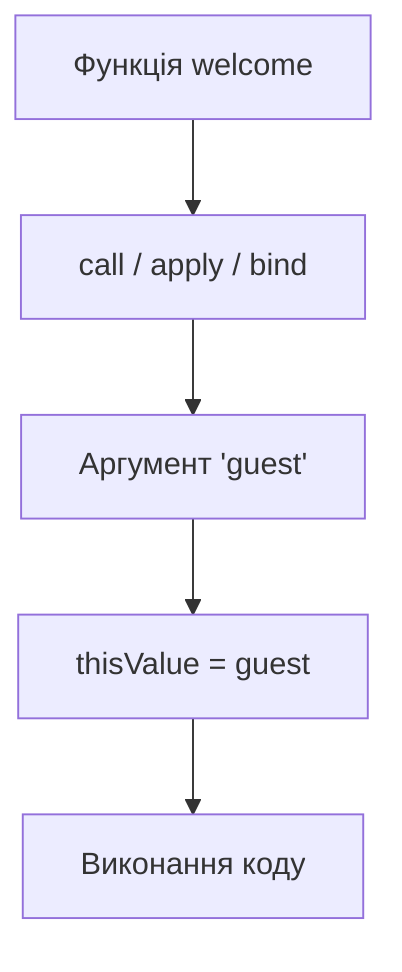
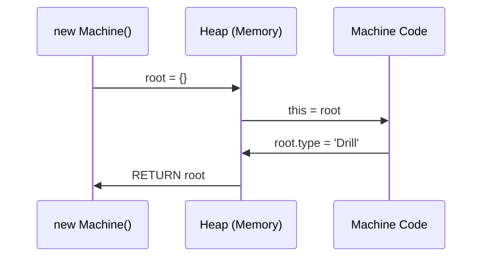

# 04. This Binding (Прив’язка контексту)

Ключове слово **`this`** у JavaScript — це не просто вказівник на об'єкт. Це динамічний ідентифікатор, значення якого визначається **лише в момент виклику функції** (крім стрілкових функцій). Якщо `Lexical Environment` відповідає на питання "Де була написана змінна?", то `this` відповідає на питання "Хто викликав код?".

Розуміння `this` критично важливе для опанування ООП у JS та розуміння того, як рушій V8 налаштовує `Execution Context`.

---

## I. Global Binding (За замовчуванням)

**Теза:** Якщо функція викликається без жодного контексту (`func()`), значення `this` за замовчуванням прив'язується до Глобального об'єкта (`window` або `global`).

### Приклад
```javascript
function showThis() {
  console.log(this);
}

showThis(); // window (Browser) / global (Node)
```

### Просте пояснення
Коли ви викликаєте функцію "просто так", рушій не знає, якому об'єкту вона належить. У такому разі він автоматично підставляє головний об'єкт середовища. 
> ⚠️ У **Strict Mode** (`'use strict'`) таке поводження заблоковано, і `this` буде `undefined`.

### Технічне пояснення
Згідно специфікації, при створенні `Function Execution Context` для звичайної функції викликається абстрактна операція `ResolveThisBinding()`. Якщо під час виклику базис (base) посилання є `undefined`, рушій перевіряє режим. У нестрогому режимі він дістає значення `Global Environment Record.ObjectRecord.BindingObject`, яким і є глобальний об'єкт.

### Візуалізація


### Edge Cases / Підводні камені
Втрата контексту в колбеках: якщо передати метод об'єкта як колбек (`setTimeout(obj.method, 1000)`), він буде викликаний як звичайна функція, і `this` стане глобальним об'єктом.

---

## II. Implicit Binding (Неявна прив’язка)

**Теза:** Коли функція викликається як метод об'єкта (`obj.method()`), `this` автоматично вказує на об'єкт, що стоїть ліворуч від крапки на момент виклику.

### Приклад
```javascript
const user = {
  name: 'Artur',
  greet() {
    console.log(`Hi, I am ${this.name}`);
  }
};

user.greet(); // 'Hi, I am Artur'
```

### Просте пояснення
Об'єкт перед крапкою стає "власником" виклику. Вся магія відбувається саме тоді, коли ви ставите крапку та дужки.

### Технічне пояснення
Під час виконання виразу `user.greet()`, парсер створює спеціальну структуру — **Reference Record**. Вона складається з трьох частин: `base` (об'єкт `user`), `name` (рядок `'greet'`) та флаг `strict`. Коли викликається наступна операція `GetValue`, рушій бачить, що `base` — це об'єкт, і під час створення контексту передає цей `base` у слот `thisValue` нового `Environment Record`.

### Візуалізація


### Edge Cases / Підводні камені
**Shadowing (Nested Objects):** Якщо ви викликаєте `a.b.c.method()`, `this` буде вказувати тільки на `c` (найближчий до крапки об'єкт).

---

## III. Explicit Binding (Явна прив’язка)

**Теза:** Ми можемо примусово вказати рушію, що саме має бути в `this`, використовуючи методи `call`, `apply` або `bind`.

### Приклад
```javascript
function welcome() {
  console.log(`Hello, ${this.user}`);
}

const guest = { user: 'Guest' };

welcome.call(guest); // Hello, Guest
```

### Просте пояснення
Це спосіб сказати рушію: "Забудь про правила крапки чи глобального об'єкта. Використовуй ось цей об'єкт як `this`".
- `call` та `apply` викликають функцію негайно.
- `bind` створює нову версію функції з "приклеєним" контекстом.

### Технічне пояснення
Ці методи є частиною `Function.prototype`. Методи `call/apply` викликають внутрішню операцію `[[Call]]` функціонального об'єкта, передаючи перший аргумент безпосередньо в параметр `thisArgument`. Метод `bind` створює новий **Exotic Bound Function Object**, який зберігає `[[BoundThis]]` у внутрішньому стані і завжди підставляє його при виклику.

### Візуалізація


---

## IV. New Binding (Конструктор)

**Теза:** Коли функція викликається з оператором `new`, рушій створює новий порожній об'єкт і прив'язує його до `this` всередині цієї функції.

### Приклад
```javascript
function Machine(type) {
  this.type = type;
}

const drill = new Machine('Drill');
console.log(drill.type); // 'Drill'
```

### Просте пояснення
`new` — це команда рушію: "Створи новий екземпляр, нехай функція його наповнить властивостями через `this`, а потім поверни його мені".

### Технічне пояснення
Оператор `new` запускає внутрішній алгоритм `[[Construct]]`:
1. Створюється новий об'єкт `{}`, прототип якого встановлюється на `Constructor.prototype`.
2. Викликається функція з цим об'єктом як `thisValue`.
3. Якщо функція не повертає явно інший об'єкт, автоматично повертається `this`.

### Візуалізація


---

## V. Lexical This (Стрілкові функції)

**Теза:** Стрілкові функції **не мають власного `this`**. Вони захоплюють (замикають) значення `this` з того місця, де вони були **написані** (Outer Lexical Environment).

### Приклад
```javascript
const group = {
  title: 'JS Lab',
  show() {
    setTimeout(() => {
      console.log(this.title); // Працює! this взято з show()
    }, 100);
  }
};
group.show();
```

### Просте пояснення
Стрілка поводиться як звичайна змінна. Якщо вона не знаходить `this` у собі (а вона ніколи його не має), вона просто піднімається на один рівень вище в коді та "позичає" його звідти.

### Технічне пояснення
До стрілкових функцій не застосовуються правила `this`. Вони не мають операції `ResolveThisBinding`. Коли рушій бачить `this` у стрілці, спрацьовує стандартний алгоритм **Identifier Resolution**: він шукає `this` в поточному `Environment Record`. Оскільки в стрілковому Ер його немає, рушій переходить по `[[OuterEnv]]` до батьківського контексту.

---

## VI. Правила пріоритету (The Hierarchy)

Якщо на один виклик діють кілька правил одночасно, JS використовує таку чергу:

1. **`new` Binding** (вищий пріоритет)
2. **Explicit Binding** (`call/apply/bind`)
3. **Implicit Binding** (метод об'єкта)
4. **Default Binding** (нижчий пріоритет)

> [!IMPORTANT]
> **Стрілкові функції неможливо "перебити":** методи `bind/call` і навіть оператор `new` не зможуть змінити `this` у стрілковій функції. Вона завжди вірна своєму лексичному оточенню.
