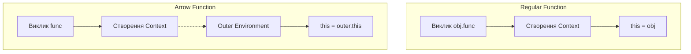

# 05. Arrow vs Regular Functions (Стрілкові проти Звичайних)

Вибір між `function` та `() =>` у сучасному JavaScript — це не питання стилю чи довжини коду. Це вибір між двома фундаментально різними механізмами обробки контексту (`this`), пам'яті та можливостей конструювання об'єктів.

---

## I. Динамічний vs Лексичний `this`

**Теза:** Звичайна функція отримує `this` у момент **виклику** (Dynamic Binding), тоді як стрілкова функція "захоплює" `this` у момент **створення** з оточуючого коду (Lexical Binding).

### Приклад
```javascript
const runner = {
  name: 'Runner',
  regular() { console.log('Regular:', this.name); },
  arrow: () => { console.log('Arrow:', this.name); }
};

runner.regular(); // Regular: Runner
runner.arrow();   // Arrow: undefined (бачить глобальний name)
```

### Просте пояснення
Звичайна функція чекає на "господаря" (об'єкт перед крапкою). Стрілкова функція — це "командний гравець", вона не має свого Его (`this`) і завжди використовує `this` своєї "сім'ї" (місця, де її написали).

### Технічне пояснення
Для звичайних функцій V8 створює `this` запис у `Function Environment Record`. Для стрілкових функцій слот `[[ThisBindingStatus]]` встановлено в `lexical`. Це означає, що операція `ResolveThisBinding()` у стрілці не створює нове значення, а запускає **Identifier Resolution** — рекурсивний пошук `this` по ланцюжку `[[OuterEnv]]`.

### Візуалізація


---

## II. Конструктори та `[[Construct]]`

**Теза:** Звичайні функції можуть бути конструкторами (їх можна викликати через `new`), а стрілкові — ні.

### Приклад
```javascript
function Reg() {}
const arrow = () => {};

new Reg();   // Працює (об'єкт створено)
new arrow(); // TypeError: arrow is not a constructor
```

### Просте пояснення
Звичайна функція має "інструкцію по збиранню" нових об'єктів. Стрілкова функція — це просто алгоритм для виконання, вона не вміє створювати нові екземпляри.

### Технічне пояснення
Об'єкти звичайних функцій мають внутрішній метод **`[[Construct]]`** та властивість `prototype`. Стрілкові функції позбавлені обох. Коли рушій бачить `new`, він перевіряє наявність `[[Construct]]`. Якщо його немає — кидається `TypeError`. Це також економить пам'ять, бо стрілки важать менше (не мають об'єкта прототипу).

### Візуалізація
```mermaid
graph LR
    Regular[Regular Function] --> HasC{[[Construct]]?}
    HasC -- Так --> New[new OK]
    
    Arrow[Arrow Function] --> NoC{[[Construct]]?}
    NoC -- Ні --> Error[TypeError]
```

---

## III. Об'єкт `arguments`

**Теза:** Стрілкові функції не мають власного локального об'єкта `arguments`.

### Приклад
```javascript
function showArgs() {
  console.log(arguments);
}

const showArgsArrow = () => {
  console.log(arguments); // ReferenceError (якщо немає в outer)
};
```

### Просте пояснення
У звичайній функції ви автоматично отримуєте список усіх переданих значень. У стрілці такого списку немає (треба використовувати `...rest` параметри).

### Технічне пояснення
При створенні `Function Environment Record` для звичайної функції рушій автоматично створює ініціалізований запис `arguments`. Для стрілок цей крок пропускається. Стрілка шукає `arguments` лексично, так само як і `this`.

---

## IV. Методи `call`, `apply`, `bind`

**Теза:** Методи примусової зміни контексту не працюють для стрілкових функцій.

### Приклад
```javascript
const fn = () => console.log(this);
fn.call({ a: 1 }); // this все одно Global/Outer
```

### Просте пояснення
Ви не можете "переманити" стрілку на інший об'єкт. Вона назавжди вірна тому `this`, який бачила при народженні.

### Технічне пояснення
Хоча методи `call/apply/bind` існують у прототипі стрілки (бо вона наслідується від `Function.prototype`), внутрішня логіка цих методів намагається змінити `thisValue` у `Function Environment Record`. Оскільки у стрілки статус `lexical`, ці спроби ігноруються на рівні специфікації.

---

## V. Підсумкова таблиця

| Особливість | Regular Function | Arrow Function |
| :--- | :--- | :--- |
| **Прив'язка this** | Динамічна (moment of call) | Лексична (moment of creation) |
| **Використання new** | Так, є `[[Construct]]` | Ні, немає `[[Construct]]` |
| **arguments** | Доступний локально | Відсутній (використовує outer) |
| **prototype** | Має за замовчуванням | Не має |
| **this у методах .call/.apply** | Змінюється | Ігнорується |

---

## Edge Cases / Підводні камені

> [!WARNING]
> **Методи в класах та об'єктах:**
> Якщо ви використовуєте стрілку як метод об'єкта (`obj = { a: () => ... }`), `this` НЕ буде вказувати на `obj`. Він вкаже на те, що було `this` у момент створення об'єкта (зазвичай `window`). 
> **Рішення:** Для методів об'єктів завжди використовуйте звичайні функції або скорочений синтаксис `method() { ... }`.

> [!TIP]
> **Автоматичний bind:**
> Стрілки ідеальні для колбеків у `setTimeout` або обробників подій у React-класах, оскільки вони автоматично "замикають" правильний контекст класу і не потребують `.bind(this)`.
