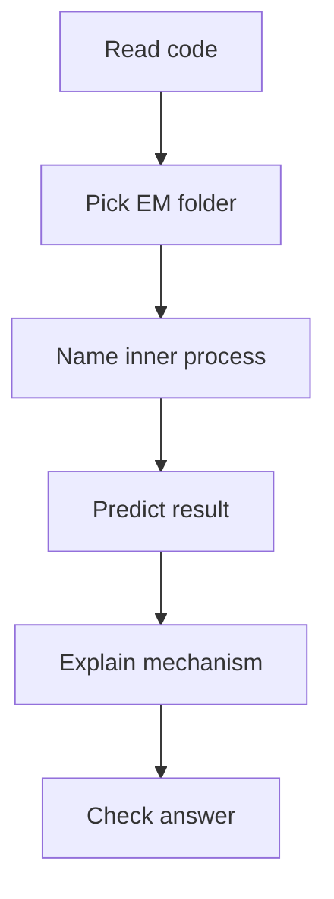

# 06. Practice Lab: Execution Model

Цей lab не про “вгадати, що виведе консоль”. Його мета — навчитися читати JS-код через **п'ять великих папок Execution Model**:

1. **Declaration Instantiation** — як JS готує імена перед виконанням.
2. **Lexical Environment** — де імена живуть і як JS їх шукає.
3. **Execution Context Stack** — хто зараз виконується.
4. **This Binding** — хто є `this` для regular function.
5. **Arrow vs Regular** — чи функція має власний `this`.

---

## I. Як проходити цей Lab

Для кожної задачі не починай із відповіді. Спочатку пройди однаковий workflow:

1. Назви активну “папку”: Declaration Instantiation, Lexical Environment, Execution Context Stack, This Binding або Arrow vs Regular.
2. Назви inner process: binding creation, initial state, identifier resolution, scope chain, push/pop, call-site, lexical this.
3. Передбач результат.
4. Поясни результат одним реченням через механізм.
5. Якщо помилився, повернися не до всього блоку, а до конкретної папки.



---

## II. Declaration Instantiation Tasks

### Task 1
```javascript
console.log(a);
var a = 10;
```

**Що перевіряємо:** `var` binding creation і initial state `undefined`.

### Task 2
```javascript
console.log(a);
let a = 10;
```

**Що перевіряємо:** `let` binding існує, але перебуває в `uninitialized` / TDZ.

### Task 3
```javascript
run();

function run() {
  console.log("running");
}
```

**Що перевіряємо:** function declaration отримує function object до execution.

### Task 4
```javascript
run();

var run = function () {
  console.log("running");
};
```

**Що перевіряємо:** function expression справа не виконується під час Declaration Instantiation; `run` як `var` стартує з `undefined`.

### Task 5
```javascript
{
  console.log(value);
  const value = 42;
}
```

**Що перевіряємо:** block-scoped `const` і TDZ всередині block environment.

---

## III. Lexical Environment Tasks

### Task 6
```javascript
const name = "global";

function show() {
  const name = "local";
  console.log(name);
}

show();
```

**Що перевіряємо:** local binding shadowing global binding.

### Task 7
```javascript
const name = "global";

function outer() {
  function inner() {
    console.log(name);
  }

  inner();
}

outer();
```

**Що перевіряємо:** Identifier Resolution через scope chain.

### Task 8
```javascript
function makeCounter() {
  let count = 0;

  return function inc() {
    count++;
    console.log(count);
  };
}

const inc = makeCounter();
inc();
inc();
```

**Що перевіряємо:** closure retention через `[[Environment]]`.

### Task 9
```javascript
let value = "outer";

{
  let value = "block";
}

console.log(value);
```

**Що перевіряємо:** block scope і знищення block binding після виходу з блоку.

### Task 10
```javascript
function read() {
  console.log(missing);
}

read();
```

**Що перевіряємо:** unresolvable reference після проходу scope chain до `null`.

---

## IV. Execution Context Stack Tasks

### Task 11
```javascript
function b() {
  console.log("b");
}

function a() {
  console.log("a:start");
  b();
  console.log("a:end");
}

console.log("global:start");
a();
console.log("global:end");
```

**Що перевіряємо:** PUSH/POP і suspended caller.

### Task 12
```javascript
function first() {
  second();
  console.log("first:end");
}

function second() {
  console.log("second");
}

first();
```

**Що перевіряємо:** return flow після POP `second`.

### Task 13
```javascript
function loop() {
  loop();
}

loop();
```

**Що перевіряємо:** stack growth і stack overflow risk.

---

## V. This Binding Tasks

### Task 14
```javascript
const user = {
  name: "Artur",
  show() {
    console.log(this.name);
  }
};

user.show();
```

**Що перевіряємо:** implicit binding через `obj.method()`.

### Task 15
```javascript
const user = {
  name: "Artur",
  show() {
    console.log(this.name);
  }
};

const fn = user.show;
fn();
```

**Що перевіряємо:** detached method і default binding / `undefined` у strict-like environments.

### Task 16
```javascript
function show() {
  console.log(this.name);
}

show.call({ name: "Call" });
```

**Що перевіряємо:** explicit binding через `call`.

### Task 17
```javascript
function User(name) {
  this.name = name;
}

const user = new User("New");
console.log(user.name);
```

**Що перевіряємо:** `new` binding і `[[Construct]]`.

---

## VI. Arrow vs Regular Tasks

### Task 18
```javascript
const user = {
  name: "Artur",
  regular() {
    console.log(this.name);
  },
  arrow: () => {
    console.log(this.name);
  }
};

user.regular();
user.arrow();
```

**Що перевіряємо:** regular own `this` vs arrow lexical `this`.

### Task 19
```javascript
function outer() {
  const arrow = () => {
    console.log(arguments[0]);
  };

  arrow("inner");
}

outer("outer");
```

**Що перевіряємо:** arrow не має власного `arguments`; шукає outer `arguments`.

### Task 20
```javascript
const Fn = () => {};
new Fn();
```

**Що перевіряємо:** arrow function не має `[[Construct]]`.

---

## VII. Mixed Tasks

### Task 21
```javascript
var name = "global";

const user = {
  name: "user",
  show() {
    function inner() {
      console.log(this.name);
    }

    inner();
  }
};

user.show();
```

**Що перевіряємо:** lexical nesting не задає `this`; `inner()` викликається як plain function.

### Task 22
```javascript
const name = "global";

const user = {
  name: "user",
  show() {
    const inner = () => {
      console.log(this.name);
    };

    inner();
  }
};

user.show();
```

**Що перевіряємо:** arrow бере `this` з `show`, а `show` отримує `this` через `user.show()`.

### Task 23
```javascript
function makeUser(name) {
  return {
    name,
    show() {
      console.log(name, this.name);
    }
  };
}

const user = makeUser("closure");
user.name = "object";
user.show();
```

**Що перевіряємо:** одночасно closure lookup (`name`) і implicit this binding (`this.name`).

---

## VIII. Short Answers / Hints

1. `undefined`; `var a` отримує binding зі стартовим значенням `undefined`.
2. `ReferenceError`; `let a` у TDZ до виконання рядка ініціалізації.
3. `"running"`; function declaration уже має function object.
4. `TypeError`; `run` на момент виклику дорівнює `undefined`.
5. `ReferenceError`; `const value` існує в block scope, але ще uninitialized.
6. `"local"`; локальний binding shadow-ить глобальний.
7. `"global"`; `inner` не знаходить `name` локально й іде в outer/global scope.
8. `1`, потім `2`; `inc` тримає environment `makeCounter`.
9. `"outer"`; block binding зник після блоку, outer binding не змінився.
10. `ReferenceError`; ім'я не знайдено до кінця scope chain.
11. `"global:start"`, `"a:start"`, `"b"`, `"a:end"`, `"global:end"`.
12. `"second"`, `"first:end"`; після POP `second` виконання повертається в `first`.
13. `RangeError` / maximum call stack size exceeded.
14. `"Artur"`; receiver у call-site `user.show()` — `user`.
15. У strict mode `TypeError` або `undefined`-подібний результат залежно від середовища; method detached від receiver.
16. `"Call"`; `call` явно задає `this`.
17. `"New"`; `new` створює object і передає його як `this`.
18. `regular` виведе `"Artur"`; arrow не бере `this` з `user.arrow()`.
19. `"outer"`; arrow читає outer `arguments`.
20. `TypeError: Fn is not a constructor`.
21. Plain `inner()` не отримує `this` від `user.show()`.
22. `"user"`; arrow бере `this` з regular `show`.
23. `"closure object"`; перше `name` з closure, друге з receiver object.

---

## IX. Step-by-Step Example Answer

Для будь-якої задачі відповідь має виглядати так:

```text
Task 23:
1. Active folders: Lexical Environment + This Binding.
2. `name` шукається через lexical scope і знаходиться в environment makeUser.
3. `this.name` залежить від call-site `user.show()`, тому this = user.
4. user.name був змінений на "object".
5. Результат: "closure object".
```

Якщо твоя відповідь містить лише “виведе X”, це ще не практика Execution Model. Це просто вгадування результату.

---

## X. Suggested Review

Після цього lab повернись до:

- [00 Big Picture](../00-big-picture/README.md)
- [01 Declaration Instantiation](../01-declaration-instantiation/README.md)
- [02 Lexical Environment](../02-lexical-environment/README.md)
- [03 Execution Context Stack](../03-execution-context-stack/README.md)
- [04 This Binding](../04-this-binding/README.md)
- [05 Arrow vs Regular Functions](../05-arrow-vs-regular/README.md)

І окремо відкрий:

- [Execution Model Atlas](../../visualisation/execution-model/00-big-picture/execution-model-atlas/index.html)
- [Declaration Instantiation Lifecycle](../../visualisation/execution-model/01-declaration-instantiation/instantiation-lifecycle/index.html)
- [Lexical Environment Resolution](../../visualisation/execution-model/02-lexical-environment/lex-env-resolution/index.html)
- [Call Stack Lifecycle](../../visualisation/execution-model/03-execution-context-stack/call-stack/index.html)
- [This Binding Visualizer](../../visualisation/execution-model/04-this-binding/index.html)
- [Arrow vs Regular Visualizer](../../visualisation/execution-model/05-arrow-vs-regular/index.html)
