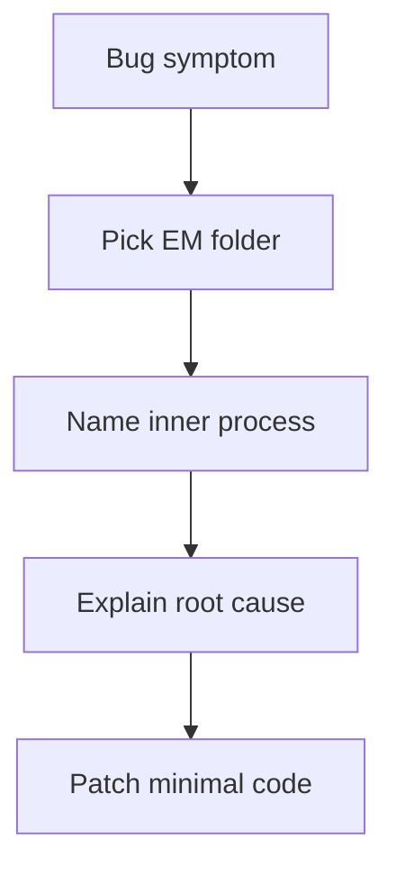

# 07. Bug Lab: Execution Model

Цей lab не про “що виведе консоль”, а про debugging. Тут ти бачиш симптом і маєш визначити, яка частина Execution Model пояснює баг:

- підготовка binding;
- TDZ;
- scope chain;
- closure retention;
- call stack;
- `this` binding;
- arrow vs regular behavior.

---

## I. Diagnostic Workflow

Для кожного кейсу проходь один маршрут:

1. Назви симптом.
2. Назви активну “папку” Execution Model.
3. Назви inner process.
4. Поясни, чому код поводиться саме так.
5. Запропонуй мінімальне виправлення.



---

## II. Diagnostic Cases

### Bug 1: Config Is `undefined`
```javascript
console.log(config);
var config = loadConfig();
```

**Симптом:** У логах `undefined`, хоча нижче в коді `config` присвоюється.

**Що треба знайти:** Чим відрізняється binding creation від assignment під час execution?

---

### Bug 2: Feature Flag Crashes Before Initialization
```javascript
if (featureEnabled) {
  startFeature();
}

let featureEnabled = true;
```

**Симптом:** Код падає з `ReferenceError`.

**Що треба знайти:** Чому `let` binding існує, але його не можна читати?

---

### Bug 3: Function Expression Is Not Callable Yet
```javascript
start();

var start = function () {
  console.log("started");
};
```

**Симптом:** `TypeError: start is not a function`.

**Що треба знайти:** Чому function expression не поводиться як function declaration?

---

### Bug 4: Block Variable Disappears
```javascript
if (ready) {
  let message = "Ready";
}

console.log(message);
```

**Симптом:** `message` не знайдено за межами `if`.

**Що треба знайти:** Де живе block-scoped binding?

---

### Bug 5: Wrong Variable Is Read
```javascript
const mode = "global";

function run() {
  const mode = "local";
  return mode;
}

run();
```

**Симптом:** Очікували `"global"`, але отримали `"local"`.

**Що треба знайти:** Який binding shadow-ить зовнішній?

---

### Bug 6: Closure Keeps Old State Alive
```javascript
function createStore() {
  const cache = new Map();

  return function get(key) {
    return cache.get(key);
  };
}

const get = createStore();
```

**Симптом:** `cache` не зникає після завершення `createStore`.

**Що треба знайти:** Хто тримає reference на старий environment?

---

### Bug 7: Recursive Code Freezes and Crashes
```javascript
function renderNode(node) {
  return renderNode(node.parent);
}

renderNode(current);
```

**Симптом:** `Maximum call stack size exceeded`.

**Що треба знайти:** Чому Execution Context Stack росте без POP?

---

### Bug 8: Method Loses `this` in Callback
```javascript
const user = {
  name: "Artur",
  print() {
    console.log(this.name);
  }
};

setTimeout(user.print, 0);
```

**Симптом:** `this.name` не читає `"Artur"`.

**Що треба знайти:** Чому `setTimeout` не викликає функцію як `user.print()`?

---

### Bug 9: Arrow Method Does Not See Object
```javascript
const user = {
  name: "Artur",
  print: () => {
    console.log(this.name);
  }
};

user.print();
```

**Симптом:** `this.name` не дорівнює `"Artur"`.

**Що треба знайти:** Чому arrow function не бере `this` з `user.print()`?

---

### Bug 10: Inner Regular Function Loses Outer Method `this`
```javascript
const user = {
  name: "Artur",
  print() {
    function inner() {
      console.log(this.name);
    }

    inner();
  }
};

user.print();
```

**Симптом:** `inner` не бачить `user.name`.

**Що треба знайти:** Чому lexical nesting не передає `this` у regular function?

---

### Bug 11: `call` Does Not Fix Arrow `this`
```javascript
const print = () => {
  console.log(this.name);
};

print.call({ name: "Artur" });
```

**Симптом:** `call` не змінює `this`.

**Що треба знайти:** Чому explicit binding ігнорується для arrow function?

---

### Bug 12: Constructor Refactor Breaks
```javascript
const User = (name) => {
  this.name = name;
};

new User("Artur");
```

**Симптом:** `TypeError: User is not a constructor`.

**Що треба знайти:** Чому arrow function не має `[[Construct]]`?

---

## III. Quick Hints

1. `var` binding створений раніше, assignment ще не відбувся.
2. `let` у TDZ до виконання declaration line.
3. `var start` стартує як `undefined`; function object справа створиться пізніше.
4. `let` живе в block environment.
5. Local binding має пріоритет у identifier resolution.
6. Returned function тримає `[[Environment]]`.
7. Немає base case / progress до завершення.
8. Передається function value, а не method call з receiver.
9. Arrow не має own `this`.
10. Regular `inner()` має власний this binding, який визначається її call-site.
11. Arrow lexical this не перебивається `call`.
12. Arrow не constructable.

---

## IV. Step-by-Step Answers

### Bug 1
**Активна папка:** Declaration Instantiation.

**Inner process:** binding creation vs assignment.

**Пояснення:** `var config` створює binding зі стартовим значенням `undefined` до execution. `loadConfig()` виконається лише на рядку assignment.

**Мінімальний fix:** не читати `config` до assignment або перейти на `const config = loadConfig();` перед використанням.

---

### Bug 2
**Активна папка:** Declaration Instantiation.

**Inner process:** TDZ / uninitialized binding.

**Пояснення:** `featureEnabled` як `let` binding уже існує, але до рядка `let featureEnabled = true` перебуває в TDZ.

**Мінімальний fix:** перенести declaration вище першого читання.

---

### Bug 3
**Активна папка:** Declaration Instantiation.

**Inner process:** function expression assignment during execution.

**Пояснення:** `var start` на старті дорівнює `undefined`. Function expression справа ще не присвоєна, тому `start()` намагається викликати `undefined`.

**Мінімальний fix:** використати function declaration або викликати `start()` після assignment.

---

### Bug 4
**Активна папка:** Lexical Environment.

**Inner process:** block scope / Environment Record lifetime.

**Пояснення:** `message` створено в block environment для `if`. Після виходу з блоку цей binding недоступний.

**Мінімальний fix:** оголосити `message` у зовнішньому scope, якщо він потрібен після `if`.

---

### Bug 5
**Активна папка:** Lexical Environment.

**Inner process:** shadowing / identifier resolution.

**Пояснення:** локальний `const mode = "local"` знаходиться першим під час пошуку імені `mode`, тому global `mode` не читається.

**Мінімальний fix:** перейменувати локальну змінну або явно змінити модель доступу.

---

### Bug 6
**Активна папка:** Lexical Environment.

**Inner process:** closure retention.

**Пояснення:** функція `get` повертається назовні й тримає `[[Environment]]` на environment `createStore`, де живе `cache`.

**Мінімальний fix:** це не завжди баг. Якщо cache має бути звільнений, треба прибрати references на `get` або додати явний lifecycle/cleanup.

---

### Bug 7
**Активна папка:** Execution Context Stack.

**Inner process:** push without reaching pop / missing base case.

**Пояснення:** кожен виклик `renderNode` додає новий Function Execution Context. Якщо немає умови зупинки, stack росте до переповнення.

**Мінімальний fix:** додати base case: якщо `node` або `node.parent` відсутній, повернути результат без нового recursive call.

---

### Bug 8
**Активна папка:** This Binding.

**Inner process:** detached method / lost receiver.

**Пояснення:** `setTimeout(user.print, 0)` передає function value. Пізніше вона викликається не як `user.print()`, тому receiver `user` не передається.

**Мінімальний fix:** `setTimeout(() => user.print(), 0)` або `setTimeout(user.print.bind(user), 0)`.

---

### Bug 9
**Активна папка:** Arrow vs Regular.

**Inner process:** lexical this.

**Пояснення:** arrow function не має власного `this`, тому `user.print()` не може задати їй receiver через call-site.

**Мінімальний fix:** зробити метод regular: `print() { console.log(this.name); }`.

---

### Bug 10
**Активна папка:** This Binding.

**Inner process:** plain function call inside method.

**Пояснення:** `inner()` викликається як plain function, не як method. Лексична вкладеність у regular function не передає `this`.

**Мінімальний fix:** використати arrow для `inner`, зберегти `const self = this`, або викликати `inner.call(this)`.

---

### Bug 11
**Активна папка:** Arrow vs Regular.

**Inner process:** explicit binding ignored for arrow.

**Пояснення:** `call` передає `thisArgument`, але arrow function має lexical `this`, тому не створює новий this binding.

**Мінімальний fix:** використати regular function, якщо `this` має задаватися через `call`.

---

### Bug 12
**Активна папка:** Arrow vs Regular.

**Inner process:** no `[[Construct]]`.

**Пояснення:** arrow function не є constructor function, не має `[[Construct]]` і не може викликатися через `new`.

**Мінімальний fix:** використати regular function або `class`.

---

## V. Suggested Review

Після цього bug lab повернись до:

- [00 Big Picture](../00-big-picture/README.md)
- [01 Declaration Instantiation](../01-declaration-instantiation/README.md)
- [02 Lexical Environment](../02-lexical-environment/README.md)
- [03 Execution Context Stack](../03-execution-context-stack/README.md)
- [04 This Binding](../04-this-binding/README.md)
- [05 Arrow vs Regular Functions](../05-arrow-vs-regular/README.md)
- [06 Practice Lab](../06-practice-lab/README.md)

Якщо bug важко класифікувати, спочатку відкрий [Execution Model Atlas](../../visualisation/execution-model/00-big-picture/execution-model-atlas/index.html), а не deep dive. Карта має підказати правильну папку.
