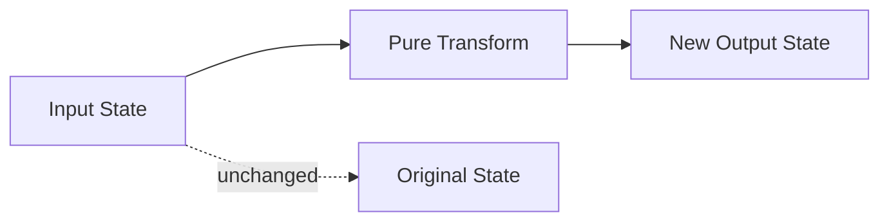

# Immutability & Pure Functions

Ця тема пояснює, як зробити код **передбачуваним**: прибрати приховані зміни стану, локалізувати side effects і навчитися бачити різницю між “значенням” і “місцем, де це значення зберігається”.

---

## I. Core Mechanism

**Теза:** **Pure function** не змінює зовнішній стан і для однакових аргументів дає однаковий результат. **Immutability** не означає “ніколи нічого не змінювати”; вона означає “не змінювати старе значення непомітно для інших частин програми”.

### Приклад
```javascript
function addTax(amount, taxRate) {
  return amount + amount * taxRate;
}

function applyDiscount(cart, percent) {
  return {
    ...cart,
    total: cart.total - cart.total * percent
  };
}
```

### Просте пояснення
Якщо функція отримує вхідні дані і просто обчислює результат, її легко тестувати, кешувати і повторно використовувати. Проблеми починаються тоді, коли функція “тихо” змінює об'єкт, масив, глобальну змінну, DOM або будь-який інший зовнішній стан.

### Технічне пояснення
У JavaScript purity — це не окрема конструкція мови, а **discipline of observable behavior**. Функція вважається pure, якщо:

| Критерій | Що це означає |
| :--- | :--- |
| **Determinism** | За тих самих аргументів результат той самий |
| **No Observable Side Effects** | Немає mutation зовнішніх об'єктів, I/O, timer registration, DOM writes |
| **Referential Transparency** | Вираз можна замінити результатом без зміни поведінки програми |

Immutability у JS зазвичай означає **створювати нову структуру даних**, а не мутувати стару. Але треба відрізняти:

- shallow copy через spread
- deep clone
- structural sharing

Spread-copy вирішує тільки верхній рівень структури. Nested references лишаються спільними.

### Mental Model
Чистий код мислить так: **input -> transform -> output**. Нечистий код мислить так: **input -> maybe mutate hidden thing -> output maybe depends on history**.

### Покроковий Walkthrough
1. Функція отримує дані як аргументи.
2. Вона не читає приховано глобальний mutable state.
3. Вона не мутує отримані об'єкти або масиви.
4. Вона повертає новий результат.
5. Якщо side effect потрібний, його виносять на межу системи: логування, network, DOM, storage.

> [!TIP]
> **[▶ Відкрити Immutability vs Mutation Board](../../visualisation/functional-programming-and-patterns/01-immutability-and-pure-functions/immutability-vs-mutation-board/index.html)**

> [!TIP]
> **[▶ Відкрити Nested Immutable Update Board](../../visualisation/functional-programming-and-patterns/01-immutability-and-pure-functions/nested-immutable-update-board/index.html)**

### Візуалізація


### Edge Cases / Підводні камені
- `const` не робить об'єкт immutable; воно лише забороняє reassignment binding.
- `Object.freeze()` не робить automatic deep immutability.
- Spread `...obj` не розриває nested references.
- Локальна mutation всередині функції може бути ок, якщо вона не “витікає” назовні.
- Pure function може повертати новий об'єкт на основі старого; це не side effect.

---

## II. Common Misconceptions

> [!IMPORTANT]
> **Immutability** не означає “ніколи нічого не міняй”. Це означає “не міняй shared state непомітно”.

> [!IMPORTANT]
> **Pure** не означає “коротка” або “функціонально-стильна” функція. Pure — це про поведінку, а не про синтаксис.

> [!IMPORTANT]
> Локальна temporary mutation може бути технічно допустимою, якщо вона не observable ззовні і не ламає модель даних.

---

## III. When This Matters / When It Doesn't

- **Важливо:** state management, reducers, form logic, data transforms, unit tests, concurrency-like reasoning.
- **Менш важливо:** дуже локальний одноразовий скрипт без shared state.

---

## IV. Self-Check Questions

1. Що таке pure function?
2. Чим pure function відрізняється від просто “зручної” функції?
3. Чому mutation shared object створює важкі для дебагу баги?
4. Чому `const user = {}` не робить `user` immutable?
5. Що таке referential transparency?
6. Чим shallow copy відрізняється від deep copy?
7. Чому spread над nested object не гарантує безпечний update?
8. Коли локальна mutation всередині функції ще може бути прийнятною?
9. Чому логування вже робить функцію technically impure?
10. Що краще для predictability: mutate input чи return new value?
11. У яких сценаріях immutable update дає найбільшу користь?
12. Що таке structural sharing і чому воно важливе?

---

## V. Short Answers / Hints

1. Та сама пара аргументів -> той самий результат, без side effects.
2. Зручність і purity — різні речі.
3. Бо різні частини коду спільно дивляться на один mutable reference.
4. `const` блокує reassignment binding, а не mutation object contents.
5. Вираз можна замінити значенням без зміни поведінки.
6. Shallow copy копіює тільки верхній рівень.
7. Nested references залишаються спільними.
8. Коли вона повністю локальна й не observable ззовні.
9. Бо це observable interaction із зовнішнім світом.
10. Return new value.
11. Shared state, reducers, UI updates, tests.
12. Нова структура перевикористовує незмінені частини старої.

---

## VI. Suggested Practice

1. Візьми mutating reducer і перепиши його в immutable style.
2. Знайди функцію, яка читає global state, і зроби її pure через explicit arguments.
3. Програй 3 сценарії в `Nested Immutable Update Board`: direct mutation, shallow copy, correct nested copy.
4. Після цього переходь до [02 Higher-Order Functions](../02-higher-order-functions/README.md), бо purity найкраще відчувається саме в pipeline-style коді.
