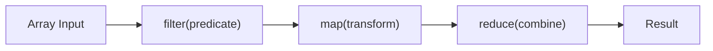

# Higher-Order Functions

Ця тема пояснює, як у JavaScript функції стають **інструментом керування логікою**, а не лише місцем обчислення. Саме тут `map`, `filter`, `reduce`, custom predicates і reusable callbacks перестають виглядати як синтаксичні трюки.

---

## I. Core Mechanism

**Теза:** **Higher-Order Function** — це функція, яка приймає іншу функцію як аргумент або повертає функцію як результат. В JavaScript це природно, бо функції є **first-class values**.

### Приклад
```javascript
const users = [
  { name: 'Ann', active: true },
  { name: 'Max', active: false },
  { name: 'Ira', active: true }
];

const activeNames = users
  .filter(user => user.active)
  .map(user => user.name);
```

### Просте пояснення
HOF дозволяють не писати кожен раз цикл і умови вручну. Замість “як крутити масив” ти описуєш “що треба зробити з елементами”.

### Технічне пояснення
У JS функція — це значення в heap, яке можна:

- передати як аргумент
- зберегти в змінній
- повернути з іншої функції
- замкнути в closure

Саме це робить HOF можливими. Найчастіші HOF у стандартній бібліотеці:

| Метод | Що робить |
| :--- | :--- |
| **map** | Трансформує кожен елемент |
| **filter** | Відбирає підмножину |
| **reduce** | Акумулює одне значення |
| **some** | Перевіряє, чи є хоча б один збіг |
| **every** | Перевіряє, чи всі елементи задовольняють умову |
| **sort** | Делегує comparator-функції спосіб порівняння |

### Mental Model
HOF зміщують фокус із “керування індексом” на “керування трансформацією”.

### Покроковий Walkthrough
1. Колекція передається стандартному HOF.
2. Callback викликається для кожного елемента або кроку акумуляції.
3. HOF керує iteration protocol.
4. Твій callback відповідає лише за transform / predicate / combine logic.

> [!TIP]
> **[▶ Відкрити HOF Pipeline Visualizer](../../visualisation/functional-programming-and-patterns/02-higher-order-functions/hof-pipeline-visualizer/index.html)**

### Візуалізація


### Edge Cases / Підводні камені
- `reduce` часто погіршує читабельність, якщо ним заміняють усе підряд.
- `sort` mutates original array, якщо не копіювати дані перед сортуванням.
- HOF не гарантує purity; callback усередині може бути impure.
- Довгі chain-и без іменованих кроків стають важчими за звичайний `for`.

---

## II. Common Misconceptions

> [!IMPORTANT]
> HOF — це не лише про масиви. Будь-яка функція, яка приймає або повертає функцію, уже HOF.

> [!IMPORTANT]
> Declarative не завжди означає більш зрозумілий. Якщо pipeline важко читати, це не перемога.

> [!IMPORTANT]
> `reduce` — не “найфункціональніший” варіант за замовчуванням. Часто `map` + `filter` або звичайний loop кращі.

---

## III. When This Matters / When It Doesn't

- **Важливо:** data transforms, reusable predicates, validation chains, collection processing.
- **Менш важливо:** дуже короткі або performance-critical tight loops, де pipeline лише ускладнює код.

---

## IV. Self-Check Questions

1. Що таке HOF?
2. Чому функції в JS можна передавати як значення?
3. Чим `map` відрізняється від `forEach`?
4. Коли `filter` виражає намір краще за ручний `if` у циклі?
5. Що робить `reduce` і чому його часто використовують надмірно?
6. Чому `sort` — небезпечний приклад у блоці про predictability?
7. Коли callback усередині HOF робить весь pipeline impurity-heavy?
8. Чому HOF не завжди покращують читабельність?
9. Коли варто назвати transform-функцію окремо, а не залишати inline?
10. Яка різниця між “function passed in” і “function returned out”?
11. Яку задачу краще вирішувати через `some` або `every`, а не через `filter`?
12. Чому HOF добре поєднуються з pure functions?

---

## V. Short Answers / Hints

1. Приймає або повертає функцію.
2. Бо вони first-class values.
3. `map` повертає новий масив, `forEach` — ні.
4. Коли треба явно показати selection logic.
5. Акумулює одне значення; ним часто зловживають.
6. Бо він mutates array in place.
7. Коли callback має side effects.
8. Бо long chain може бути важчим за loop.
9. Коли логіка вже не очевидна з одного рядка.
10. Один випадок — callback input, інший — factory output.
11. Коли треба boolean answer, а не нова колекція.
12. Бо тоді pipeline стає передбачуваним.

---

## VI. Suggested Practice

1. Перепиши цикл із `push` у `filter` + `map`.
2. Візьми overengineered `reduce` і спростуй його до більш читабельного pipeline.
3. Далі переходь у [03 Currying & Composition](../03-currying-and-composition/README.md), бо саме там HOF стають reusable building blocks.
