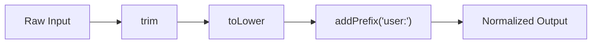

# Currying & Composition

Ця тема пояснює, як будувати **pipeline із дрібних функцій**, не перетворюючи код на математичну загадку. Тут важливо розрізняти **currying**, **partial application** і власне **composition**.

---

## I. Core Mechanism

**Теза:** **Currying** перетворює функцію з кількома аргументами на ланцюг unary-функцій. **Composition** поєднує кілька функцій так, щоб результат однієї став входом іншої. Разом вони дають reusable, configurable transforms.

### Приклад
```javascript
const trim = value => value.trim();
const toLower = value => value.toLowerCase();
const addPrefix = prefix => value => `${prefix}${value}`;

const normalizeName = value => addPrefix('user:')(toLower(trim(value)));
```

### Просте пояснення
Currying дозволяє “налаштувати” функцію по частинах. Composition дозволяє зібрати довшу операцію з коротких кроків.

### Технічне пояснення
Треба розрізняти:

| Термін | Суть |
| :--- | :--- |
| **Currying** | `f(a, b, c)` -> `f(a)(b)(c)` |
| **Partial Application** | Фіксуємо частину аргументів, але не обов'язково зводимо все до unary chain |
| **Composition** | `compose(f, g)(x)` = `f(g(x))` |
| **Pipe** | Left-to-right version composition |

У JS composition працює найкраще тоді, коли кроки pipeline мають **один вхід і один вихід**. Це спрощує поєднання функцій.

### Mental Model
Не “велика функція робить усе”, а “кожна функція робить один крок, а pipeline описує data flow”.

### Покроковий Walkthrough
1. Виділи маленькі pure transforms.
2. Зроби їх сумісними за input/output shape.
3. Якщо треба конфігурація, зафіксуй її через currying або partial application.
4. Збери pipeline через `compose` або явну послідовність викликів.
5. Зупинись, якщо code readability почала падати.

> [!TIP]
> **[▶ Відкрити Currying vs Partial Application Board](../../visualisation/functional-programming-and-patterns/03-currying-and-composition/currying-vs-partial-board/index.html)**

> [!TIP]
> **[▶ Відкрити Composition Chain Board](../../visualisation/functional-programming-and-patterns/03-currying-and-composition/composition-chain-board/index.html)**

> [!TIP]
> **[▶ Відкрити Pipeline Refactor Board](../../visualisation/functional-programming-and-patterns/03-currying-and-composition/pipeline-refactor-board/index.html)**

### Візуалізація


### Edge Cases / Підводні камені
- Point-free style швидко стає unreadable без сильних імен для функцій.
- Currying не потрібний, якщо функцію ніхто не перевикористовує конфігуровано.
- Composition не рятує від impurity; impurity просто переноситься по pipeline.
- Якщо функції мають різну форму аргументів, композиція стає ламкою.

---

## II. Common Misconceptions

> [!IMPORTANT]
> Currying і partial application — не одне й те саме.

> [!IMPORTANT]
> Composition не зобов'язана бути point-free. Часто явний параметр робить код зрозумілішим.

> [!IMPORTANT]
> “Функціональніший” запис не автоматично кращий. Якщо pipeline важко розшифрувати, його треба спростити.

---

## III. When This Matters / When It Doesn't

- **Важливо:** reusable validators, formatters, selectors, adapters, data parsing pipelines.
- **Менш важливо:** одноразова логіка на два рядки, де currying створює лише шум.

---

## IV. Self-Check Questions

1. Що таке currying?
2. Чим currying відрізняється від partial application?
3. Що таке composition?
4. Чому unary transforms легше композиціонувати?
5. Коли `pipe` читається краще за `compose`?
6. Коли point-free style стає шкідливим?
7. Чому currying корисний для configurable validators або formatters?
8. Який ризик у composition chain із impure functions?
9. Чому shape input/output має значення для composition?
10. Коли явний проміжний value читабельніший за composition helper?
11. Чому reusable “маленькі кроки” корисніші за “одну велику універсальну функцію”?
12. Як зрозуміти, що pipeline already over-engineered?

---

## V. Short Answers / Hints

1. Багатоаргументна функція -> ланцюг unary-функцій.
2. Partial application не обов'язково робить unary chain.
3. Поєднання output однієї функції з input іншої.
4. Бо shape узгоджений: один вхід, один вихід.
5. Коли data flow хочеться читати зліва направо.
6. Коли код втрачає явний сенс.
7. Бо можна зафіксувати конфігурацію заздалегідь.
8. Side effects просто рухаються далі по chain.
9. Без сумісності кроки не з'єднаються надійно.
10. Коли pipeline уже неочевидний без debug pause.
11. Бо їх легше тестувати й комбінувати.
12. Коли звичайний послідовний код уже читався б краще.

---

## VI. Suggested Practice

1. Зроби `startsWith`, `minLength`, `includes` як curried validators.
2. Збери formatter pipeline для user input із 3-4 маленьких кроків.
3. Порівняй той самий кейс у `Pipeline Refactor Board` через `loop`, HOF і composition.
4. Потім переходь у [04 Recursion & Tail-Call Thinking](../04-recursion-and-tail-call-thinking/README.md), щоб завершити блок алгоритмічним рівнем.
