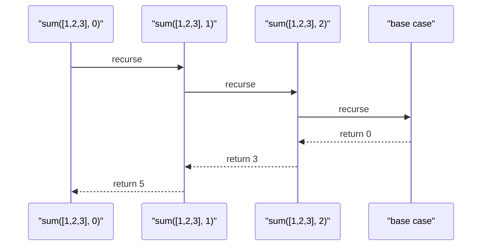

# Recursion & Tail-Call Thinking

Ця тема пояснює рекурсію як **модель розв'язання задачі**, а не як трюк із само-викликом. Також тут важливо чітко розділити: **концепція TCO корисна**, але в сучасному JavaScript на неї не можна покладатися як на runtime guarantee.

---

## I. Core Mechanism

**Теза:** Рекурсія працює тоді, коли задача природно розкладається на меншу версію самої себе. Але кожен recursive call у JS зазвичай ростить **call stack**, тому безпечність рекурсії залежить від глибини, а не лише від елегантності рішення.

### Приклад
```javascript
function sum(list, index = 0) {
  if (index >= list.length) {
    return 0;
  }

  return list[index] + sum(list, index + 1);
}
```

### Просте пояснення
У рекурсії завжди є дві частини:

- **base case**: коли треба зупинитися
- **recursive case**: як перейти до меншої задачі

Без base case функція не зупиниться. Якщо recursive chain занадто глибокий, стек переповниться.

### Технічне пояснення
Кожен виклик функції зазвичай створює новий stack frame. Для нерекурсивної ітерації цей ріст контрольованіший, бо робота йде в межах одного frame loop-конструкції. **Tail position** означає, що recursive call є останньою дією функції. Теоретично це відкриває шлях до **Tail Call Optimization**, але в більшості сучасних JS runtime цю оптимізацію не слід вважати доступною production guarantee.

### Mental Model
Рекурсія відповідає на питання: “Як розв'язати цю задачу, якщо я вже вмію розв'язувати її трохи меншу версію?”

### Покроковий Walkthrough
1. Знайди найменший випадок, який легко повернути одразу.
2. Сформулюй меншу підзадачу.
3. Переконайся, що кожен крок реально рухається до base case.
4. Оціни глибину recursion.
5. Якщо depth може бути великою, розглянь loop або explicit stack.

> [!TIP]
> **[▶ Відкрити Recursion Stack Visualizer](../../visualisation/functional-programming-and-patterns/04-recursion-and-tail-call-thinking/recursion-stack-visualizer/index.html)**

> [!TIP]
> **[▶ Відкрити Recursion vs Iteration Board](../../visualisation/functional-programming-and-patterns/04-recursion-and-tail-call-thinking/recursion-vs-iteration-board/index.html)**

> [!TIP]
> **[▶ Відкрити Recursion Debug Board](../../visualisation/functional-programming-and-patterns/04-recursion-and-tail-call-thinking/recursion-debug-board/index.html)**

### Візуалізація


### Edge Cases / Підводні камені
- Відсутній або недосяжний base case веде до stack overflow.
- Formally present base case не допомагає, якщо recursive call не має реального progress до нього.
- Рекурсія над великими масивами або глибокими деревами може бути небезпечною в JS runtime.
- Tail-recursive форма виглядає красиво, але не гарантує реальної оптимізації.
- Іноді explicit stack або queue читаються краще і працюють безпечніше.

---

## II. Common Misconceptions

> [!IMPORTANT]
> Рекурсія не “функціональніша” автоматично. Це лише одна з моделей алгоритму.

> [!IMPORTANT]
> Tail-recursive function у JavaScript не слід вважати автоматично memory-safe.

> [!IMPORTANT]
> Якщо loop виражає алгоритм простіше і безпечніше, це не поразка. Це кращий інженерний вибір.

---

## III. When This Matters / When It Doesn't

- **Важливо:** tree traversal, nested structures, divide-and-conquer, parser-like задачі.
- **Менш важливо:** великі лінійні обходи, де loop простіший і безпечніший.

---

## IV. Self-Check Questions

1. Що таке base case?
2. Що таке recursive case?
3. Чому без base case recursion ламається?
4. Як зрозуміти, що recursive call рухається до зупинки?
5. Чому call stack росте під час recursion?
6. Що таке tail position?
7. Що таке TCO і чому воно важливе концептуально?
8. Чому на TCO не можна покладатися в сучасному JS?
9. Коли tree traversal природно писати рекурсивно?
10. Коли loop кращий за recursion?
11. Чим explicit stack іноді корисніший за recursion?
12. Який головний production-ризик у глибокій recursion?

---

## V. Short Answers / Hints

1. Умова зупинки.
2. Крок, який зводить задачу до меншої версії себе.
3. Бо chain викликів не закінчиться.
4. Потрібен measurable progress до base case.
5. Кожен виклик створює frame.
6. Коли recursive call — остання дія функції.
7. Дозволяє не ростити stack у tail calls.
8. Бо runtime support не є надійною production assumption.
9. Коли структура даних сама рекурсивна.
10. Коли depth велика і алгоритм лінійний.
11. Дає контроль без stack overflow risk від function calls.
12. Stack overflow.

---

## VI. Suggested Practice

1. Перепиши recursive `sum` у loop.
2. Напиши recursive tree walk і explicit stack version того ж алгоритму.
3. Програй у `Recursion Debug Board` сценарії `missing base`, `no progress` і `large depth`.
4. Після цього переходь до [05 Practice Lab](../05-practice-lab/README.md), щоб закріпити вибір між mutation, HOF, composition і recursion у реальних кейсах.
