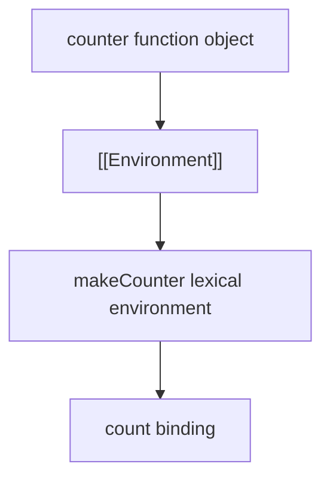
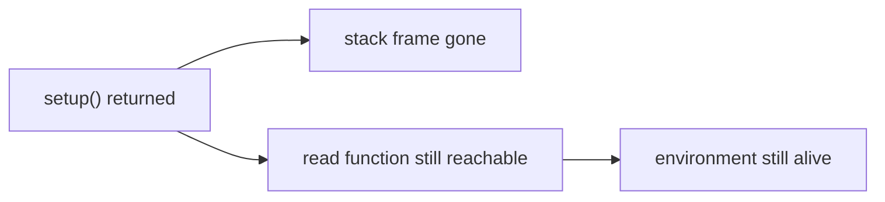
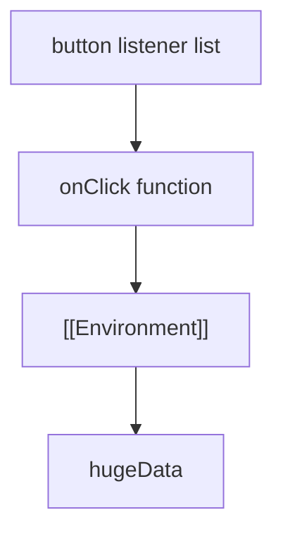

# 01. `[[Environment]]` Reference

Closure у JavaScript — це не "магічна пам'ять функції", а зв'язок між function object і lexical environment, у якому вона була створена.

---

## I. The Core Mechanism

**Теза:** Коли function object створюється, він отримує внутрішнє посилання `[[Environment]]` на поточне lexical environment. Саме це посилання і є механічною основою closures.

### Приклад
```javascript
function makeCounter() {
  let count = 0;

  return function counter() {
    count += 1;
    return count;
  };
}

const c = makeCounter();
c(); // 1
c(); // 2
```

### Просте пояснення
Внутрішня функція `counter` не "копіює" значення `count`. Вона зберігає шлях назад до середовища, де ця змінна живе.

### Технічне пояснення
Під час створення inner function:

1. Створюється function object.
2. У нього записується `[[Environment]]`.
3. Це посилання веде на lexical environment зовнішньої функції.
4. При виклику inner function її новий execution context використовує це збережене посилання як outer environment.

### Візуалізація


> [!TIP]
> **[▶ Запустити інтерактивний симулятор (Closures & Environment Reference)](../../visualisation/functions-and-oop/01-closures/index.html)**

### Edge Cases / Підводні камені
> [!IMPORTANT]
> Closure зберігає не "значення на момент створення", а доступ до binding. Саме тому значення може змінюватись між викликами.

---

## II. Closure Lifetime vs Stack Lifetime

**Теза:** Завершення зовнішньої функції не означає автоматичного знищення її lexical environment.

### Приклад
```javascript
function setup() {
  const token = "abc";

  return function read() {
    return token;
  };
}

const read = setup();
```

### Просте пояснення
Stack frame функції `setup` зникає. Але lexical environment може лишитися reachable через `read`.

### Технічне пояснення
Треба розділяти:

- **Execution lifetime:** скільки функція перебуває в call stack.
- **Memory lifetime:** скільки її environment лишається reachable.

GC дивиться не на "функція вже завершилась", а на reachability.

### Візуалізація


### Edge Cases / Підводні камені
> [!WARNING]
> Помилка мислення "функція завершилась, значить дані вже мертві" часто веде до неправильного debug memory leaks.

---

## III. Practical Retention Risk

**Теза:** Closure стає проблемою не сам по собі, а коли він випадково тримає важкі дані довше, ніж потрібно.

### Приклад
```javascript
function attachHandler(element) {
  const hugeData = new Array(100000).fill("x");

  function onClick() {
    console.log(hugeData.length);
  }

  element.addEventListener("click", onClick);
}
```

### Просте пояснення
Поки listener живий, живе і весь шлях до `hugeData`.

### Технічне пояснення
Retained path тут виглядає так:

`DOM/EventTarget -> listener function -> [[Environment]] -> hugeData`

### Візуалізація


### Edge Cases / Підводні камені
> [!CAUTION]
> Проблема не в closure як такому. Проблема в довгому lifetime listener/timer/cache, який тримає closure reachable.

---

## IV. Common Misconceptions

> [!IMPORTANT]
> Closure не копіює локальні змінні "всередину функції". Він зберігає доступ до environment bindings.

> [!IMPORTANT]
> Не кожна вкладена функція автоматично створює memory problem.

> [!IMPORTANT]
> `[[Environment]]` — це механізм мови, а не "окрема фіча лише для замикань".

---

## V. When This Matters / When It Doesn't

- **Важливо:** event listeners, timers, factories, hooks, async callbacks, memory debugging.
- **Менш важливо:** короткі локальні closures без довгого lifetime і без великих retained objects.

---

## VI. Self-Check Questions

1. Що саме зберігає function object у `[[Environment]]`?
2. Чим memory lifetime closure відрізняється від stack lifetime зовнішньої функції?
3. Чому `count` у closure не "скидається" між викликами?
4. Який retained path утримує дані в listener-based leak?
5. Чому closure не означає автоматичний memory leak?
6. Що саме треба прибрати, щоб GC міг зібрати затримані дані?
7. У чому різниця між "захопити binding" і "скопіювати значення"?
8. Чому ця тема важлива при дебазі React/browser UI і Node callbacks?

---

## VII. Short Answers / Hints

1. Посилання на lexical environment, у якому функцію створили.
2. Stack frame може зникнути раніше, ніж environment стане unreachable.
3. Бо зберігається той самий binding, а не нова копія.
4. Root -> callback/listener -> function object -> `[[Environment]]` -> data.
5. Бо closure може бути короткоживучим і без важких retained objects.
6. Retained path: listener, timer, global ref, cache entry або сам function reference.
7. Binding може змінюватися; копія значення — ні.
8. Бо саме там callbacks часто живуть довго.
