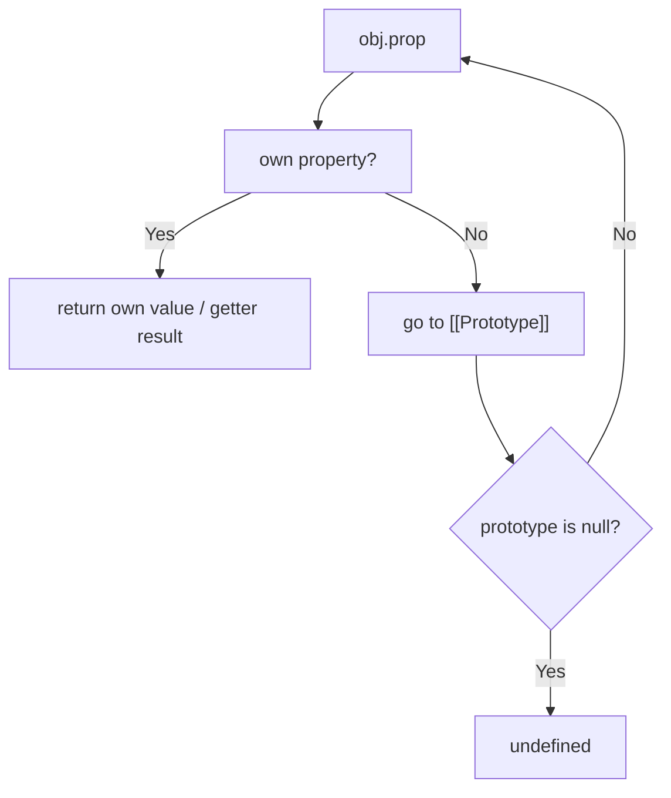
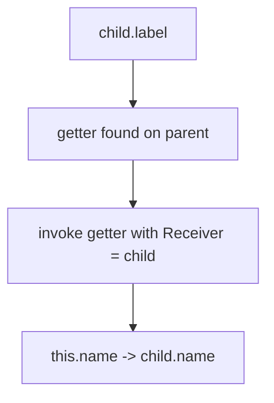
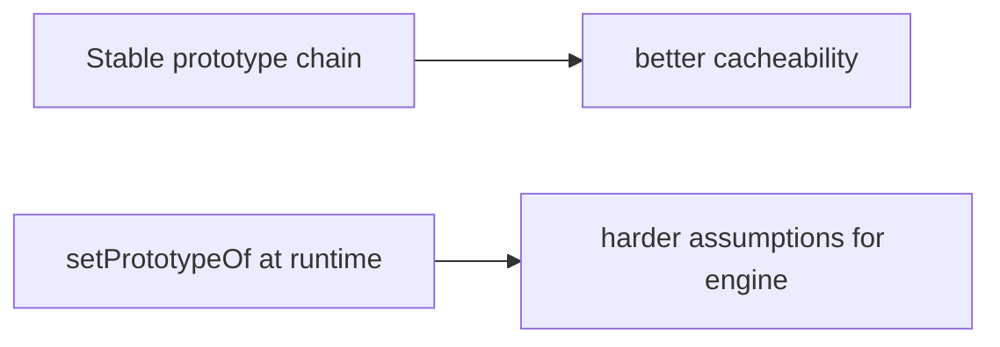

# 02. Prototype Chain Lookup

Prototype chain — це не "успадкування як у класичних ООП-мовах", а механізм делегування під час читання властивостей.

---

## I. `[[Get]]` as the Real Lookup Model

**Теза:** Читання `obj.prop` у JavaScript запускає внутрішню операцію `[[Get]]`, яка може пройти весь prototype chain.

### Приклад
```javascript
const parent = { greet: "Hello" };
const child = Object.create(parent);

child.greet; // "Hello"
```

### Просте пояснення
Об'єкт спочатку шукає властивість у себе. Якщо не знаходить — запит іде далі в його прототип.

### Технічне пояснення
У спрощеному вигляді `[[Get]]` робить так:

1. Знайти own property через `GetOwnProperty`.
2. Якщо знайдено data descriptor — повернути його value.
3. Якщо знайдено accessor descriptor — викликати getter із поточним `Receiver`.
4. Якщо не знайдено — перейти до `[[Prototype]]`.
5. Якщо прототип `null` — повернути `undefined`.

### Візуалізація


> [!TIP]
> **[▶ Запустити інтерактивний симулятор (Prototype Chain `[[Get]]` Lookup)](../../visualisation/functions-and-oop/02-prototype-chain/index.html)**

### Edge Cases / Підводні камені
> [!IMPORTANT]
> Prototype chain lookup — це читання. Воно не означає, що значення "скопіювалося" на сам об'єкт.

---

## II. `Receiver` and Getters

**Теза:** Під час accessors lookup важливий не лише об'єкт, де знайшли getter, а й `Receiver`, з яким його викликають.

### Приклад
```javascript
const parent = {
  get label() {
    return this.name;
  }
};

const child = Object.create(parent);
child.name = "Ada";

child.label; // "Ada"
```

### Просте пояснення
Getter знайшли в `parent`, але `this` всередині getter дорівнює `child`.

### Технічне пояснення
Саме тому `[[Get]]` має параметр `Receiver`: це об'єкт, який стає `this` для getter call.

### Візуалізація


### Edge Cases / Підводні камені
> [!CAUTION]
> Без розуміння `Receiver` легко помилково думати, що getter завжди працює "на прототипі", де він оголошений.

---

## III. Performance and Prototype Mutation

**Теза:** Сам lookup по прототипу нормальний для мови. Небезпечним він стає, коли ви мутуєте `[[Prototype]]` під час роботи програми.

### Приклад
```javascript
Object.setPrototypeOf(obj, newProto);
```

### Просте пояснення
Статичний prototype chain — це нормально. Часті зміни прототипів у рантаймі — погана ідея.

### Технічне пояснення
JIT і IC краще працюють із стабільною object model. Динамічна зміна `[[Prototype]]` ускладнює кешування property access.

### Візуалізація


### Edge Cases / Підводні камені
> [!WARNING]
> `Object.setPrototypeOf()` і `__proto__` не заборонені, але в продуктивному коді це майже завжди сигнал поганої моделі.

---

## IV. Common Misconceptions

> [!IMPORTANT]
> Prototype chain не означає копіювання методів у кожен екземпляр.

> [!IMPORTANT]
> Властивість, знайдена в прототипі, лишається властивістю прототипу, а не самого об'єкта.

> [!IMPORTANT]
> Lookup по прототипу не є "автоматично повільним". Поведінка залежить від моделі об'єктів і стабільності chain.

---

## V. When This Matters / When It Doesn't

- **Важливо:** object models, library internals, inheritance-like APIs, getters, performance-sensitive property access.
- **Менш важливо:** короткі прості об'єкти без delegation semantics.

---

## VI. Self-Check Questions

1. Які основні кроки виконує `[[Get]]`?
2. Коли lookup завершується `undefined`?
3. Чим data descriptor lookup відрізняється від accessor lookup?
4. Навіщо `[[Get]]` потрібен `Receiver`?
5. Чому `child.label` у прикладі читає `child.name`, хоча getter лежить у `parent`?
6. Чому `Object.setPrototypeOf()` вважається risky для performance?
7. Чому prototype lookup не означає копіювання значення на child object?
8. Як би ви відрізнили lookup bug від shadowing bug?

---

## VII. Short Answers / Hints

1. Own property -> descriptor handling -> prototype walk -> `undefined` at `null`.
2. Коли власної властивості немає і chain доходить до `null`.
3. Data descriptor повертає value, accessor descriptor викликає getter.
4. Щоб правильно визначити `this` у getter.
5. Бо getter викликається з `Receiver = child`.
6. Бо рантайм-мутація прототипу ускладнює engine assumptions і property caches.
7. Бо lookup лише делегує читання.
8. Lookup bug — властивість не знайдена; shadowing bug — знайдена own property раніше за prototype property.
