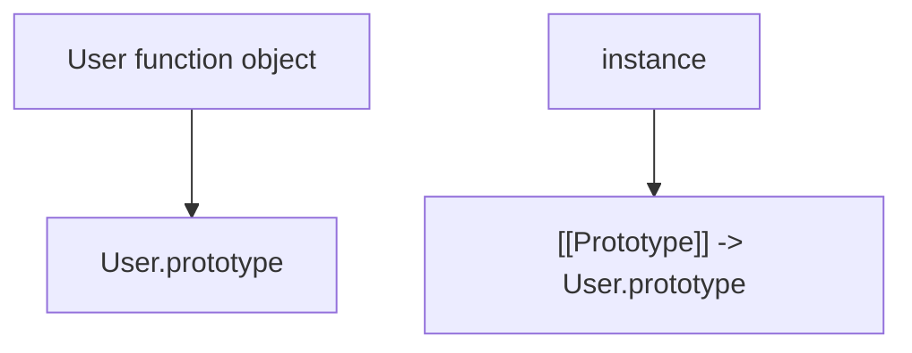
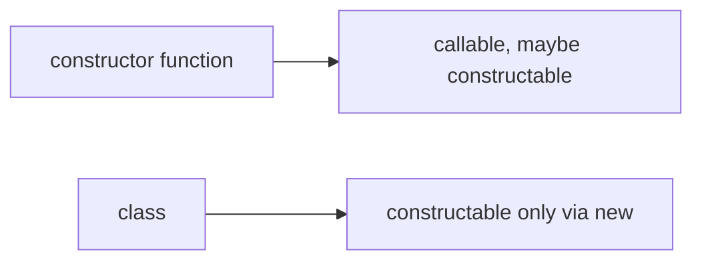
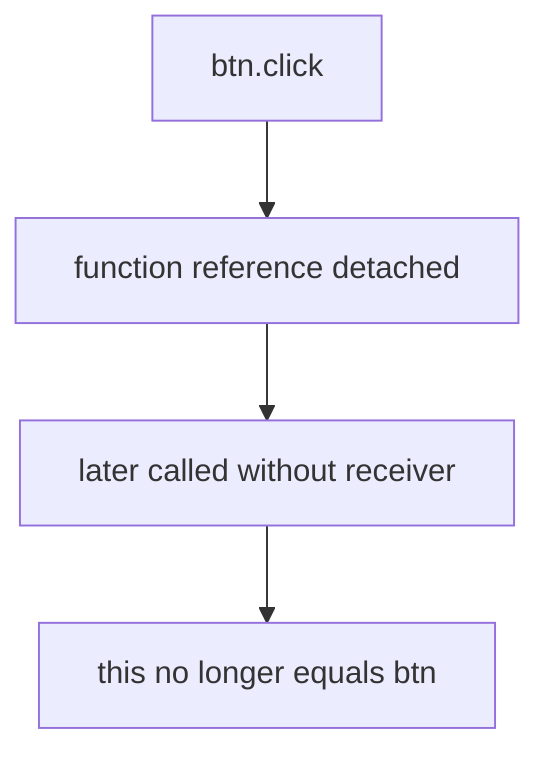

# 03. Syntactic Sugar

`class` у JavaScript не створює нову об'єктну модель. Він робить існуючу prototype/constructor модель зручнішою і суворішою на рівні syntax та semantics.

---

## I. `class` Under the Hood

**Теза:** Методи класу живуть у `.prototype`, а не копіюються в кожен екземпляр.

### Приклад
```javascript
class User {
  constructor(name) {
    this.name = name;
  }

  sayHi() {
    return this.name;
  }
}
```

### Просте пояснення
`class` виглядає як окрема ООП-модель, але екземпляр усе одно тримає own data, а спільні методи бере з prototype.

### Технічне пояснення
Під капотом ви все ще маєте:

- function object, який виступає constructor;
- `Constructor.prototype`;
- instances з `[[Prototype]] -> Constructor.prototype`.

### Візуалізація


> [!TIP]
> **[▶ Запустити інтерактивний симулятор (The `new` Keyword Algorithm)](../../visualisation/functions-and-oop/03-new-keyword/index.html)**

### Edge Cases / Підводні камені
> [!IMPORTANT]
> Якщо метод винести в class field arrow function, він уже не буде shared prototype method — він стане own property кожного екземпляра.

---

## II. What `class` Changes Semantically

**Теза:** Хоча базова модель лишається старою, `class` додає важливі semantics, яких немає у plain constructor functions.

### Приклад
```javascript
class A {}

// A(); // TypeError
new A(); // ok
```

### Просте пояснення
Клас не можна викликати як звичайну функцію. Це одна з реальних semantic-відмінностей, а не просто "інший запис того самого".

### Технічне пояснення
Важливі відмінності:

1. Класи не можна викликати без `new`.
2. Вони підпорядковуються TDZ-подібній поведінці до оголошення.
3. Методи класу на prototype є non-enumerable.

### Візуалізація


### Edge Cases / Підводні камені
> [!CAUTION]
> Фраза "class це просто sugar" корисна як базова модель, але буквально вона неповна: sugar тут поверх старої object model, але з новими semantics.

---

## III. `this` and Methods

**Теза:** `class` не виправляє стару проблему втрати `this` при відриві методу від екземпляра.

### Приклад
```javascript
class Button {
  constructor() {
    this.name = "Click";
  }

  click() {
    return this.name;
  }
}

const btn = new Button();
setTimeout(btn.click, 0);
```

### Просте пояснення
Метод лишається звичайною функцією. Якщо його викликати без об'єкта-отримувача, `this` поводиться так само, як і в звичайних methods.

### Технічне пояснення
Проблема тут не в `class`, а в semantics місця виклику. Метод на prototype не "пришитий" до конкретного екземпляра.

### Візуалізація


### Edge Cases / Підводні камені
> [!WARNING]
> `bind`, wrapper function або class field arrow method вирішують різні задачі й мають різну memory/model cost.

---

## IV. Common Misconceptions

> [!IMPORTANT]
> `class` не скасовує prototype chain.

> [!IMPORTANT]
> `class` не дає автоматичний autobind для методів.

> [!IMPORTANT]
> "Просто sugar" — добра стартова модель, але не повний опис semantics.

---

## V. When This Matters / When It Doesn't

- **Важливо:** library APIs, architecture decisions, method binding, inheritance design, code review.
- **Менш важливо:** дуже маленькі приклади, де різниця між `class` і constructor function не впливає на поведінку.

---

## VI. Self-Check Questions

1. Що саме в `class` лишається тим самим, що й у constructor/prototype model?
2. Де живуть methods класу за замовчуванням?
3. Чим `class` семантично відрізняється від plain constructor function?
4. Чому `A()` для `class A {}` кидає помилку?
5. Чому class method можна "відірвати" від екземпляра і втратити `this`?
6. У чому різниця між prototype method і class field arrow method?
7. Чому фраза "class це просто sugar" одночасно корисна і недостатня?
8. Коли `class` справді покращує читабельність, а коли лише маскує базову модель?

---

## VII. Short Answers / Hints

1. Constructor/prototype/instance object model.
2. У `Constructor.prototype`.
3. Необхідність `new`, non-enumerable methods, TDZ-like access restrictions.
4. Бо class constructor не callable як звичайна function.
5. Бо method reference лишається звичайною функцією без автоматичного bind.
6. Prototype method shared, arrow field — own function per instance.
7. Корисна для моделі пам'яті, недостатня для semantics.
8. Коли команда розуміє базову поведінкову модель, а не лише синтаксис.
