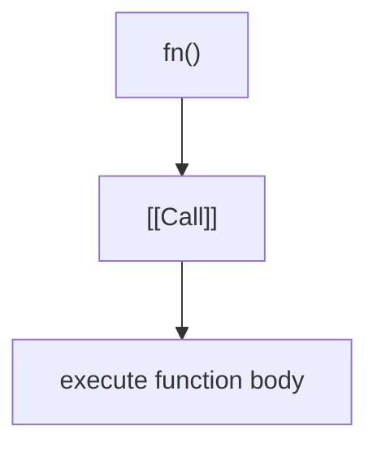
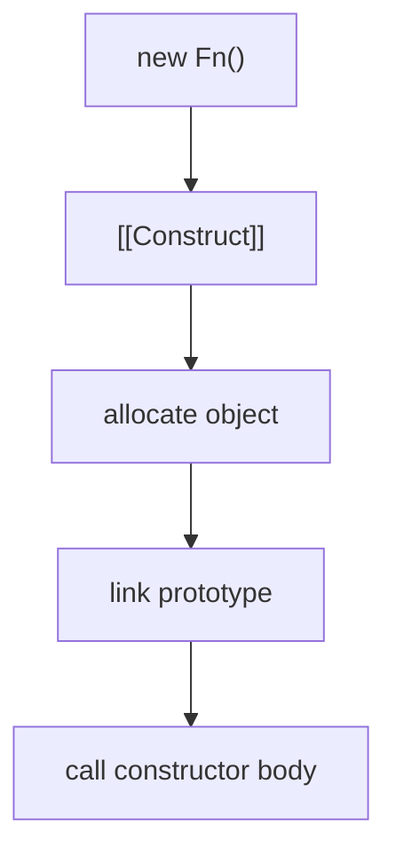
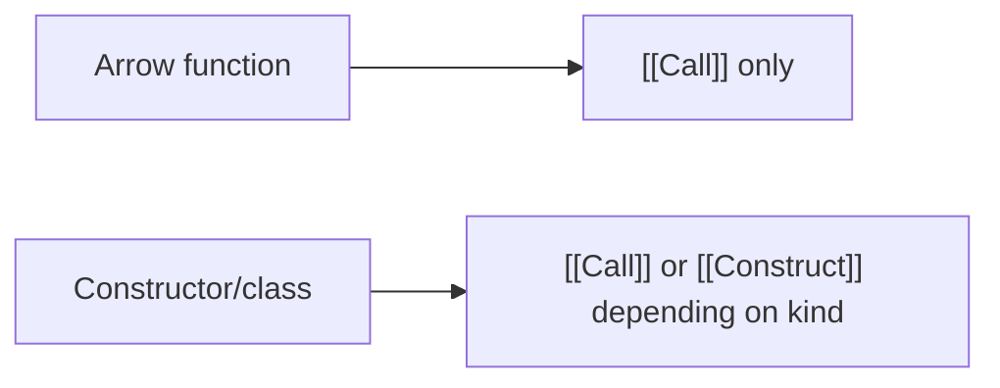

# 04. Function Internal Slots

Не кожна function у JavaScript однаково "вміє все". Частина functions має `[[Call]]`, частина має і `[[Call]]`, і `[[Construct]]`, а частина взагалі не придатна для `new`.

---

## I. `[[Call]]`

**Теза:** `[[Call]]` — це внутрішня здатність function object бути викликаним як звичайна функція.

### Приклад
```javascript
function greet(name) {
  return `Hi, ${name}`;
}

greet("Ada");
```

### Просте пояснення
Якщо значення можна викликати через `fn()`, значить за цим стоїть callable behavior.

### Технічне пояснення
У специфікації function object має internal slot / internal method `[[Call]]`, який запускається при звичайному виклику.

### Візуалізація


### Edge Cases / Підводні камені
> [!IMPORTANT]
> "Має `typeof value === 'function'`" зазвичай означає callable, але semantic-відмінності між function kinds лишаються важливими.

---

## II. `[[Construct]]`

**Теза:** `[[Construct]]` — окремий механізм, який дозволяє function object бути constructor target для `new`.

### Приклад
```javascript
function User(name) {
  this.name = name;
}

new User("Ada");
```

### Просте пояснення
`new fn()` — це не просто "виклик функції іншим синтаксисом". Це інша внутрішня операція.

### Технічне пояснення
`[[Construct]]`:

1. Створює новий object.
2. Лінкує його з `Constructor.prototype`.
3. Виконує function body з `this = new object`.
4. Повертає або explicit returned object, або створений instance.

### Візуалізація


> [!TIP]
> **[▶ Запустити інтерактивний візуалізатор (`[[Call]]` vs `[[Construct]]`)](../../visualisation/functions-and-oop/04-function-internal-slots/call-vs-construct/index.html)**

### Edge Cases / Підводні камені
> [!CAUTION]
> `[[Construct]]` не зобов'язаний існувати в кожної function-like сутності.

---

## III. Callable but Not Constructable

**Теза:** Arrow functions, methods і деякі built-ins callable, але не constructable.

### Приклад
```javascript
const sum = (a, b) => a + b;

// new sum(1, 2); // TypeError
```

### Просте пояснення
Не кожну function можна використовувати як constructor.

### Технічне пояснення
Arrow function має `[[Call]]`, але не має `[[Construct]]`. Тому `new` на ній неможливий.

### Візуалізація


### Edge Cases / Підводні камені
> [!WARNING]
> Якщо API очікує constructable target, не підсовуйте туди arrow function лише тому, що "це теж function".

---

## IV. Common Misconceptions

> [!IMPORTANT]
> `new fn()` не є просто синтаксичним варіантом `fn()`.

> [!IMPORTANT]
> Callable function і constructable function — це не синоніми.

> [!IMPORTANT]
> `class` пов'язаний із `[[Construct]]`, але не знімає важливість `[[Call]]`/`[[Construct]]` distinction.

---

## V. When This Matters / When It Doesn't

- **Важливо:** constructors, frameworks, metaprogramming, factories, inheritance internals, API design.
- **Менш важливо:** прості utility functions, де ніхто не розглядає `new`.

---

## VI. Self-Check Questions

1. Що запускається при `fn()`?
2. Що запускається при `new Fn()`?
3. Чому arrow function не можна використовувати з `new`?
4. Чому `[[Call]]` і `[[Construct]]` не варто плутати?
5. Які кроки приблизно виконує `[[Construct]]`?
6. Чому ця тема важлива для API design?
7. Як `class` пов'язаний із `[[Construct]]`?
8. Коли callable/constructable distinction реально впливає на баги?

---

## VII. Short Answers / Hints

1. `[[Call]]`.
2. `[[Construct]]`.
3. Бо в неї немає `[[Construct]]`.
4. Бо вони запускають різні semantics і дають різні наслідки для `this` і allocation.
5. Allocate -> link prototype -> execute -> return instance/object.
6. Бо API може вимагати constructor target або plain callable.
7. Class constructor працює через construct semantics.
8. Коли хтось намагається використовувати `new` на неправильному function kind.
