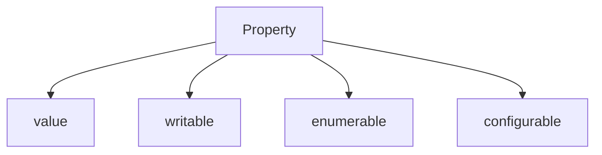
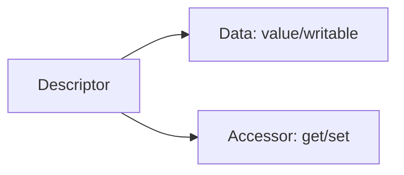
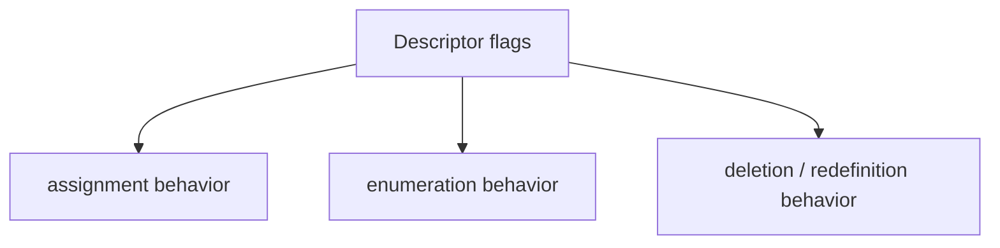

# 05. Property Descriptors

Властивість у JavaScript — це не просто "ключ і значення". За нею стоїть descriptor, який визначає, чи її можна змінити, показати в enumeration або видалити.

---

## I. Data Descriptors

**Теза:** Data property описується не лише `value`, а й прапорцями `writable`, `enumerable`, `configurable`.

### Приклад
```javascript
const user = {};

Object.defineProperty(user, "id", {
  value: 42,
  writable: false,
  enumerable: true,
  configurable: false
});
```

### Просте пояснення
Descriptor — це набір правил поведінки властивості.

### Технічне пояснення
- `writable`: чи можна переприсвоїти value.
- `enumerable`: чи видно властивість у `for...in`, `Object.keys`.
- `configurable`: чи можна видалити властивість або змінити descriptor shape.

### Візуалізація


> [!TIP]
> **[▶ Запустити інтерактивний візуалізатор (Property Descriptors)](../../visualisation/functions-and-oop/05-property-descriptors/descriptors/index.html)**

> [!TIP]
> **[▶ Запустити інтерактивний debug board (Descriptors + Shadowing)](../../visualisation/functions-and-oop/10-descriptor-shadowing-bug-lab/debug-board/index.html)**

### Edge Cases / Підводні камені
> [!IMPORTANT]
> Властивості, створені через `Object.defineProperty`, за замовчуванням не стають автоматично `writable/enumerable/configurable: true`.

---

## II. Accessor Descriptors

**Теза:** Замість `value`/`writable` властивість може бути описана через `get` і `set`.

### Приклад
```javascript
const user = {
  first: "Ada",
  last: "Lovelace",

  get fullName() {
    return `${this.first} ${this.last}`;
  }
};
```

### Просте пояснення
Іноді властивість не зберігає значення напряму, а обчислює його під час читання.

### Технічне пояснення
Data descriptor і accessor descriptor — різні форми descriptor model. Їх не можна змішати в одній властивості як попало.

### Візуалізація


### Edge Cases / Підводні камені
> [!CAUTION]
> Якщо ви працюєте з getters/setters, property access уже не "просто читання поля", а код, який виконується.

---

## III. Why Descriptors Matter

**Теза:** Descriptors визначають API-поведінку об'єкта так само сильно, як і самі значення.

### Приклад
```javascript
Object.keys(user);
delete user.id;
user.id = 100;
```

### Просте пояснення
Одна й та сама властивість може виглядати однаково в коді, але поводитися зовсім інакше через descriptor flags.

### Технічне пояснення
Саме descriptors пояснюють:

- чому частина властивостей "не видно" у keys;
- чому деякі властивості не видаляються;
- чому methods класу non-enumerable;
- як built-ins приховують частину внутрішніх деталей від звичайної enumeration.

### Візуалізація


### Edge Cases / Підводні камені
> [!WARNING]
> Без descriptors легко помилково думати, що "властивість є, значить її можна змінити або видалити". Це не гарантується.

---

## IV. Common Misconceptions

> [!IMPORTANT]
> Властивість — це не лише `key -> value`.

> [!IMPORTANT]
> `Object.defineProperty` без явних прапорців створює значно "суворішу" властивість, ніж plain assignment.

> [!IMPORTANT]
> Getter — це не "красиве поле", а виконувана поведінка, яка спрацьовує під час доступу до властивості.

---

## V. When This Matters / When It Doesn't

- **Важливо:** library APIs, framework internals, decorators, metaprogramming, serialization and enumeration behavior.
- **Менш важливо:** короткі plain objects, де вистачає звичайного assignment.

---

## VI. Self-Check Questions

1. Що контролює `writable`?
2. Що контролює `enumerable`?
3. Що контролює `configurable`?
4. Чим data descriptor відрізняється від accessor descriptor?
5. Чому class methods зазвичай не видно в `Object.keys(instance)`?
6. Чому `Object.defineProperty` часто дає несподівані дефолти?
7. Яка практична різниця між getter і plain field?
8. У яких API descriptors реально корисні?

---

## VII. Short Answers / Hints

1. Можливість переприсвоїти value.
2. Видимість у звичайній enumeration.
3. Видалення і частину redefinition semantics.
4. Data: value/writable; accessor: get/set.
5. Бо methods живуть у prototype і ще й non-enumerable.
6. Бо прапорці не стають автоматично `true`.
7. Getter виконує код під час доступу.
8. Там, де важлива поведінка API, а не лише зберігання даних.
