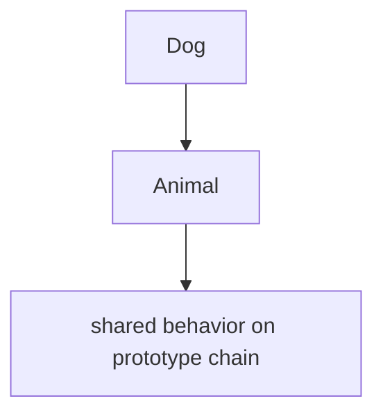
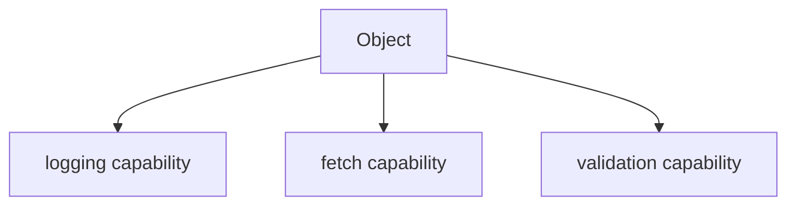
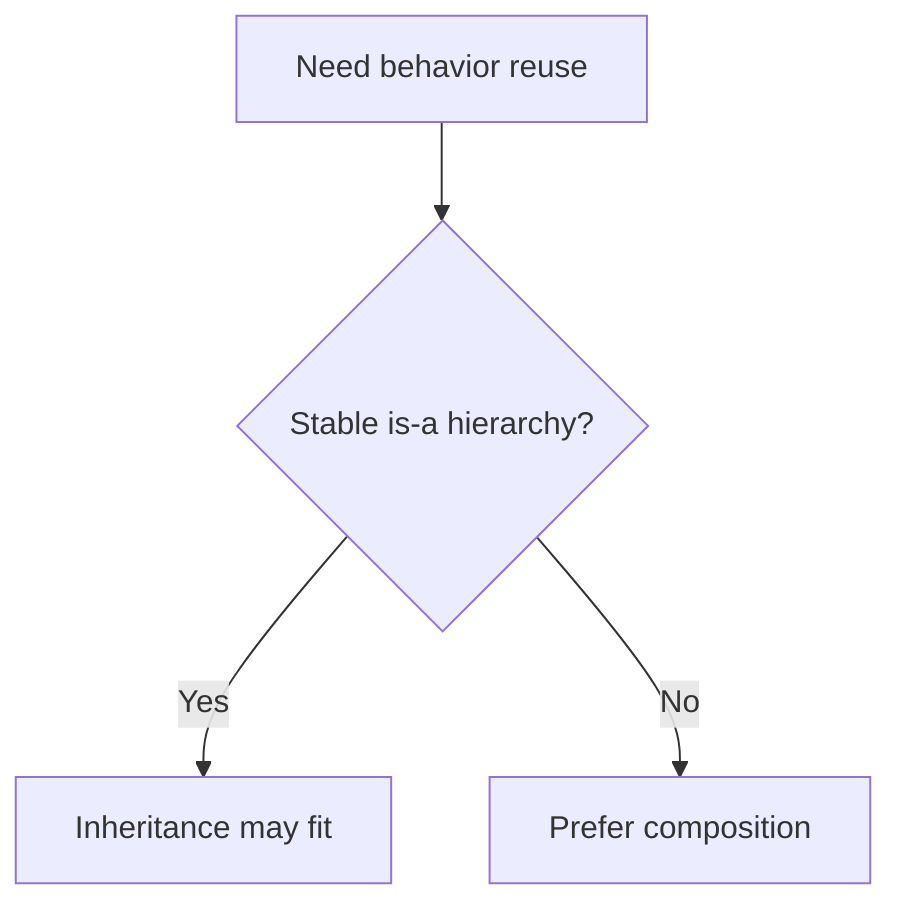

# 06. OOP Patterns: Composition vs Inheritance

У JavaScript питання зазвичай не в тому, "чи є inheritance поганим", а в тому, яка модель поведінки менше зв'язує код і краще витримує зміни.

---

## I. Inheritance

**Теза:** Inheritance добре працює там, де справді є стабільне "is-a" відношення і спільна поведінка природно живе в prototype chain.

### Приклад
```javascript
class Animal {
  speak() {
    return "sound";
  }
}

class Dog extends Animal {
  speak() {
    return "woof";
  }
}
```

### Просте пояснення
Inheritance дає готовий шлях до reuse через prototype chain.

### Технічне пояснення
Проблема з inheritance починається тоді, коли ієрархія стає доменно штучною, а зміни в базовому рівні ламають багато похідних типів.

### Візуалізація


### Edge Cases / Підводні камені
> [!CAUTION]
> Якщо модель "is-a" тримається лише на словах, а не на стійкій поведінці, inheritance швидко стає крихким.

---

## II. Composition

**Теза:** Composition збирає поведінку з окремих частин замість того, щоб вбудовувати її в жорстку ієрархію.

### Приклад
```javascript
function withLogger(target) {
  target.log = (msg) => console.log(msg);
  return target;
}

const service = withLogger({
  fetch() {}
});
```

### Просте пояснення
Замість "цей об'єкт є різновидом іншого" ми кажемо: "цей об'єкт має певну поведінку".

### Технічне пояснення
Composition зазвичай дає слабший coupling і кращу локальність змін, особливо в JS-коді з великою кількістю дрібних behavior units.

### Візуалізація


### Edge Cases / Підводні камені
> [!IMPORTANT]
> Composition не означає автоматично кращу архітектуру. Погано скоординовані mixins або wrappers теж можуть породити хаос.

---

## III. Choosing Between Them

**Теза:** Для більшості прикладного JS composition часто дає гнучкішу модель, але inheritance не треба забороняти догматично.

### Приклад
```javascript
// "has-a" / capability style often fits JS better
const dialog = {
  open() {},
  close() {}
};
```

### Просте пояснення
Коли вам потрібно reuse через поведінки, а не через жорсткі типи, composition зазвичай легше підтримувати.

### Технічне пояснення
Оцінюйте:

1. Чи стабільне відношення "is-a"?
2. Чи не зростає coupling між базовим і похідними рівнями?
3. Чи можна reuse виразити як capability?

### Візуалізація


### Edge Cases / Підводні камені
> [!WARNING]
> "Композиція завжди краща" — така сама спрощена догма, як і "класичне успадкування завжди правильне".

---

## IV. Common Misconceptions

> [!IMPORTANT]
> Composition не означає "без прототипів". Це лише інший спосіб організації reuse.

> [!IMPORTANT]
> Inheritance не дорівнює автоматично поганому дизайну.

> [!IMPORTANT]
> Правильне питання — не "що модніше", а "яка модель краще виражає поведінку".

---

## V. When This Matters / When It Doesn't

- **Важливо:** UI components, domain services, framework architecture, reusable behaviors, library public APIs.
- **Менш важливо:** маленькі локальні структури, де reuse майже відсутній.

---

## VI. Self-Check Questions

1. Коли inheritance має природний сенс?
2. Коли composition краще виражає модель поведінки?
3. Чим composition часто краща з точки зору coupling?
4. Чому "has-a" іноді важливіше за "is-a"?
5. Який ризик у штучній class hierarchy?
6. Чому composition не є автоматичним silver bullet?
7. Як би ви обирали між цими підходами в JS UI code?
8. Які сигнали в коді кажуть, що inheritance уже тягне занадто багато?

---

## VII. Short Answers / Hints

1. Коли є стабільне поведінкове "is-a".
2. Коли поведінку краще збирати з capability blocks.
3. Бо вона послаблює жорстку залежність від базового рівня.
4. Бо reuse часто йде через можливості, а не через типову ієрархію.
5. Зміни в базі починають ламати багато нащадків.
6. Бо погана композиція теж може розмазати відповідальність.
7. Через модель поведінки, coupling і частоту змін.
8. Багато override, fragile base class, неприродні назви ієрархії.
