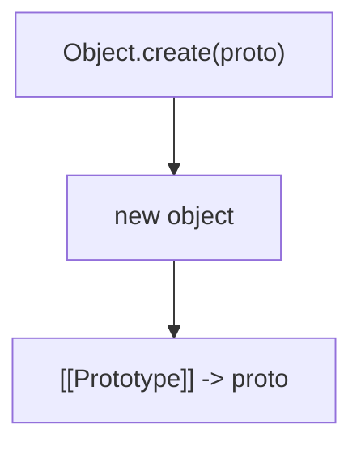
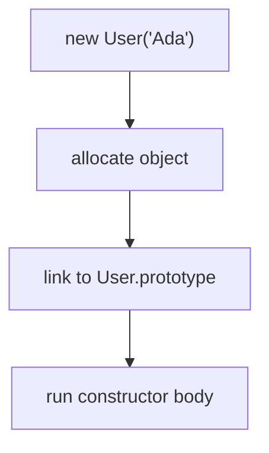
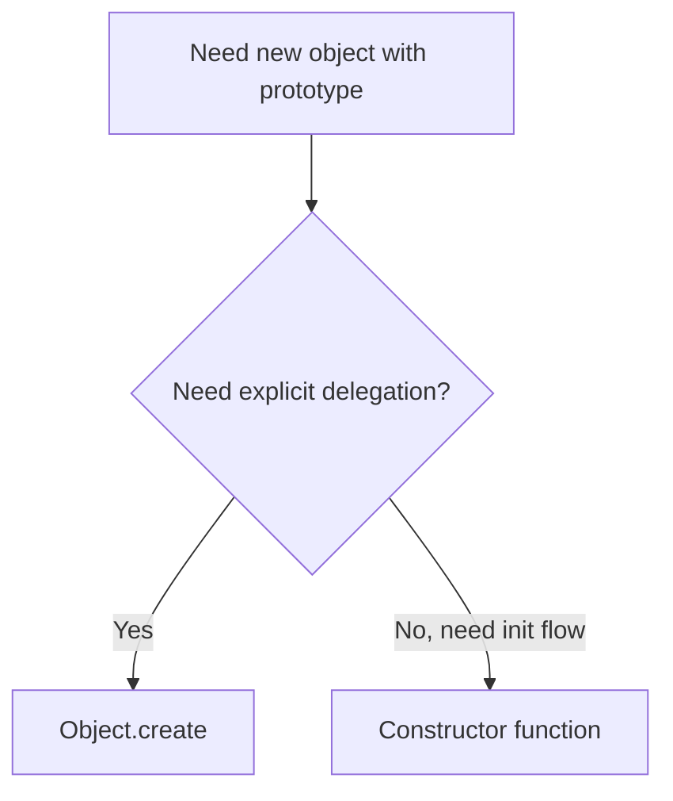

# 07. Object.create vs Constructor Functions

Обидва підходи створюють objects із prototype link, але роблять це по-різному і з різним рівнем явності.

---

## I. `Object.create`

**Теза:** `Object.create(proto)` дає явний спосіб сказати: "ось новий object, який делегує в цей prototype".

### Приклад
```javascript
const userProto = {
  sayHi() {
    return this.name;
  }
};

const user = Object.create(userProto);
user.name = "Ada";
```

### Просте пояснення
Тут прототип видно прямо в коді, без constructor ceremony.

### Технічне пояснення
`Object.create` корисний там, де ви хочете explicit delegation model без обов'язкового constructor invocation path.

### Візуалізація


> [!TIP]
> **[▶ Запустити інтерактивний візуалізатор (`Object.create(null)` vs `{}` vs `Object.create(proto)`)](../../visualisation/functions-and-oop/07-object-create-vs-constructor-functions/object-create-variants/index.html)**

### Edge Cases / Підводні камені
> [!IMPORTANT]
> `Object.create` не ініціалізує state сам по собі. Вам треба явно наповнювати object даними.

---

## II. Constructor Functions

**Теза:** Constructor function поєднує allocation, prototype linking і state initialization в одному виклику через `new`.

### Приклад
```javascript
function User(name) {
  this.name = name;
}

User.prototype.sayHi = function () {
  return this.name;
};

const user = new User("Ada");
```

### Просте пояснення
Тут model більш "ритуалізована": є constructor, prototype methods і `new`.

### Технічне пояснення
Constructor functions зручні, коли ви хочете природний initialization flow і звичний instance creation API.

### Візуалізація


### Edge Cases / Підводні камені
> [!CAUTION]
> Без `new` constructor function може поводитися зовсім не так, як очікує автор.

---

## III. Choosing Between Them

**Теза:** `Object.create` зазвичай точніший для explicit delegation, constructor function — для instance initialization pattern.

### Приклад
```javascript
const safeDict = Object.create(null);
```

### Просте пояснення
Є задачі, де prototype треба задати прямо і без додаткової ceremony. Є задачі, де важливіший звичний constructor API.

### Технічне пояснення
Обирайте за питанням:

1. Потрібна explicit delegation чи constructor semantics?
2. Потрібен special prototype, наприклад `null`?
3. Чи є сенс у `new`-based initialization flow?

### Візуалізація


### Edge Cases / Підводні камені
> [!WARNING]
> `Object.create(null)` — це не "дивний трюк", а важливий інструмент для safe dictionaries і спеціальної поведінки lookup.

---

## IV. Common Misconceptions

> [!IMPORTANT]
> `Object.create` не є "старшою" або "молодшою" версією constructor function. Це інший інтерфейс до object model.

> [!IMPORTANT]
> Constructor function не обов'язково краща лише тому, що виглядає ближчою до `class`.

> [!IMPORTANT]
> `Object.create(null)` створює object без `Object.prototype`, і це інколи саме те, що треба.

---

## V. When This Matters / When It Doesn't

- **Важливо:** library internals, dictionaries, explicit delegation, object factories, special prototype setups.
- **Менш важливо:** дрібні випадки, де простий object literal або `class` уже достатні й зрозумілі.

---

## VI. Self-Check Questions

1. Що робить `Object.create(proto)`?
2. Чим він відрізняється від `new Constructor()`?
3. Коли `Object.create(null)` кращий за `{}`?
4. Яку задачу добре вирішує constructor function?
5. Чому `Object.create` вважається explicit delegation style?
6. Коли відсутність автоматичної ініціалізації в `Object.create` є мінусом?
7. Чому ці дві моделі не варто плутати як "однаковий синтаксис різними словами"?
8. У якій архітектурі ви б обрали `Object.create` свідомо?

---

## VII. Short Answers / Hints

1. Створює новий object із `[[Prototype]] -> proto`.
2. `new` ще й запускає constructor body.
3. Для safe dictionaries і об'єктів без `Object.prototype`.
4. Ініціалізацію instance state через `new`.
5. Бо prototype задається прямо і явно.
6. Коли треба зручний init API.
7. Бо одна модель про explicit linking, друга — про construct semantics.
8. У library internals, delegation-heavy code, safe map-like objects.
