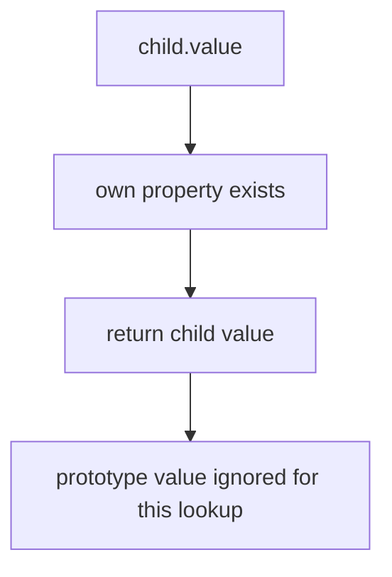
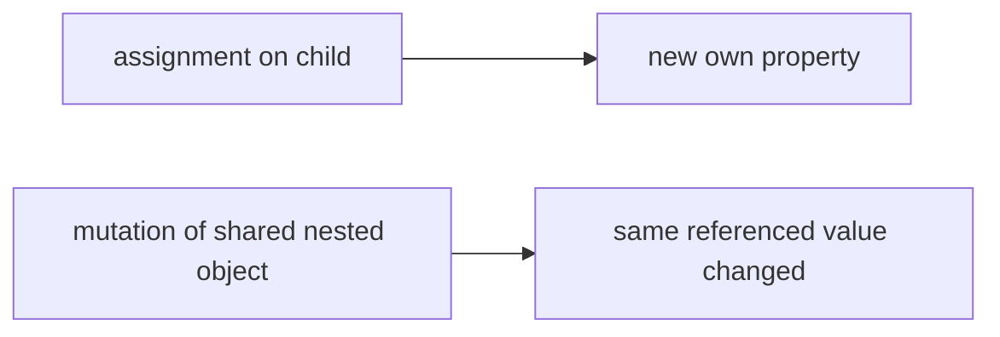
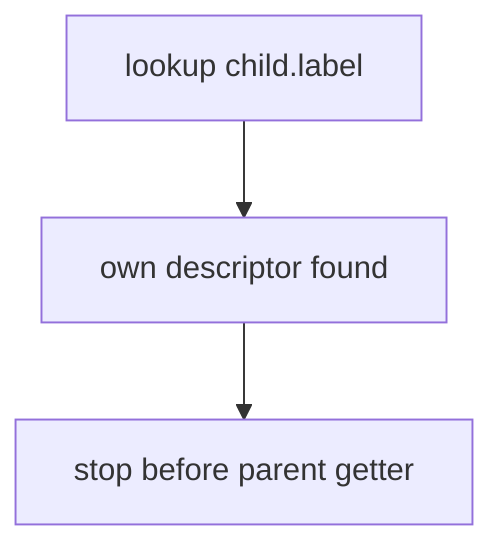

# 08. Shadowing Properties

Shadowing — це ситуація, коли own property з тим самим ім'ям затуляє property, яку інакше було б знайдено в prototype chain.

---

## I. The Basic Mechanism

**Теза:** Якщо на самому об'єкті є own property, lookup зупиняється раніше й prototype property вже не читається.

### Приклад
```javascript
const parent = { value: 10 };
const child = Object.create(parent);

child.value = 20;

child.value;  // 20
parent.value; // 10
```

### Просте пояснення
Child object "затіняє" властивість батька власним значенням.

### Технічне пояснення
Це прямий наслідок `[[Get]]`: own property перевіряється до того, як lookup піде в `[[Prototype]]`.

### Візуалізація


> [!TIP]
> **[▶ Запустити інтерактивний візуалізатор (Shadowing Lookup)](../../visualisation/functions-and-oop/08-shadowing-properties/shadowing-lookup/index.html)**

> [!TIP]
> **[▶ Запустити інтерактивний debug board (Descriptors + Shadowing)](../../visualisation/functions-and-oop/10-descriptor-shadowing-bug-lab/debug-board/index.html)**

### Edge Cases / Підводні камені
> [!IMPORTANT]
> Shadowing не змінює prototype value автоматично. Воно лише змінює результат поточного lookup.

---

## II. Shadowing vs Mutation

**Теза:** Запис на child object часто створює нову own property, а не мутує prototype property.

### Приклад
```javascript
const parent = { config: { theme: "light" } };
const child = Object.create(parent);

child.config = { theme: "dark" }; // shadowing
```

### Просте пояснення
Переприсвоєння `child.config` створює новий шлях читання для child. Але якщо child та parent ділять один і той самий nested object, mutation уже інша історія.

### Технічне пояснення
Треба розділяти:

- **shadowing:** нова own property;
- **shared reference mutation:** зміна спільного object value.

### Візуалізація


### Edge Cases / Підводні камені
> [!CAUTION]
> Shadowing bug і shared-reference bug часто виглядають схоже для розробника, але походять із різних механік.

---

## III. Shadowing with Methods and Accessors

**Теза:** Shadowing стосується не лише plain values, а й methods, getters, setters.

### Приклад
```javascript
const parent = {
  get label() {
    return "parent";
  }
};

const child = Object.create(parent);
Object.defineProperty(child, "label", {
  value: "child"
});
```

### Просте пояснення
Own property на child може затінити навіть getter із prototype.

### Технічне пояснення
Як тільки own descriptor знайдено, lookup до prototype getter уже не доходить.

### Візуалізація


### Edge Cases / Підводні камені
> [!WARNING]
> Якщо prototype accessor раптом "перестав працювати", перевірте, чи не з'явилася own property з тим самим ім'ям.

---

## IV. Common Misconceptions

> [!IMPORTANT]
> Shadowing не означає mutation батьківського об'єкта.

> [!IMPORTANT]
> Shadowing не вимагає класів — це просто наслідок prototype lookup rules.

> [!IMPORTANT]
> Own property може затінити і value, і method, і accessor.

---

## V. When This Matters / When It Doesn't

- **Важливо:** prototype-based APIs, class instances, config objects, getters/setters, debugging weird property reads.
- **Менш важливо:** completely flat objects без prototype-dependent behavior.

---

## VI. Self-Check Questions

1. Що таке shadowing у термінах property lookup?
2. Чому `child.value = 20` не змінює `parent.value` у базовому прикладі?
3. Чим shadowing відрізняється від mutation shared object?
4. Чи може own property затінити prototype getter?
5. Чому `[[Get]]` naturally приводить до shadowing behavior?
6. Як розпізнати, що баг пов'язаний саме з shadowing?
7. Чому ця тема важлива в class/prototype code?
8. Які об'єкти чи API особливо часто породжують shadowing confusion?

---

## VII. Short Answers / Hints

1. Own property перекриває prototype property того ж імені.
2. Бо створюється own property на child.
3. Shadowing змінює lookup path, mutation змінює саме shared value.
4. Так.
5. Бо own properties перевіряються першими.
6. Значення на parent лишається старим, але child читає інше.
7. Бо methods/getters часто живуть у prototype, а child може їх випадково перекрити.
8. Класи, delegated objects, config layers, descriptor-heavy APIs.
