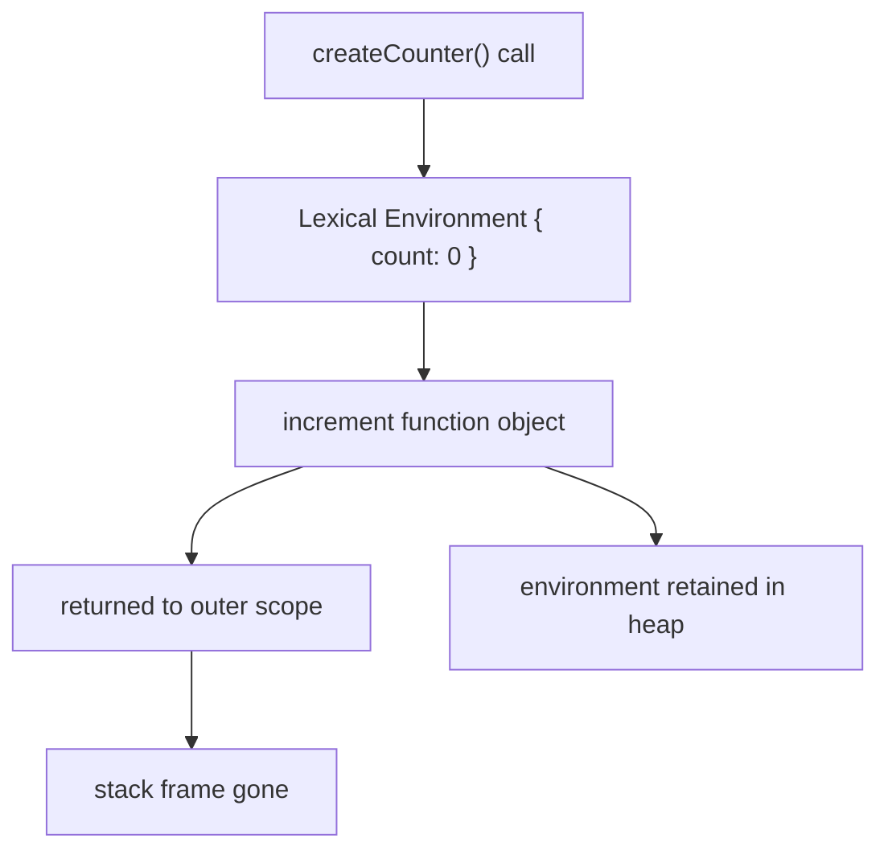
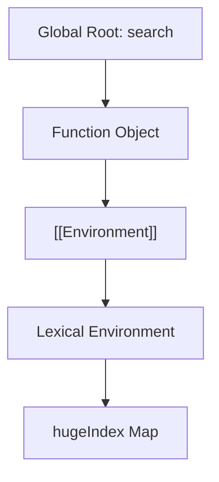
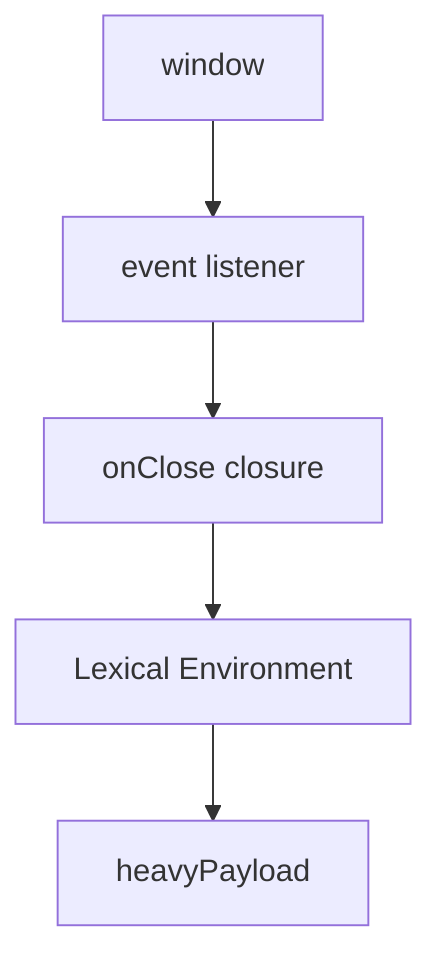

# 02b. Closures & Memory Retention

Замикання це одна з найсильніших концепцій JavaScript і одна з найчастіше неправильно зрозумілих. Вона одночасно пояснює приватний стан, callbacks, event handlers, memoization і цілий клас memory leaks. У цьому розділі ми дивимося на closure не як на "магію функцій", а як на **механізм утримання даних у пам'яті**.

---

## I. Що таке Closure з точки зору пам'яті

**Теза:** Closure це функція, яка продовжує мати доступ до зовнішніх змінних навіть після завершення зовнішньої функції. Причина проста: внутрішня функція утримує посилання на середовище, де була створена.

### Приклад
```javascript
function createCounter() {
  let count = 0;

  return function increment() {
    count += 1;
    return count;
  };
}

const counter = createCounter();
counter(); // 1
counter(); // 2
```

### Просте пояснення
Функція `increment` ніби "забирає з собою" змінну `count`. Зовнішня функція завершилась, але `count` не зник, бо внутрішня функція все ще ним користується.

### Технічне пояснення
Після виклику `createCounter()` її stack frame зникає з call stack. Але lexical environment не можна прибрати, бо повернений function object продовжує посилатись на нього через внутрішній механізм на кшталт `[[Environment]]`. Саме тому дані переживають завершення зовнішньої функції.

### Візуалізація


### Edge Cases / Підводні камені
> [!IMPORTANT]
> Closure не означає "копію змінної". Він означає **живе посилання** на зовнішнє середовище, яке може змінюватись між викликами.

---

## II. Closure Retention: Чому GC не прибирає змінні

**Теза:** Garbage Collector не видаляє lexical environment, якщо до нього ще можна дійти через function object, який існує у Heap або в якомусь root.

### Приклад
```javascript
function createSearch() {
  const hugeIndex = new Map();

  return function search(id) {
    return hugeIndex.get(id);
  };
}

const search = createSearch();
```

### Просте пояснення
`hugeIndex` не видно напряму ззовні, але він усе ще живий, бо функція `search` його "тримає".

### Технічне пояснення
Поки існує змінна `search`, існує function object. Поки існує function object, існує посилання на зовнішній lexical environment. Поки існує цей шлях, `hugeIndex` залишається reachable і GC не може його зібрати.

### Візуалізація


> [!TIP]
> **[▶ Запустити інтерактивний візуалізатор (Closure Retention)](../../visualisation/memory-and-data-structures/02b-closures-and-memory-retention/closure-retention/index.html)**

### Edge Cases / Підводні камені
> [!WARNING]
> Проблема не в самому closure. Проблема виникає тоді, коли closure випадково утримує **більше даних**, ніж потрібно для бізнес-логіки.

---

## III. Коли Closure це Норма, а Коли Leak

**Теза:** Closure сам по собі не є memory leak. Це нормальний механізм мови. Leak починається там, де lifetime замкнених даних стає довшим, ніж потрібно.

### Приклад
```javascript
function mountModal() {
  const heavyPayload = new Array(100000).fill("modal");

  const onClose = () => {
    console.log(heavyPayload.length);
  };

  window.addEventListener("click", onClose);
}
```

### Просте пояснення
Поки висить event listener, функція `onClose` жива. Поки жива `onClose`, живий і `heavyPayload`. Якщо забути зняти listener, пам'ять не звільниться.

### Технічне пояснення
Retained path тут виглядає так: `window -> event listener list -> onClose function -> lexical environment -> heavyPayload`. Поки цей шлях існує, об'єкт reachable. GC працює правильно. Логічна помилка у вас, а не в рушії.

### Візуалізація


### Edge Cases / Підводні камені
> [!CAUTION]
> Найнебезпечніші closure leaks виникають через listeners, timers, caches, module singletons і глобальні масиви callback-ів.

---

## IV. Common Misconceptions

> [!IMPORTANT]
> **"Closure зберігає копію змінних."** Ні. Closure тримає доступ до середовища, а не snapshot його значень.

> [!IMPORTANT]
> **"Якщо функція завершилась, усі її локальні змінні гарантовано зникають."** Ні. Вони зникнуть лише тоді, коли на їхнє середовище більше не буде reachable path.

> [!IMPORTANT]
> **"Closure = memory leak."** Ні. Closure це базовий механізм мови. Leak це побічний ефект неправильного ownership або cleanup.

---

## V. When This Matters / When It Doesn't

- **Важливо:** callbacks, event handlers, timers, memoized factories, hooks, middleware, caches, UI-компоненти з heavy payload.
- **Менш важливо:** короткоживучі локальні closures, які не тікають назовні і не утримуються довгоживучими roots.

---

## VI. Self-Check Questions

1. Чому closure може пережити завершення зовнішньої функції?
2. Яка різниця між "stack frame зник" і "lexical environment зник"?
3. Чому `counter()` з прикладу продовжує бачити `count`, хоча `createCounter()` уже відпрацювала?
4. Який retained path тримає дані живими в event-listener closure leak?
5. Що виведе код і чому?
```javascript
function makeAdder() {
  let value = 1;
  return () => ++value;
}
const add = makeAdder();
console.log(add(), add());
```
6. Чому closure не можна вважати "копією" зовнішніх змінних?
7. У якому сценарії closure абсолютно корисний і не є проблемою для пам'яті?
8. У якому сценарії closure стає небезпечним для memory retention?
9. Що треба прибрати в коді: сам великий об'єкт чи retained path до нього?
10. Як би ви пояснили junior-розробнику різницю між "GC не прибрав об'єкт" і "GC зламався"?
