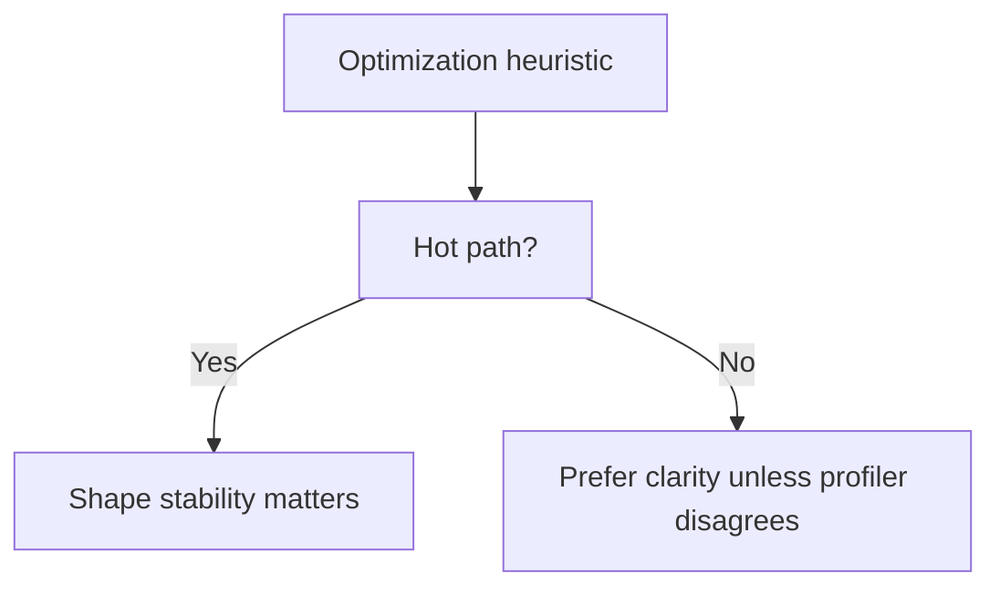

# 03. V8 Hidden Classes and Inline Caches

Швидкість JavaScript завжди вважалася проблемою через його природу: динамічну типізацію. В С++ чи Java структура об'єкта (його розмір та розміщення полів у пам'яті) фіксується ще до старту програми під час компіляції. У JavaScript ви можете взяти порожній об'єкт `{}`, додати в нього 10 нових властивостей прямо під час виконання, а потім видалити половину.

Щоб мати змогу виконувати такий хаос із прийнятною швидкістю, двигун V8 використовує геніальні механізми адаптації на льоту: **Hidden Classes (Shapes)** та **Inline Caches**.

---

## I. Essential Частина

### 1. Проблема динамічної пам'яті (Hash Tables)

**Теза:** Коли ви додаєте властивість до об'єкта в JavaScript, для рушія це виглядає як словник (Dictionary / Hash Table). Пошук значення у словнику по ключу займає значно більше часу, ніж читання прямої адреси у пам'яті (як в C++).

**Приклад:**
```javascript
const user = {};
user.name = "Artur"; // V8 має динамічно виділити місце і додати ключ
user.role = "Admin";
```

**Просте пояснення (Junior/Middle):**
Уявіть, що ви шукаєте книгу в величезній бібліотеці без каталогу. Кожного разу вам доводиться сканувати полиці в пошуках потрібного слова. Хеш-таблиці швидкі, але якщо ви знаходите і читаєте властивості об'єкта мільйони разів за секунду (наприклад, у циклі рендеру React), цей постійний пошук стає надзвичайно дорогим. Java-програма, навпаки, знає, що "name" лежить рівно на 32-му байті (це називається Memory Offset). V8 намагається перетворити JavaScript на таку ж швидку мову.

### 2. Приховані Класи: Спроба надати структуру хаосу

**Теза:** Щоб не шукати властивості як у словнику, V8 під капотом непомітно створює статичні структури в пам'яті (подібні до класів у C++). Вони називаються **Hidden Classes** або **Shapes** (у рушії SpiderMonkey).

Коли об'єкт створюється та заповнюється, замість хеш-таблиці він отримує посилання на `Shape`. Цей `Shape` вже містить мапу (схему), де в пам'яті лежать реальні значення (Offsets) для цього об'єкта.

**Технічне пояснення (Senior):**
V8 використовує C++ структуру `Map` (не плутати з JS-об'єктом `Map`). Кожен об'єкт має вказівник на свій поточний Hidden Class (`Map`).
- Коли створюється порожній об'єкт `const p1 = {}`, йому призначається порожній Map (`C0`).
- Коли ви додаєте `p1.x = 10`, V8 створює **новий** Map (`C1`), який знає, що властивість `x` лежить за Offset `0` в пам'яті об'єкта.
- Коли ви додаєте `p1.y = 20`, V8 створює `C2`, знаючи, що `x` лежить за Offset `0`, а `y` — за Offset `1`.
Це дозволяє двигуну звертатися до значень миттєво через арифметичне додавання (Base Pointer + Offset).

**Візуалізація:**
> [!TIP]
> **[▶ Запустити інтерактивний візуалізатор (V8 Transition Trees та Deoptimizations)](../../visualisation/memory-and-data-structures/03-v8-hidden-classes-and-ic/hidden-classes/index.html)**

### 3. Anti-patterns (The "Delete" Trap)

**Теза:** Будь-яка нестандартна зміна форми об'єкта руйнує оптимізацію і перетворює швидкий об'єкт (Shape) назад у повільний словник (Slow Dictionary Mode).

**Edge Cases / Підводні камені:**
> [!WARNING]
> 1. **Уникайте `delete` на hot paths і shape-sensitive об'єктах.**
> ```javascript
> const config = { title: "App", debug: true };
> delete config.debug; // КАТАСТРОФА ДЛЯ ПРОДУКТИВНОСТІ!
> ```
> Коли ви видаляєте властивість, shape об'єкта може втратити стабільність, і рушій піде в повільніший шлях доступу до властивостей. Це особливо боляче для гарячого коду і однотипних об'єктів, які багаторазово проходять через одну функцію. Для таких місць безпечніше зберігати форму стабільною через `null` або `undefined`.

> [!CAUTION]
> 2. **Порядок додавання властивостей має значення.**
> ```javascript
> // Ці два об'єкти матимуть РІЗНІ Hidden Classes!
> const p1 = { x: 1, y: 2 };
> const p2 = { y: 2, x: 1 }; 
> ```
> Завжди ініціалізуйте однотипні об'єкти з тим самим порядком ключів.

---

## II. Advanced Section (Deep Dive & Inline Caches)

### 1. Transition Trees (Дерева переходів)

Як саме V8 знає, який Shape призначити об'єкту? Він будує **Transition Trees**.

Коли ви додаєте `p1.x = 1`, V8 перевіряє, чи має порожній базовий `C0` перехід з назвою `"x"`. Якщо ні — він його будує (`C1`). Коли ви створюєте новий об'єкт `p2.x = 2`, V8 бачить: "Ага, в мене вже є перехід `"x"` з `C0`, я дам об'єкту `p2` існуючу форму `C1`".
Це феноменально економить пам'ять та час. Обидва об'єкти розділяють один `Shape`, хоча мають у Купі (Heap) абсолютно різні значення (1 та 2).

### 2. Inline Caches (IC)

**Теза:** Inline Cache — це "гарячий кеш" на рівні машинного коду, завдяки якому об'єкти з однаковими `Shapes` обробляються з блискавичною швидкістю (O(1)).

Коли V8 (TurboFan компілятор) виконує функцію, він "запам'ятовує" форму об'єкта, яка туди прийшла:
```javascript
function getRole(user) {
    return user.role; 
}
```
1. **Uninitialized Stage:** При першому запуску V8 ще нічого не знає. Він іде до `user`, дивиться на його Hidden Class, витягує Offset для `"role"` (наприклад, +8 байтів від базового вказівника).
2. **Monomorphic Stage (Ідеал):** V8 кешує цей Offset. Наступного разу, якщо у функцію прийде об'єкт **З ТОЧНО ТАКИМ ЖЕ HIDDEN CLASS**, він взагалі не шукатиме ключ "role". Він просто візьме дані з пам'яті за зміщенням +8 байтів. Швидкість виконання злітає в сотні разів.

### 3. Monomorphism vs Polymorphism vs Megamorphism

Чому стабільність типів (TypeScript-підхід) робить код швидшим?

- **Monomorphic (1 Shape):** Функція завжди отримує об'єкти однакової структури. IC закешував один Offset. C++ швидкість.
- **Polymorphic (2-4 Shapes):** Функція отримує дві трохи різні форми (наприклад, `{name, role}` та `{name, role, age}`). IC створює невелику таблицю (`if Shape1 -> offset +8, if Shape2 -> offset +12`). Це трохи повільніше, використовується умовне відгалуження (branching).
- **Megamorphic (5+ Shapes):** У функцію передають абсолютну вільну кашу з об'єктів. Кеш не витримує. `Inline Cache` відключається, і V8 повертається до повністю динамічного повільного пошуку хеш-таблицями для кожної ітерації (Dictionary Lookup).

**Висновок:** Якщо ви хочете писати High-Performance JS, вирівнюйте структури даних. Передавайте у функції однотипні об'єкти, ініціалізуйте поля заздалегідь і з обережністю використовуйте `delete` там, де shape stability реально важлива.

### 4. When This Matters / When It Doesn't

- **Важливо:** гарячі цикли, render-пайплайни, парсери, серіалізація, high-throughput data processing.
- **Менш важливо:** холодний адміністративний код, одноразові скрипти, місця, де читабельність важливіша за micro-optimization.

### 5. Practical Contrast: Hot Path vs Cold Path

**Теза:** Одна й та сама порада може бути критично важливою в одному місці і майже неважливою в іншому.

**Приклад:**
```javascript
// Hot path: рендер кожного елемента списку 10_000 разів
function renderRow(row) {
  return row.title + " - " + row.status;
}

// Cold path: одноразовий admin script
function normalizeConfig(config) {
  delete config.debug;
  return config;
}
```

**Просте пояснення:** `renderRow` викликається багато разів, тому стабільність shape тут реально впливає на продуктивність. `normalizeConfig` може виконатись один раз на старті, і виграш від micro-optimization там часто нульовий.

**Технічне пояснення:** Hidden Classes та IC дають максимальну користь лише там, де одна й та сама machine-code path виконується знову й знову. Якщо код холодний, витрати на стабілізацію shape можуть не окупитись взагалі.

**Візуалізація:**


**Edge Cases / Підводні камені:**
> [!TIP]
> Якщо ви не можете показати, що функція гаряча через profiler або repeatable benchmark, не варто ускладнювати модель даних лише через страх перед polymorphism.

### 6. Common Misconception

> [!IMPORTANT]
> `delete` не є "забороненим" оператором JavaScript. Це легальний інструмент. Проблема не в самому операторі, а в тому, **де** і **як часто** він застосовується.

---

## III. Self-Check Questions

1. Навіщо V8 взагалі потрібні Hidden Classes, якщо JavaScript динамічна мова?
2. Чому стабільна форма об'єкта допомагає `Inline Cache` працювати швидше?
3. Що таке `monomorphic`, `polymorphic` і `megamorphic` доступ до властивостей у практичному сенсі?
4. Чому два об'єкти з однаковими ключами, але в різному порядку, можуть поводитись по-різному для рушія?
5. Який код потенційно дружніший до V8 і чому?
```javascript
const a = { x: 1, y: 2 };
const b = { x: 3, y: 4 };
```
або
```javascript
const a = { x: 1, y: 2 };
const b = {};
b.y = 4;
b.x = 3;
```
6. Коли попередження про `delete` має високий пріоритет, а коли ним можна знехтувати?
7. Чому plain object як shape-stable entity і `Map` як lookup collection це не взаємовиключні ідеї, а різні інструменти?
8. Уявіть функцію, яка приймає 7 різних форм об'єктів. Який режим кешування для доступу до властивостей найімовірніший?
9. Чому ця тема важливіша для гарячих шляхів виконання, ніж для одноразових скриптів?
10. Як би ви пояснили junior-розробнику, що V8 не "перетворює JS на C++", а лише прагне дати подібно швидкий доступ у певних сценаріях?
