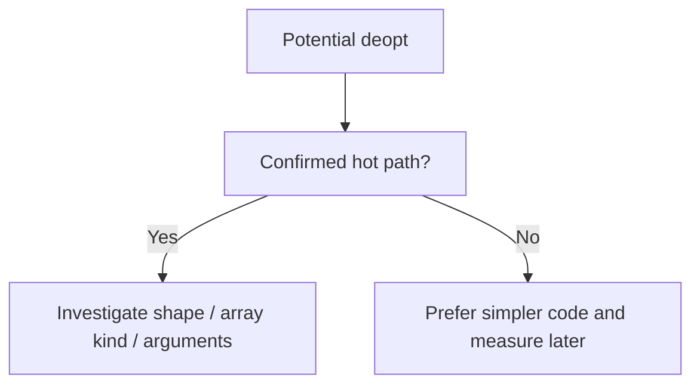
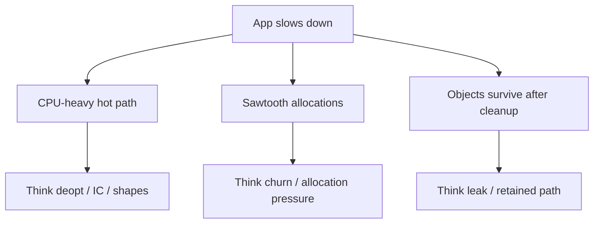

# 04. Deoptimization and Performance Pitfalls

Двигун V8 працює у два етапи. Спочатку швидкий компілятор **Ignition** перетворює ваш JS у повільний байт-код (Bytecode). Потім гарячий код передається оптимізуючому компілятору **TurboFan**, який генерує ідеальний машинний код. Але якщо ваш код непередбачувано "ламає форму", TurboFan змушений викинути машинний код — це і є **Деоптимізація (Deoptimization)**.

---

## I. Essential Частина

### 1. Що таке Deoptimization (Bailout)?

**Теза:** Коли V8 не може передбачити структуру ваших даних, він відключає оптимізації і "падає" (bails out) до базового повільного виконання байт-коду. Деоптимізація — це головна причина, чому один і той самий цикл може раптом змінити швидкість виконання від $O(1)$ до $O(N^2)$.

### 2. The `delete` Operator (Вбивця Оптимізації)

**Теза:** Використання ключового слова `delete` **може** зруйнувати shape stability об'єкта і штовхнути рушій у повільніший шлях доступу до властивостей. Це не завжди критично, але в hot code paths ризик реальний.

**Приклад:**
```javascript
const userData = { id: 1, access: "User", flags: 0 };
delete userData.flags; // ❌ Об'єкт деоптимізувався назавжди

const validData = { id: 1, access: "User", flags: 0 };
validData.flags = undefined; // ✅ Часто кращий підхід для стабільної форми
```

**Просте пояснення (Junior/Middle):**
Якщо ви купуєте машину з 4 колесами і потім хочете її тюнінгувати, ви не відпилюєте 4-те колесо бензопилою (це `delete`). Ви знімаєте покришку, але залишаєте вісь (це `= undefined`). V8 дуже легко читати значення `undefined`, але коли ви фізично "відпилюєте" ключ, V8 розгублено перебудовує всю машину всередині пам'яті.

**Технічне пояснення (Senior):**
V8 використовує C++ структуру `Map` (Shape), яка зберігає зміщення в пам'яті (`Offset`) для властивостей об'єкта. Оператор `delete` може зробити shape менш передбачуваним і в окремих сценаріях перевести об'єкт із fast properties у повільніший режим доступу. Якщо така операція відбувається всередині гарячого циклу або на великій кількості однотипних об'єктів, падіння продуктивності може бути відчутним. У холодному коді ефект часто не вартий окремої уваги.

### 3. Dynamic Properties (Ініціалізуйте заздалегідь)

**Теза:** Додавання нових полів до об'єкта після його ініціалізації генерує нові гілки в дереві *Transition Tree* і створює поліморфізм для функцій, змушуючи `TurboFan` працювати повільніше.

**Приклад:**
```javascript
// ❌ ПОГАНО (Dynamic Allocation)
const req = {};
req.method = "GET"; 
req.status = 200;

// ✅ ДОБРЕ (Ahead of Time Allocation)
const res = {
    method: "GET",
    status: 200,
    body: null // Ініціалізуємо навіть якщо ще немає даних
};
```

**Edge Cases / Підводні камені:**
> [!CAUTION]
> Об'єкти, які передаються в одну й ту ж саму функцію, **МАЮТЬ БУТИ** ідентичними (Monomorphic) і заповнюватися в однаковому порядку.
> ```javascript
> // Різний порядок = Різні Shapes!
> const p1 = { x: 1, y: 2 };
> const p2 = { y: 2, x: 1 };
> processPoints(p1);
> processPoints(p2); // Deoptimizes processPoints() do Polymorphic (Slow)
> ```

---

## II. Advanced Section (Deep Dive)

### 1. Elements Kinds (Фантастична Оптимізація Масивів)

**Теза:** У JavaScript масиви є різновидом Object, але під капотом V8 оптимізує їх до С++-подібних лінійних масивів. Проте ця оптимізація вразлива і має 5+ рівнів деградації (Downgrades).

V8 відслідковує тип масиву (Elements Kind). Ось найрозповсюдженіші:
1. `PACKED_SMI_ELEMENTS` (Максимально швидкий) — масив суцільних `Small Integers`: `[1, 2, 3]`.
2. `PACKED_DOUBLE_ELEMENTS` — деградує, як тільки ви додаєте рухому крапку (`4.5`).
3. `PACKED_ELEMENTS` — деградує, якщо ви додаєте будь-який інший об'єкт/рядок.
4. `HOLEY_ELEMENTS` — **найгірший**, виникає при появі "дірок" у масиві.

**Приклад (Шлях Деоптимізації масиву):**
```javascript
const arr = [1, 2, 3]; // PACKED_SMI_ELEMENTS (The King 👑)

arr.push(4.5); // Downgrade do PACKED_DOUBLE_ELEMENTS
arr.push('x'); // Downgrade do PACKED_ELEMENTS

arr[6] = 10;   // Downgrade do HOLEY_ELEMENTS (The Hole 🕳️)
```

**Візуалізація:**
> [!TIP]
> **[▶ Запустити інтерактивний візуалізатор (V8 Elements Kinds та HOLEY деоптимізації)](../../visualisation/memory-and-data-structures/04-deoptimization-pitfalls/elements-kinds/index.html)**

**The "HOLEY" Anti-pattern:**
Чому Holey (масиви з дірками) настільки повільні? Якщо масив `PACKED` і ви ітеруєте його `arr[5]`, V8 знає, що там лежать дані. Але якщо масив `HOLEY`, і ви торкаєтеся пустої комірки (`empty`), V8 за специфікацією зобов'язаний повернути `undefined`. Оскільки в самій комірці немає значення "undefined", V8 змушений зупинитися і перевірити весь **ланцюг прототипів (Prototype Chain)** `Array.prototype`, шукаючи, чи немає властивості `arr[5]` там! Ця повна перевірка прототипів для кожного пустого індексу в циклі знищує продуктивність у $10+$ разів.
- **Ніколи не використовуйте `new Array(100)`**, бо це створює HOLEY-масив.
- **Використовуйте `new Array(100).fill(0)`**, це фіксує масив як PACKED_SMI.

### 2. Leaking "arguments" Object (Витріск Оптимізації)

**Теза:** До появи ES6, розробники використовували магічний об'єкт `arguments` для доступу до невідомої кількості параметрів у функції. Його "витік" за межі функції негайно деоптимізує весь її контекст.

**Приклад:**
```javascript
// ❌ ПОГАНО (Leaking Arguments Penalty)
function trackEvents() {
    const argsArray = Array.prototype.slice.call(arguments); // Витік "arguments"
    externalLogger(arguments); // Ще один витік 
}

// ✅ ДОБРЕ (Rest parameters)
function trackEvents(...args) {
    // args - це звичайний PACKED_ELEMENTS масив
    externalLogger(args);
}
```

**Технічне пояснення:**
Об'єкт `arguments` у стародавньому JS має магічний зв'язок (Aliasing) із реальними параметрами функції. Зміна `arguments[0] = 5` міняла реальну першу локальну змінну функції `x = 5`.
Двигун V8 докладає величезних зусиль, щоб тримати `arguments` лише у Stack Frame. Якщо ви передаєте `arguments` як аргумент в іншу функцію (витік), V8 втрачає контроль над ним і мусить матеріалізувати цю важку структуру повністю у Heap (як повільний Dictionary Object), відключаючи `Inline Caches` для всієї функції.
Рест-параметри (`...args`) збирають елементи у чистий, швидкий `PACKED` справжній масив без магічних зв'язків. 

### 3. When Optimization Matters / When It Doesn't

**Теза:** Deopt-пастки мають значення лише тоді, коли вони б'ють по коду, який реально часто виконується або вже підтверджений як вузьке місце.

**Приклад:**
```javascript
// Hot path: parser викликається тисячі разів
function parsePoint(raw) {
  return raw.x + raw.y;
}

// Cold path: міграція конфігу один раз при старті
function migrateConfig(config) {
  delete config.legacyFlag;
  return config;
}
```

**Просте пояснення:** Якщо deopt трапляється в коді, який живе в гарячому циклі, він може зіпсувати весь throughput. Якщо це одноразова міграція, зручність і ясність коду можуть бути важливішими.

**Технічне пояснення:** TurboFan інвестує в оптимізацію лише в гарячі шляхи. Якщо функція не hot, навіть ідеально стабільний shape не дасть практичного виграшу. Саме тому deopt heuristics без профайлінгу легко перетворюються на cargo cult.

**Візуалізація:**


**Edge Cases / Підводні камені:**
> [!WARNING]
> Код може бути "теоретично неідеальним" для V8 і водночас повністю прийнятним для продукту. Важливий не сам факт deopt, а його вплив на latency, CPU і memory pressure.

### 4. Practical Contrast: Leak, Churn or Deopt?

**Теза:** Не кожна проблема продуктивності походить від deoptimization. Часто корінь проблеми — memory churn або leak, а не shape instability.

**Приклад:**
```javascript
function render(items) {
  return items.map(item => ({
    id: item.id,
    title: item.title
  }));
}
```

**Просте пояснення:** Якщо цей код гальмує, проблема може бути не в object shapes, а в тому, що він створює забагато короткоживучих об'єктів на кожен render.

**Технічне пояснення:** Для реальної діагностики треба розділяти три класи проблем: deopt, excessive allocation churn і retention/leak. Вони можуть виглядати схоже на рівні "додаток став повільним", але лікуються різними інструментами.

**Візуалізація:**


**Edge Cases / Підводні камені:**
> [!TIP]
> Якщо ви бачите проблему лише в Memory tab, не починайте з `delete` або `arguments`. Спочатку з'ясуйте, чи це взагалі deopt-клас проблеми.

### 5. Common Misconceptions

> [!IMPORTANT]
> "Є deopt" не означає "код неправильний". Це означає лише, що рушій більше не може тримати певні припущення, а вже далі важить лише реальний вплив на гарячий шлях.

---

### Резюме: Правила Швидкого JS
1. Уникайте `delete` у shape-sensitive і hot-path коді. Часто краще `null` або `undefined`.
2. Оголошуйте всі поля об'єкта в конструкторі (або під час ініціалізації масиву).
3. Передавайте у функції об'єкти з ідентичними ключами у тому самому порядку.
4. Не допускайте дірок `[1, , 3]` у масивах. Прагніть до монотипних масивів (лише числа/лише рядки).
5. Забудьте про `arguments` і завжди використовуйте синтаксис `...args`.

### Benchmark Caveat

> [!IMPORTANT]
> Не перетворюйте ці правила на релігію. Якщо код не є hot path, оптимізація форми об'єкта може дати нульову практичну користь. Спочатку вимірюйте, потім оптимізуйте.

---

## III. Self-Check Questions

1. Що таке deoptimization у контексті V8: runtime error, GC event чи відкат до повільнішого шляху виконання?
2. Чому `delete` у гарячому циклі потенційно небезпечніший, ніж `delete` в одноразовому скрипті міграції?
3. Що робить масив `HOLEY`, і чому це погано для продуктивності?
4. Чому `new Array(100)` і `new Array(100).fill(0)` це не однакові конструкції з точки зору рушія?
5. Яку проблему вирішують rest parameters порівняно з `arguments`?
6. Що в цьому коді може бути неідеальним для V8 і чому?
```javascript
function process(arr) {
  arr[10] = 1;
  return arr.includes(1);
}
```
7. Чому змішування чисел, рядків і об'єктів в одному масиві інколи шкодить передбачуваності виконання?
8. Яка різниця між "код працює правильно" і "код працює без deopt"?
9. Якщо профайлер не показує вузьке місце в цьому коді, чи варто переписувати його лише через heuristics з цієї статті?
10. Яке головне правило повинне стримувати вас від cargo cult optimization після прочитання цього розділу?
