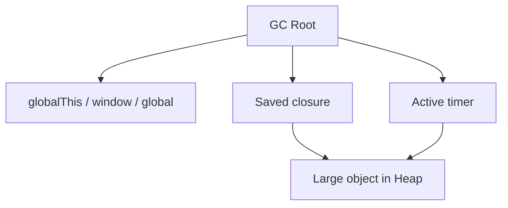

# 05. Garbage Collection Mechanics (Прибирання Пам'яті)

Мови низького рівня, такі як C або C++, вимагають від розробника ручного керування пам'яттю (використання функцій `malloc()` та `free()`). У JavaScript ви цього не робите, адже за вас працює **Збирач сміття (Garbage Collector або GC)**.

Розуміння того, як і коли звільняється пам'ять, є критичним для створення швидких SPA-додатків (React/Vue/Angular), щоб не допускати "витоків" інформації (Memory Leaks), які з часом поглинають усю пам'ять браузера і "вішають" вкладку.

---

## I. Essential Частина

### 1. Reachability (Досяжність)

**Теза:** Головна і єдина концепція, на яку спирається сучасний GC, — це **Досяжність**. Всі об'єкти, до яких можна "дійти" за посиланнями, починаючи від "Коренів" (Roots), вважаються живими (Alive). Усе інше — сміття.

До "Коренів" (GC Roots) у JavaScript належать:
- Глобальні об'єкти (наприклад, об'єкт `window` у браузері або `global` у Node.js).
- Локальні змінні та параметри функцій, які зараз знаходяться у Call Stack-у (процес виконання ще не завершився).
- Внутрішні об'єкти браузера (компоненти DOM, активні таймери `Web APIs`).

**Приклад:**
```javascript
let app = { data: "Super App Data", mode: "test" }; // Створює об'єкт у Heap

app = null; 
// Об'єкт у Heap ще існує фізично, але до нього більше 
// немає шляхів від GC Roots (Global Env). Він став недосяжним.
```

**Просте пояснення (Junior/Middle):**
Уявіть, що GC Roots — це електричні розетки у вашому домі, а об'єкти (Heap) — це гірлянда, лампочки якої з'єднані одна з одною дротами (References). GC періодично вмикає струм у розетці. Ті лампочки, до яких дійшов струм (навіть через 10 перехідників), світяться — вони "живi". Ті, до яких шнур перерізано (наприклад, `app = null`), струм не отримують. Тоді GC просто приходить і згрібає всі темні лампочки у смітник.

### 2. Алгоритм Mark-and-Sweep

**Теза:** Це класичний алгоритм очищення V8, що працює у дві фази: Пошук та Знищення.

1. **Фаза Mark (Познач):** Збирач сміття стартує від GC Roots, рекурсивно перебирає всі посилання і фарбує кожен знайдений об'єкт.
2. **Фаза Sweep (Замітай):** GC сканує всю пам'ять Купи (Heap). Об'єкти, які не отримали міток "живих", видаляються, звільняючи байти для нових даних. Ця пам'ять повертається операційній системі (Free List).

**Візуалізація:**
> [!TIP]
> **[▶ Запустити інтерактивний візуалізатор (Mark-and-Sweep та Memory Leaks)](../../visualisation/memory-and-data-structures/05-garbage-collection/mark-and-sweep/index.html)**
> Ця інтерактивна візуалізація демонструє ланцюжок досяжності та процес, коли посилання втрачається (об'єкт стає кандидатом на деструкцію Sweep).

### 3. Memory Leaks (Витоки Пам'яті)

**Теза:** Витік пам'яті виникає тоді, коли об'єкт насправді вам більше не потрібен (компонент видалено з екрана), але десь у системі **залишився шлях** від GC Roots до нього, що не дає алгоритму "Sweep" видалити об'єкт.

**Типові сценарії:**
> [!WARNING]
> 1. **Забуті Таймери (Timers/Intervals):**
> Таймер, створений через `setInterval`, реєструється у браузері (Web APIs), що є окремим GC Root.
> ```javascript
> function mount() {
>   const hugeData = new Array(10000);
>   setInterval(() => console.log(hugeData.length), 1000);
> }
> mount(); // Викликали та забули. hugeData не буде видалено НІКОЛИ!
> ```
> *Рішення:* Завжди викликати `clearInterval` при демонтажі функцій.

> [!CAUTION]
> 2. **Отруйні Глобальні Змінні:**
> Можливість створити глобальні змінні без оголошення (напр. `someId = 5;` замість `const someId = 5;` в нестрогому режимі). Вони приєднуються до об'єкта `window`, який ніколи не видаляється. Щоб уникнути цього, завжди використовуйте `'use strict'`.

> [!IMPORTANT]
> 3. **DOM-Витоки (Event Listeners):**
> Якщо ви видалили HTML-вузол з екрану `element.remove()`, але забули зняти з нього слухач подій `.removeEventListener(...)`, який посилався на величезний JS об'єкт — весь цей об'єкт і сам DOM-вузол "зависнуть" у пам'яті як привиди (Detached DOM Tree).

> [!TIP]
> 4. **Closure Retention:**
> Замикання саме по собі не є витоком. Але якщо повернена або збережена функція продовжує тримати reference на великий об'єкт, цей об'єкт залишиться reachable.
> ```javascript
> function createHandler() {
>   const hugeCache = new Map();
>   return () => hugeCache.size;
> }
> const handler = createHandler();
> ```
> `hugeCache` не можна зібрати GC, поки живе `handler`.

---

## II. Advanced Section (Deep Dive & V8 GC Architecture)

### 1. Generational GC (Покоління Пам'яті)

Збирачу сміття складно сканувати величезний `Heap` на тисячі мегабайтів кожні кілька мілісекунд. Тому V8 базується на **Generational Hypothesis (Гіпотезі Поколінь):** "*Більшість об'єктів вмирає дуже молодими, а ті, що виживають довго — існують до кінця програми*".

Відповідно, Купа (Heap) фізично поділена на дві зони:
1. **Young Generation (Молоде покоління):** Дуже маленька зона (зазвичай 1-8 MB), де створюються всі нові `let obj = {}`.
2. **Old Generation (Старе покоління):** Величезна зона для довгожителів (Component State, Global Objects), куди об'єкти переводяться, якщо вони "пережили" кілька циклів прибирання молодого покоління.

### 2. The Scavenger Algorithm (Прибирання Young Generation)

Оскільки Young площа маленька і швидко заповнюється, V8 прибирає її надзвичайно швидко за допомогою алгоритму **Scavenge (Semi-Space)**.

- Зона розбита на дві половини. Нові об'єкти записуються в першу половину.
- Коли перша половина заповнюється, V8 блокує код, ідентифікує живі об'єкти (зазвичай лише ~10% виживають довше мілісекунд).
- Він **копіює** (Compact) ці 10% у другу (пусту) половину підряд, ігноруючи все інше.
- Далі він повністю спорожняє першу половину одним махом (як очищення Кешу).
Це гарантує відсутність дірок фрагментації у пам'яті та фантастичну швидкість алгоритму (близько 1 мс).

### 3. Incremental Marking та Stop-The-World Проблема

"Відстежити" старе покоління через масовий Mark-and-Sweep важко. 
Історично JavaScript призупиняв виконання усього коду (`Stop-The-World` пауза) під час "великого прибирання". Якщо Heap обіймав 500 МБ, це викликало "фріз" сторінки на сотні мілісекунд, що руйнувало анімації у $60fps$ ($16ms$ на кадр).

Сьогодні V8 використовує оркестрові рішення **Orinoco (V8 GC Project)**:
- **Incremental Marking (Поступове Маркування):** V8 не позначає всі об'єкти за раз. Він позначає їх маленькими шматочками (по 5-10 мс) під час простою (Idle Time) браузера, поки ви нічого не клікаєте.
- **Concurrent Marking/Sweeping:** Головний (вартівний) потік продовжує виконувати ваш JS-код, поки спеціальні Background Threads (фонові потоки V8) одночасно "вимітають" сміття.

*(Senior Insight)*: Якщо у вашому додатку зникають кадри і він відчувається "важким", вам не допоможе оптимізація React рендерів. Відкрийте вкладку *Performance* у DevTools. Якщо ви бачите часті величезні "Сходи" використання пам'яті (від 10 МБ до 500 МБ) із подальшим падінням і сотнями викликів Garbage Collector (жовті блоки) — ваш код надто агресивно плодить об'єкти в пам'яті, змушуючи GC "з'їдати" ресурси процесора на постійне прибирання.

### 4. Browser vs Node.js Memory Specifics

**Теза:** Базова ідея reachability однакова і в браузері, і в Node.js, але корені доступності та типові витоки різняться.

**Приклад:**
```javascript
// Browser leak pattern
window.cachedUser = { huge: true };

// Node.js leak pattern
global.cache = new Map();
```

**Просте пояснення (Junior/Middle):**
У браузері об'єкти часто "висять" через DOM, listeners, timers і глобальний `window`. У Node.js частіше проблема приходить через довгоживучі process-level кеші, глобальні змінні, модульний singleton state і незавершені сокети або таймери.

**Технічне пояснення (Senior):**
GC roots у браузері часто включають DOM tree, event loop callbacks і Web APIs. У Node.js критичні утримувачі це `global`, активні handles event loop, module cache, timers, sockets і application-level caches. Сам алгоритм reachability не змінюється, але retained paths у профайлері будуть принципово різними.

### Візуалізація


### Edge Cases / Підводні камені
> [!WARNING]
> Замикання, кеш і singleton самі по собі не є багами. Вони стають проблемою тоді, коли lifetime даних випадково стає довшим за lifetime бізнес-необхідності.

---

## III. Self-Check Questions

1. Що таке reachability і чому саме вона, а не "корисність для розробника", визначає чи об'єкт буде зібраний GC?
2. Чому `obj = null` не означає, що пам'ять звільнилась миттєво?
3. У чому різниця між memory leak і allocation churn?
4. Який retained path ви б шукали, якщо великий DOM-вузол не зникає після `remove()`?
5. Чому `setInterval` часто стає джерелом витоків навіть у відносно простому коді?
6. Що виведе цей код і чому він небезпечний з точки зору lifetime даних?
```javascript
function createTracker() {
  const large = new Array(100000).fill("x");
  return () => large.length;
}
const track = createTracker();
```
7. Чому `WeakMap` корисний саме в розмові про GC, а не просто як ще один контейнер?
8. Яка різниця між типовими memory-проблемами в браузері і в Node.js?
9. Якщо графік пам'яті в профайлері має sawtooth pattern, це завжди означає leak?
10. Який доказ вам потрібен після виправлення memory bug, щоб сказати, що проблема справді зникла?
