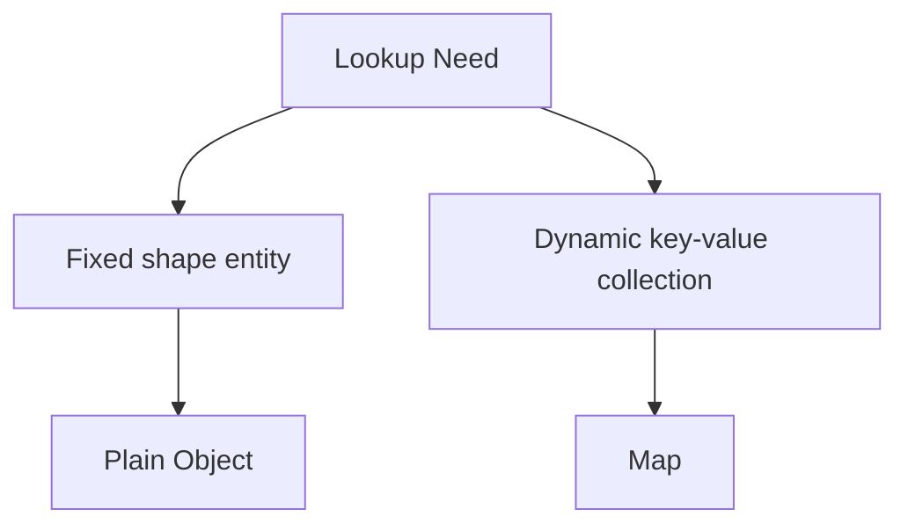
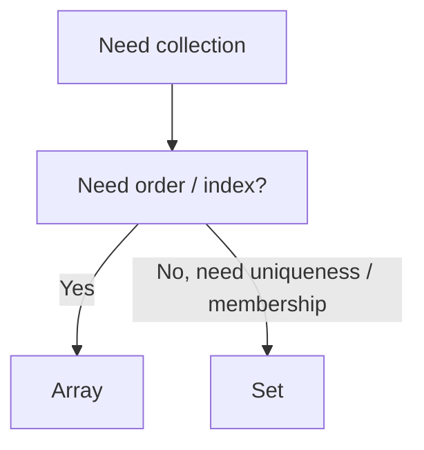
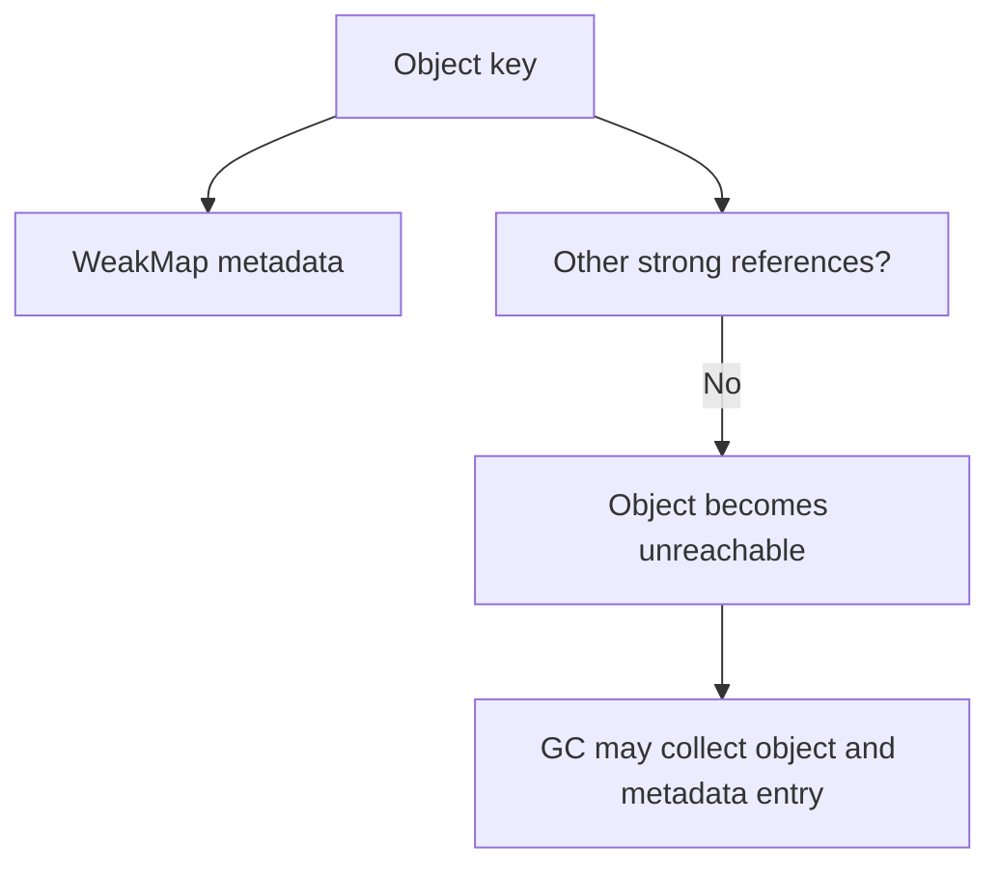
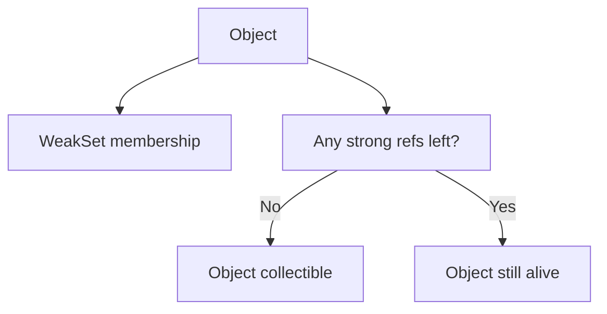

# 06. Map, Set, WeakMap, WeakSet

У JavaScript plain object історично використовували майже для всього: як словник, як cache, як set і навіть як metadata storage. Це працює, але не завжди добре. Сучасний JS має спеціалізовані структури даних, які краще виражають намір і часто краще поводяться з точки зору API, семантики та lifetime даних.

---

## I. `Map` vs Plain Object

**Теза:** Якщо вам потрібен словник довільних ключів, стабільний API для ітерації та чітка семантика "колекції", `Map` часто кращий за plain object.

### Приклад
```javascript
const objectIndex = {};
objectIndex.user42 = { role: "admin" };

const mapIndex = new Map();
mapIndex.set("user42", { role: "admin" });
```

### Просте пояснення
Об'єкт це насамперед сутність із властивостями. `Map` це саме колекція "ключ -> значення". Якщо дані поводяться як словник, `Map` виражає намір краще.

### Технічне пояснення
`Map` дозволяє використовувати будь-яке значення як ключ, має передбачуваний API (`set`, `get`, `has`, `delete`, `size`) і не має проблем із колізіями на рівні prototype properties. Plain object підходить, коли структура наперед відома і має роль моделі даних, а не довільного lookup-індексу.

### Візуалізація


### Edge Cases / Підводні камені
> [!WARNING]
> Не використовуйте `Map` тільки "бо він сучасніший". Для стабільних DTO, config-об'єктів і shape-sensitive V8 code plain object часто природніший.

---

## II. `Set` vs `Array`

**Теза:** Якщо вам потрібна унікальність елементів і швидкі перевірки на наявність, `Set` майже завжди кращий за `Array`.

### Приклад
```javascript
const selectedIdsArray = [1, 2, 3];
selectedIdsArray.includes(2);

const selectedIdsSet = new Set([1, 2, 3]);
selectedIdsSet.has(2);
```

### Просте пояснення
`Array` хороший для порядку і послідовного проходу. `Set` хороший для питання "чи є такий елемент?" і для гарантії унікальності.

### Технічне пояснення
У середньому `Set.prototype.has` дає вам логіку membership test без потреби сканувати послідовність зліва направо, як це робить `Array.prototype.includes`. Водночас `Array` залишається кращим, коли важливі індекси, порядок, сортування або щільний послідовний доступ.

### Візуалізація


### Edge Cases / Підводні камені
> [!CAUTION]
> `Set` не розв'язує проблему deep equality. Для об'єктів унікальність визначається за reference identity, а не за однаковим вмістом.

---

## III. `WeakMap` / `WeakSet` і Garbage Collection

**Теза:** `WeakMap` і `WeakSet` не утримують ключовий об'єкт живим самі по собі. Саме тому вони корисні для metadata та caches, прив'язаних до lifetime конкретного об'єкта.

### Приклад
```javascript
const metadata = new WeakMap();

function registerElement(element) {
  metadata.set(element, { mountedAt: Date.now() });
}
```

### Просте пояснення
Якщо DOM-елемент або інший об'єкт зникне з програми, `WeakMap` не буде штучно тримати його в пам'яті тільки тому, що ви колись поклали туди metadata.

### Технічне пояснення
Ключами в `WeakMap` можуть бути лише об'єкти. Вони weakly held, тому структура не дає вам повної ітерації: рушій не може гарантувати стабільний список ключів, бо частина з них може зникнути після GC. Саме через це в `WeakMap` немає `size`, `keys()` чи `forEach`.

### Візуалізація


> [!TIP]
> **[▶ Запустити інтерактивний візуалізатор (WeakMap vs Map and GC)](../../visualisation/memory-and-data-structures/06-map-set-weakmap-weakset/weakmap-gc/index.html)**

### Edge Cases / Підводні камені
> [!IMPORTANT]
> `WeakMap` не є способом "керувати GC вручну". Ви не контролюєте момент очищення, ви лише не блокуєте його своєю структурою даних.

---

## IV. When This Matters

- Використовуйте plain object для shape-stable entities, DTO, config і моделей предметної області.
- Використовуйте `Map`, коли ключі динамічні, нестрокові або коли колекція має бути явно lookup-oriented.
- Використовуйте `Set`, коли головна задача це унікальність або membership checks.
- Використовуйте `WeakMap` / `WeakSet`, коли metadata або cache мають жити не довше за ключовий об'єкт.

---

## V. `WeakSet` Окремо: Коли Потрібна Слабка Множина

**Теза:** `WeakSet` це не "Set, але рідше потрібний". Це спеціальна структура для випадків, коли вам треба позначити object keys без штучного подовження їх lifetime.

### Приклад
```javascript
const visited = new WeakSet();

function markNode(node) {
  visited.add(node);
}
```

### Просте пояснення
`WeakSet` корисний, коли ви хочете сказати "цей об'єкт уже бачили", але не хочете зберігати його в пам'яті лише заради самої позначки.

### Технічне пояснення
Як і `WeakMap`, `WeakSet` працює лише з object values і не дає повної ітерації чи `size`. Це наслідок слабкого утримання. Якщо останнє сильне посилання на об'єкт зникне, сам факт присутності в `WeakSet` не блокує GC.

### Візуалізація


### Edge Cases / Підводні камені
> [!CAUTION]
> `WeakSet` не підходить, якщо вам треба показати користувачу весь список елементів або порахувати їх кількість.

---

## VI. `Set` vs `WeakSet`

| Властивість | `Set` | `WeakSet` |
| :--- | :--- | :--- |
| Тип елементів | Будь-які значення | Лише об'єкти |
| Ітерація | Є | Немає |
| `size` | Є | Немає |
| Утримання значення живим | Так | Ні, не саме по собі |
| Типові сценарії | Унікальність, membership, visible collections | Ephemeral marking, visited flags, DOM metadata by identity |

### Просте пояснення
Якщо колекція має бути видимою і керованою як список, це `Set`. Якщо колекція має бути майже "невидимою службовою міткою", яка живе не довше за сам об'єкт, це `WeakSet`.

---

## VII. Common Misconceptions

> [!IMPORTANT]
> **"WeakMap / WeakSet автоматично чистять пам'ять одразу."** Ні. Вони лише не заважають GC. Момент очищення ви не контролюєте.

> [!IMPORTANT]
> **"`Map` завжди кращий за object."** Ні. `Map` і object вирішують різні задачі.

> [!IMPORTANT]
> **"`WeakSet` це просто менш функціональний `Set`."** Ні. Це структура з іншою семантикою lifetime.

---

## VIII. Self-Check Questions

1. У чому концептуальна різниця між plain object і `Map`?
2. Чому `Set` не розв'язує проблему deep equality для об'єктів?
3. Коли metadata storage для DOM-елемента логічніше робити через `WeakMap`, а не через `Map`?
4. Що втратить `WeakMap`, якби рушій дозволив `keys()` і `size`?
5. Чому `WeakSet` корисний для visited-marking, але незручний для UI state inspection?
6. Що вибрати для унікальних id рядкового типу: `Array`, `Set` чи `WeakSet`? Чому?
7. Що вибрати для кешу, який має жити не довше за об'єкт-ключ: `Map` чи `WeakMap`?
8. Чому `WeakMap` не варто використовувати там, де потрібна дебаг-панель зі списком усіх записів?
9. Як би ви пояснили різницю між "collection API" і "lifetime semantics" на прикладі `Map` vs `WeakMap`?
10. Уявіть, що вам треба позначати DOM-вузли як "already processed", але не тримати їх зайвий час у пам'яті. Яку структуру ви оберете і чому?
