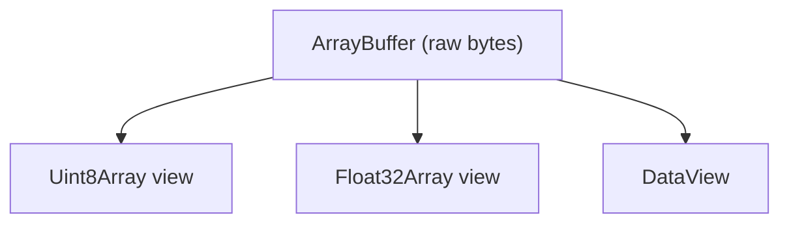
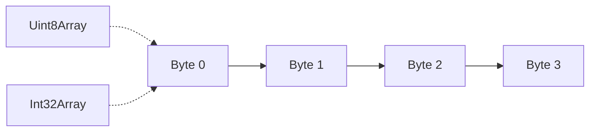
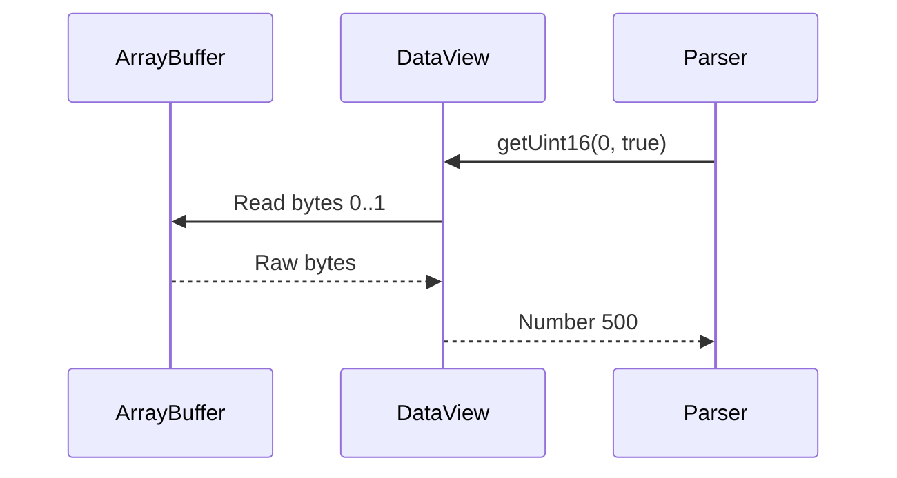
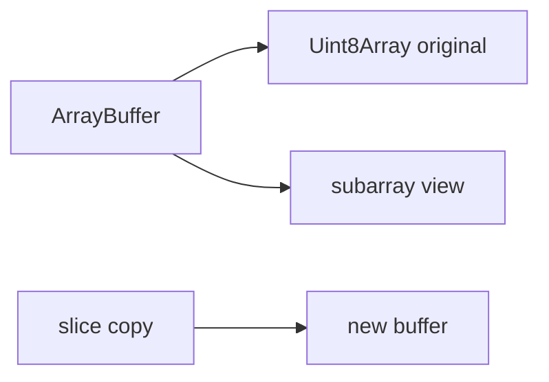
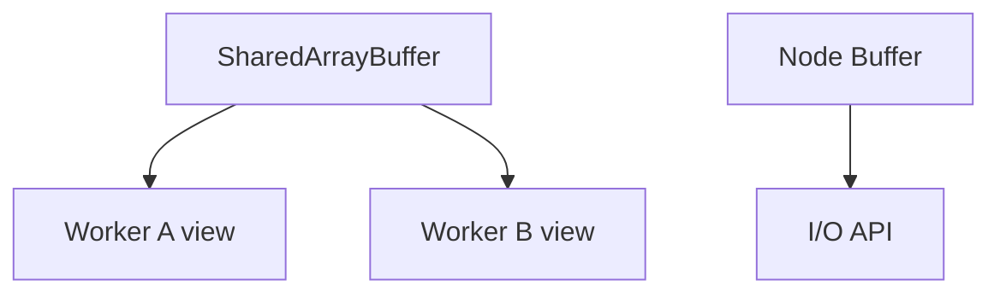
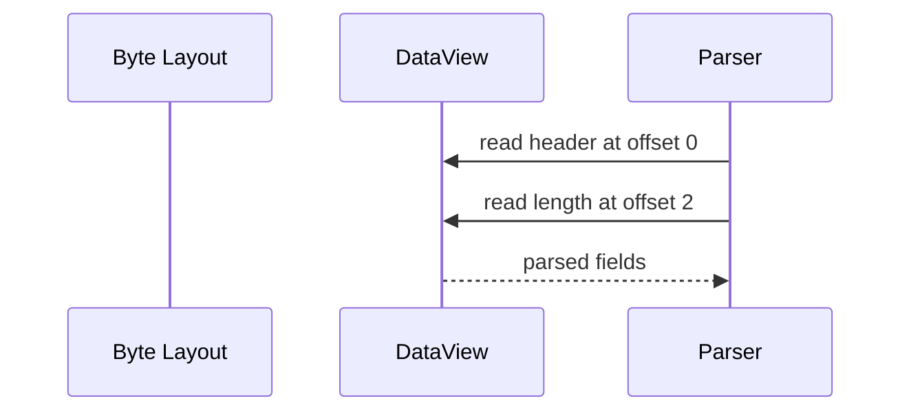

# 07. ArrayBuffer, TypedArray and Binary Data

Більшість JavaScript-коду працює з об'єктами, рядками й звичайними масивами. Але щойно справа доходить до роботи з файлами, мережею, аудіо, зображеннями або WebGL, вам потрібен інший рівень абстракції: не "об'єкти", а **байти**.

---

## I. `ArrayBuffer`: Сирий Блок Пам'яті

**Теза:** `ArrayBuffer` це контейнер сирих байтів без власної семантики читання. Він описує лише область пам'яті фіксованого розміру.

### Приклад
```javascript
const buffer = new ArrayBuffer(16); // 16 bytes
```

### Просте пояснення
Уявіть `ArrayBuffer` як пустий аркуш із 16 клітинками. Сам по собі він не каже, що саме в них лежить: числа, пікселі чи частина мережевого пакета.

### Технічне пояснення
`ArrayBuffer` не дає зручного доступу до значень напряму. Для роботи з ним потрібен "view", який визначає, як інтерпретувати байти. Саме тому `ArrayBuffer` майже завжди використовується разом із `TypedArray` або `DataView`.

### Візуалізація


> [!TIP]
> **[▶ Запустити інтерактивний візуалізатор (One Buffer, Multiple Views)](../../visualisation/memory-and-data-structures/07-arraybuffer-typedarray-and-binary-data/views-on-buffer/index.html)**

### Edge Cases / Підводні камені
> [!WARNING]
> `ArrayBuffer` має фіксований розмір. Якщо вам треба більше байтів, потрібно створити новий буфер.

---

## II. `TypedArray`: Типізоване Представлення Поверх Буфера

**Теза:** `TypedArray` це view поверх `ArrayBuffer`, який задає тип елементів і спосіб читання байтів.

### Приклад
```javascript
const buffer = new ArrayBuffer(8);
const bytes = new Uint8Array(buffer);

bytes[0] = 255;
bytes[1] = 128;
```

### Просте пояснення
`TypedArray` це як лінійка, яку ви кладете на сирі байти й кажете: "Читай ці комірки як `Uint8`, `Int32` або `Float32`".

### Технічне пояснення
На відміну від звичайного `Array`, `TypedArray` має щільний memory layout і однорідний тип елементів. Саме тому він корисний для binary protocols, DSP, image processing і сценаріїв, де потрібно компактне представлення і передбачуваний доступ до даних.

### Візуалізація


### Edge Cases / Підводні камені
> [!CAUTION]
> `TypedArray` не замінює `Array` у звичайному application code. Він корисний там, де вам реально потрібні байти, а не довільні JS-значення.

---

## III. `DataView`: Коли Формат Даних Важливіший за Зручність

**Теза:** `DataView` дає точний контроль над читанням і записом байтів, включно з endian-ness та змішаними типами.

### Приклад
```javascript
const buffer = new ArrayBuffer(4);
const view = new DataView(buffer);

view.setUint16(0, 500, true);
view.getUint16(0, true);
```

### Просте пояснення
`DataView` потрібен, коли дані приходять у строго заданому бінарному форматі, і ви не можете просто сказати "це масив чисел одного типу".

### Технічне пояснення
На відміну від `TypedArray`, який інтерпретує весь view як послідовність одного типу, `DataView` дозволяє читати різні типи на різних offset-ах. Це критично для роботи з бінарними протоколами, файловими форматами і low-level parsing.

### Візуалізація


### Edge Cases / Підводні камені
> [!IMPORTANT]
> Якщо формат даних не бінарний, не тягніть `ArrayBuffer` у звичайну бізнес-логіку без потреби. Це ускладнить код без виграшу.

---

## IV. `subarray()` vs `slice()`

**Теза:** У роботі з typed arrays важливо розуміти, чи ви хочете новий view на ті самі байти, чи незалежну копію даних.

### Приклад
```javascript
const bytes = new Uint8Array([10, 20, 30, 40]);

const view = bytes.subarray(1, 3);
const copy = bytes.slice(1, 3);
```

### Просте пояснення
`subarray()` це "вирізка-вікно" на ті самі байти. `slice()` це окремий новий шматок даних.

### Технічне пояснення
`subarray()` повертає новий typed array view на той самий `ArrayBuffer`. `slice()` повертає копію відповідної ділянки. Якщо ви мутуєте `subarray`, зміни видно і в оригіналі. Для parsing pipelines це критична відмінність.

### Візуалізація


### Edge Cases / Підводні камені
> [!WARNING]
> Якщо ви очікуєте незалежну копію, але використовуєте `subarray()`, отримаєте shared mutation на рівні байтів.

---

## V. `SharedArrayBuffer` і `Buffer` у Node.js

**Теза:** `SharedArrayBuffer` потрібен для спільної пам'яті між потоками, а `Buffer` у Node.js це практичний інструмент для роботи з байтами поверх подібної low-level моделі.

### Приклад
```javascript
const shared = new SharedArrayBuffer(16);
const view = new Uint8Array(shared);

// Node.js
const buf = Buffer.from([1, 2, 3, 4]);
```

### Просте пояснення
`SharedArrayBuffer` дозволяє кільком потокам бачити ті самі байти. `Buffer` це Node.js-обгортка для практичної роботи з binary data: сокети, файли, протоколи.

### Технічне пояснення
`SharedArrayBuffer` не копіює пам'ять між workers. Це відкриває двері до паралельної роботи, але вимагає синхронізації через `Atomics`. `Buffer` у Node.js історично побудований навколо роботи з сирими байтами і в багатьох сценаріях поводиться як спеціалізований `Uint8Array` з додатковим API для I/O.

### Візуалізація


### Edge Cases / Підводні камені
> [!CAUTION]
> Не тягніть `SharedArrayBuffer` у проєкт без реальної потреби в shared memory. Це складніша модель із новими ризиками race conditions.

---

## VI. Endian Exercises and Practical Parsing Lab

**Теза:** Справжнє розуміння `DataView` починається там, де ви вручну мапите формат байтів на поля структури.

### Приклад
```javascript
const buffer = new ArrayBuffer(8);
const view = new DataView(buffer);

view.setUint16(0, 0xCAFE, false);
view.setUint32(2, 1024, true);
```

### Просте пояснення
Тут ви самі вирішуєте, які байти що означають. Це вже майже робота з маленьким файловим форматом або network packet.

### Технічне пояснення
Для low-level parsing треба чітко тримати в голові `offset`, `byte length`, тип значення і endian-ness. Саме тому `DataView` цінний: він дозволяє читати змішані структури без примусу до одного типу елементів на весь buffer.

### Візуалізація


### Edge Cases / Підводні камені
> [!IMPORTANT]
> Найчастіша помилка в binary parsing це не неправильний API, а неправильний offset або неправильне припущення про byte order.

### Практичний Лаб

1. Створіть `ArrayBuffer` на 12 байтів.
2. Запишіть у нього `Uint16` header, `Uint32` payload length і два `Uint8` flags.
3. Прочитайте ці самі поля через `DataView`.
4. Повторіть читання з неправильним endian-flag і поясніть, чому результат інший.
5. Замініть `slice()` на `subarray()` в одному місці й перевірте, чи зміни поширюються назад у вихідний buffer.

---

## VII. Common Misconceptions

> [!IMPORTANT]
> **"`TypedArray` це просто швидший `Array`."** Ні. Це інша модель даних з однорідним типом елементів і зв'язком із сирим буфером.

> [!IMPORTANT]
> **"`ArrayBuffer` зручний для будь-яких даних."** Ні. Він корисний для binary data, а не як загальна заміна об'єктів чи масивів у бізнес-логіці.

> [!IMPORTANT]
> **"`subarray()` і `slice()` це дрібна різниця API."** Ні. Це різниця між shared bytes і copied bytes.

---

## VIII. When This Matters

- Обирайте `Array` для звичайної бізнес-логіки.
- Обирайте `TypedArray`, коли працюєте з великою кількістю чисел одного типу або binary data.
- Обирайте `DataView`, коли треба парсити конкретний двійковий формат із контролем offset-ів і endian-ness.
- Думайте про `SharedArrayBuffer`, лише якщо справді потрібна shared memory між workers.
- У Node.js думайте про `Buffer`, коли працюєте з файлами, сокетами, стрімами та протоколами.

---

## IX. Self-Check Questions

1. Чим `ArrayBuffer` відрізняється від `TypedArray`?
2. Чому `DataView` зручніший за `TypedArray`, коли формат даних змішаний?
3. У чому різниця між `subarray()` і `slice()` для typed arrays?
4. Що вибрати для parsing binary protocol header: `Array`, `Uint8Array` чи `DataView`? Чому?
5. Чому `TypedArray` не варто сприймати як універсальну заміну звичайного `Array`?
6. Що може піти не так при неправильному endian-flag?
7. Для чого `SharedArrayBuffer` потужний, але небезпечний?
8. Як `Buffer` у Node.js пов'язаний із загальною темою low-level memory model?
9. У якому сценарії shared bytes через `subarray()` це перевага, а не проблема?
10. Як би ви пояснили junior-розробнику, чому "байти" і "масив значень" це не одне й те саме?
