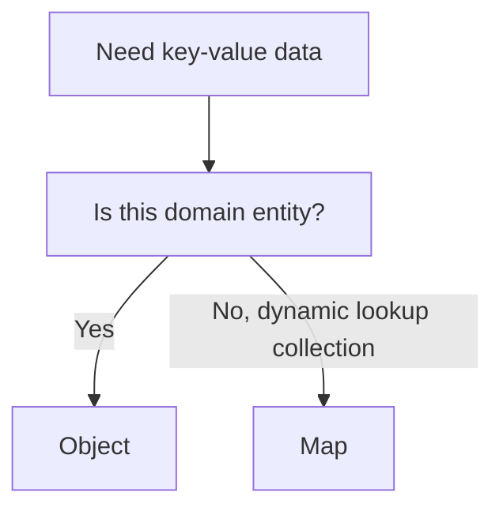
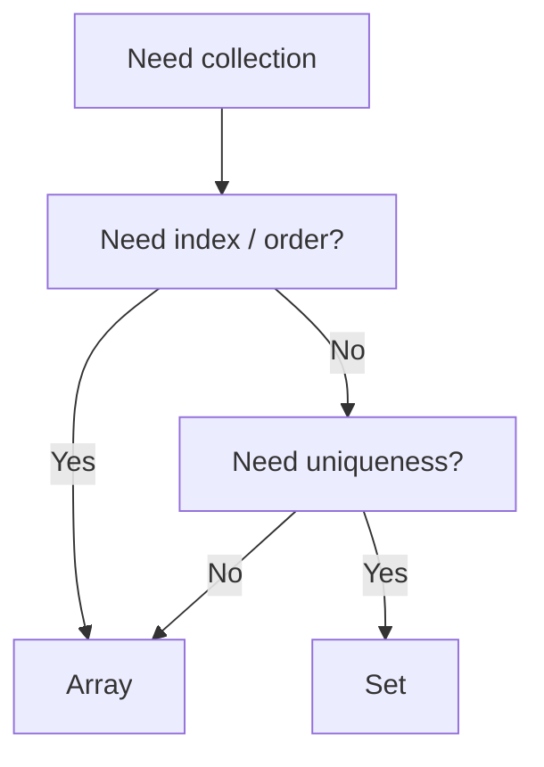
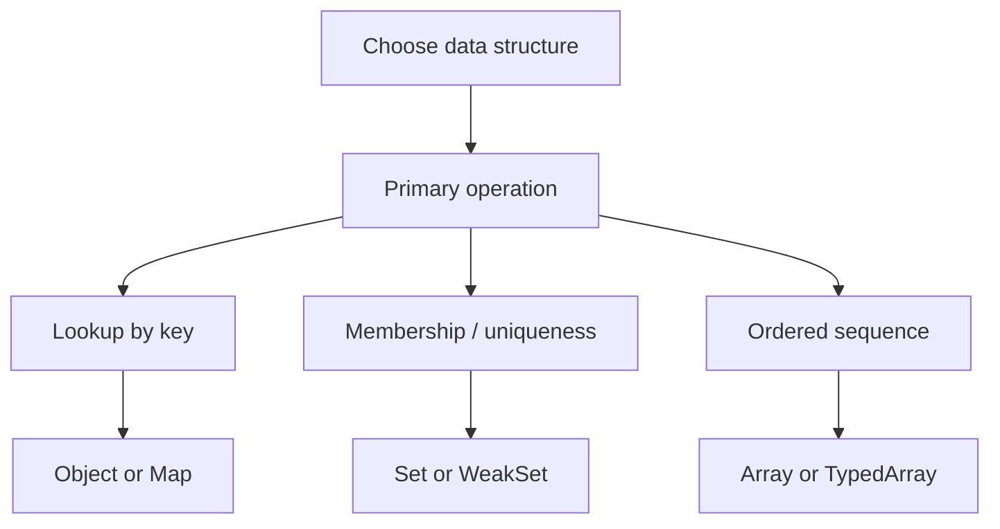

# 08. Choosing Data Structures in JS

Багато проблем продуктивності й складності коду починаються не з поганого алгоритму, а з невдалої структури даних. Цей розділ потрібен, щоб зняти питання "що взяти?" ще до написання логіки.

---

## I. Object vs Map

**Теза:** Plain object хороший як модель предметної сутності. `Map` хороший як lookup-колекція.

### Приклад
```javascript
const user = {
  id: "42",
  role: "admin"
};

const usersById = new Map();
usersById.set("42", user);
```

### Просте пояснення
Якщо структура описує "що це за сутність", частіше підходить object. Якщо структура описує "як швидко знайти значення по ключу", частіше підходить `Map`.

### Технічне пояснення
Object добре читається як shape-stable entity і природно інтегрується з JSON. `Map` краще масштабується як динамічна key-value collection, особливо коли ключі не обмежені рядками або коли важливі явні операції колекції.

### Візуалізація


### Edge Cases / Підводні камені
> [!WARNING]
> Не перетворюйте всі об'єкти на `Map`. Це часто погіршує читабельність там, де вам потрібна саме сутність із полями.

---

## II. Array vs Set

**Теза:** `Array` обирають заради порядку й послідовного доступу. `Set` обирають заради унікальності й membership checks.

### Приклад
```javascript
const tags = ["js", "v8", "gc"];
const uniqueTags = new Set(tags);
```

### Просте пояснення
Якщо ви часто питаєте "чи є елемент?" або хочете гарантувати відсутність дублікатів, `Set` дає правильнішу модель. Якщо вам важливі позиції, порядок і методи на кшталт `map` або `filter`, `Array` природніший.

### Технічне пояснення
`Array` зручно обходити, сортувати, серіалізувати і трансформувати. `Set` не має індексів, зате краще виражає семантику унікальної множини. Часто найкраща стратегія це комбінувати: `Array` для виводу, `Set` для швидкого membership lookup.

### Візуалізація


### Edge Cases / Підводні камені
> [!CAUTION]
> Якщо ви постійно конвертуєте `Array -> Set -> Array`, можливо, модель даних із самого початку вибрана невдало.

---

## III. Complexity and Trade-offs

**Теза:** Структура даних вибирається не за модою, а за типом операцій, lifetime даних і вартістю помилок.

### Таблиця

| Задача | Кращий стартовий вибір | Чому |
| :--- | :--- | :--- |
| Сутність із фіксованими полями | `Object` | Природна shape-модель і проста серіалізація |
| Динамічний lookup по ключу | `Map` | Ясний API колекції |
| Унікальність значень | `Set` | Семантика множини |
| Metadata для об'єкта без блокування GC | `WeakMap` | Lifetime прив'язаний до object key |
| Щільні числа / binary data | `TypedArray` | Компактне типізоване представлення |

### Просте пояснення
Починайте не з "яка структура найшвидша?", а з "яку операцію я роблю найчастіше?" і "чи живуть ці дані довго?".

### Технічне пояснення
У реальному коді на вибір впливають не тільки asymptotic costs, а й читабельність, V8-friendly data shape, GC pressure, serialization needs і semantics of equality. Саме тому "найшвидша структура" без контексту майже не існує.

### Візуалізація


### Edge Cases / Підводні камені
> [!IMPORTANT]
> Не приймайте micro-benchmark за архітектурне правило. Та сама структура даних може бути правильною в одному модулі і поганою в іншому.

---

## IV. Practical Rule of Thumb

1. Починайте з найпростішої структури, яка точно виражає семантику задачі.
2. Якщо код стає незграбним через постійні перевірки на дублікати або lookup по ключу, це сигнал змінити структуру даних.
3. Якщо дані прив'язані до lifetime об'єкта, подумайте про `WeakMap`.
4. Якщо дані це байти або щільні числа, не тягніть сюди звичайний `Array` без потреби.

---

## V. Common Misconceptions

> [!IMPORTANT]
> `Map` не є "швидшою заміною object у будь-якому коді". Якщо вам потрібна доменна сутність із фіксованими полями і природною JSON-формою, object часто залишається кращою моделлю.

> [!IMPORTANT]
> `Set` не є "array без дублікатів". У нього інша семантика, інший API і інший стиль використання. Якщо вам потрібні індекси, позиції або масові трансформації, `Array` може бути правильнішим.

> [!IMPORTANT]
> `WeakMap` і `WeakSet` не є кешами "для всього". Вони корисні лише тоді, коли lifetime metadata має слідувати за lifetime object key/value.

---

## VI. When This Matters / When It Doesn't

- **Важливо:** lookup-heavy код, кеші, membership checks, deduplication pipelines, DOM metadata, графові структури, binary parsing.
- **Менш важливо:** маленькі тимчасові структури в одноразовому коді, навчальні приклади, ділянки, де доменна читабельність явно важливіша за тип колекції.

---

## VII. Self-Check Questions

1. Коли plain object описує модель сутності краще, ніж `Map`?
2. У чому різниця між питаннями "що це за дані?" і "які операції я над ними роблю?" при виборі структури?
3. Чому `Set` зручніший за `Array`, якщо основна операція — membership check?
4. Коли `WeakMap` технічно точніший за `Map`, навіть якщо API `Map` здається простішим?
5. Яка структура природніша для зберігання `user -> session metadata`, якщо metadata не має переживати сам user object?
6. Чому постійне перетворення `Array -> Set -> Array` може бути сигналом невдалої моделі даних?
7. Чим `TypedArray` концептуально відрізняється від звичайного `Array`, якщо дивитись на layout і element type?
8. Яку структуру ви б вибрали для списку унікальних active IDs у UI і чому: `Array`, `Set`, `Map` чи plain object?
9. Уявіть API, яке повертає JSON-сутності, а ви весь код переводите на `Map` "бо так швидше". Який ризик для читабельності й серіалізації?
10. Який сигнал у продакшн-коді каже, що проблема вже не в алгоритмі, а саме у невдалому виборі структури даних?
