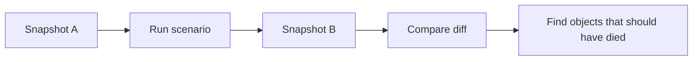
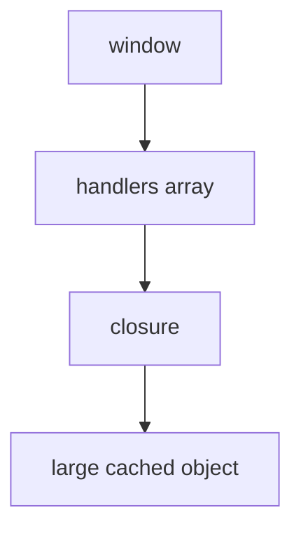
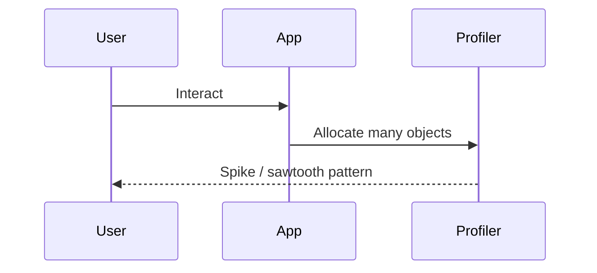
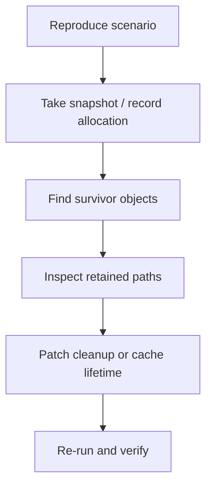

# 09. Memory Profiling in DevTools

Пам'ять не можна якісно діагностувати "на відчуття". Для цього потрібен repeatable workflow: відтворити сценарій, зняти snapshot, знайти retained path і підтвердити, що після cleanup об'єкти справді зникають.

---

## I. Heap Snapshot Diff

**Теза:** Heap Snapshot дає статичну фотографію пам'яті в конкретний момент часу. Пара snapshot-ів і їх diff показують, що саме залишилось у Heap після сценарію, який уже мав завершитись.

### Приклад
```javascript
// 1. Open page
// 2. Take Snapshot A
// 3. Open/close leaking component 5 times
// 4. Force GC if possible
// 5. Take Snapshot B
// 6. Compare A vs B
```

### Просте пояснення
Один snapshot показує "що є зараз". Два snapshot-и показують "що залишилось після дії, хоча мало зникнути".

### Технічне пояснення
У snapshot diff вас цікавлять не просто великі об'єкти, а ті, що продовжують жити після cleanup. Дивіться на count delta, shallow size, retained size і типи на кшталт detached DOM nodes, arrays, closures, maps або custom class instances.

### Візуалізація


### Edge Cases / Підводні камені
> [!WARNING]
> Не робіть висновків за одним snapshot-ом без сценарію відтворення. Інакше ви не відрізните нормальний кеш від реального витоку.

---

## II. Retained Paths

**Теза:** Найцінніше питання не "який об'єкт великий?", а "хто саме тримає його живим?".

### Приклад
```javascript
window.activeModalHandlers = [handler];
```

### Просте пояснення
Retained path це ланцюжок посилань від GC root до об'єкта. Саме цей ланцюжок треба розірвати.

### Технічне пояснення
Об'єкт може виглядати "невинно", але бути reachable через `window`, timer callback, closure, event listener, module singleton або cache. Retainers view у DevTools показує саме цей шлях утримання.

### Візуалізація


### Edge Cases / Підводні камені
> [!CAUTION]
> Видалити сам великий об'єкт недостатньо, якщо retained path продовжує створювати новий або посилання на нього все ще десь зберігається.

---

## III. Allocation Instrumentation

**Теза:** Allocation profiling показує не тільки "що залишилось", а й "що масово створюється" під час взаємодії.

### Приклад
```javascript
// Record allocation timeline
// Scroll page for 10 seconds
// Stop recording
// Inspect spikes and constructor groups
```

### Просте пояснення
Якщо Heap Snapshot це фото, то allocation instrumentation це відео. Воно допомагає побачити, де саме код починає плодити об'єкти занадто агресивно.

### Технічне пояснення
Allocation timeline особливо корисний для transient churn, який не завжди є витоком, але може тиснути на GC і викликати jank. Тут важливо дивитись на sawtooth pattern, constructor grouping і кореляцію з user interaction.

### Візуалізація


### Edge Cases / Підводні камені
> [!IMPORTANT]
> Велика кількість алокацій не завжди означає leak. Іноді це лише ознака надмірного churn, який треба оптимізувати окремо від утримання пам'яті.

---

## IV. Browser vs Node.js Workflow

**Теза:** Базовий метод однаковий, але інструменти й типові джерела проблем різняться.

### Приклад
```javascript
// Browser
// Chrome DevTools -> Memory

// Node.js
// node --inspect app.js
// Chrome DevTools -> attach to target -> Memory
```

### Просте пояснення
У браузері ви частіше ловите DOM leaks, listeners, timers і closures. У Node.js частіше ловите cache growth, globals, module singletons, sockets і черги задач.

### Технічне пояснення
У браузері debugging крутиться навколо detached DOM nodes, event listeners і Web API roots. У Node.js фокус зміщується на `global`, module cache, long-lived maps, active handles та application caches. Але метод лишається тим самим: відтворити, заміряти, знайти retained path, перевірити cleanup.

### Візуалізація


> [!TIP]
> **[▶ Запустити інтерактивний візуалізатор (Memory Profiling Workflow)](../../visualisation/memory-and-data-structures/09-memory-profiling-in-devtools/profiling-workflow/index.html)**

### Edge Cases / Підводні камені
> [!WARNING]
> Якщо після правки ви не повторили той самий сценарій і не зняли повторний профіль, у вас немає доказу, що leak справді зник.

---

## V. Practical Checklist

1. Відтворіть сценарій витоку стабільно.
2. Зніміть baseline snapshot.
3. Повторіть сценарій кілька разів.
4. Зніміть другий snapshot або allocation record.
5. Знайдіть retained paths до об'єктів, які мали б зникнути.
6. Виправте cleanup, cache lifetime або ownership даних.
7. Повторіть вимірювання тим самим способом.

---

## VI. Common Misconceptions

> [!IMPORTANT]
> Великий об'єкт у snapshot сам по собі не доводить leak. Критичне питання — чи мав він уже зникнути після сценарію cleanup.

> [!IMPORTANT]
> `Force GC` — це допоміжний інструмент, а не доказ. Він лише допомагає зменшити шум, але не замінює аналіз retained path.

> [!IMPORTANT]
> Якщо графік пам'яті виглядає як sawtooth, це ще не обов'язково leak. Може бути просто allocation churn, який створює навантаження на GC.

---

## VII. When This Matters / When It Doesn't

- **Важливо:** довгоживучі SPA, complex UI flows, drag-and-drop, віртуалізовані списки, редактори, dashboard-и, websocket-процеси, Node.js сервіси з cache.
- **Менш важливо:** маленькі одноразові демо, короткоживучі скрипти без користувацької взаємодії, утиліти, які завершуються відразу після виконання.

---

## VIII. Self-Check Questions

1. Чому один heap snapshot майже ніколи не дає достатньо інформації для впевненого висновку про leak?
2. Яка різниця між `shallow size` і `retained size`, і яке з них частіше важливіше для пошуку витоку?
3. Чому retained path зазвичай корисніший за простий список найбільших об'єктів?
4. У якому випадку allocation instrumentation покаже проблему краще, ніж heap snapshot diff?
5. Чим відрізняється "об'єкт великий" від "об'єкт не мав дожити до цього моменту"?
6. Чому після фіксу cleanup недостатньо сказати "здається, стало краще", і треба повторити той самий сценарій профілювання?
7. Які типові roots або retainers ви б перевірили спочатку в браузері, а які — в Node.js?
8. Якщо snapshot diff показує ріст `Detached HTMLDivElement`, який наступний логічний крок?
9. Якщо пам'ять росте під час interaction, але після паузи повертається до baseline, це більше схоже на leak чи churn і чому?
10. Який мінімальний repeatable workflow ви б описали колезі для діагностики memory problem без здогадок?
