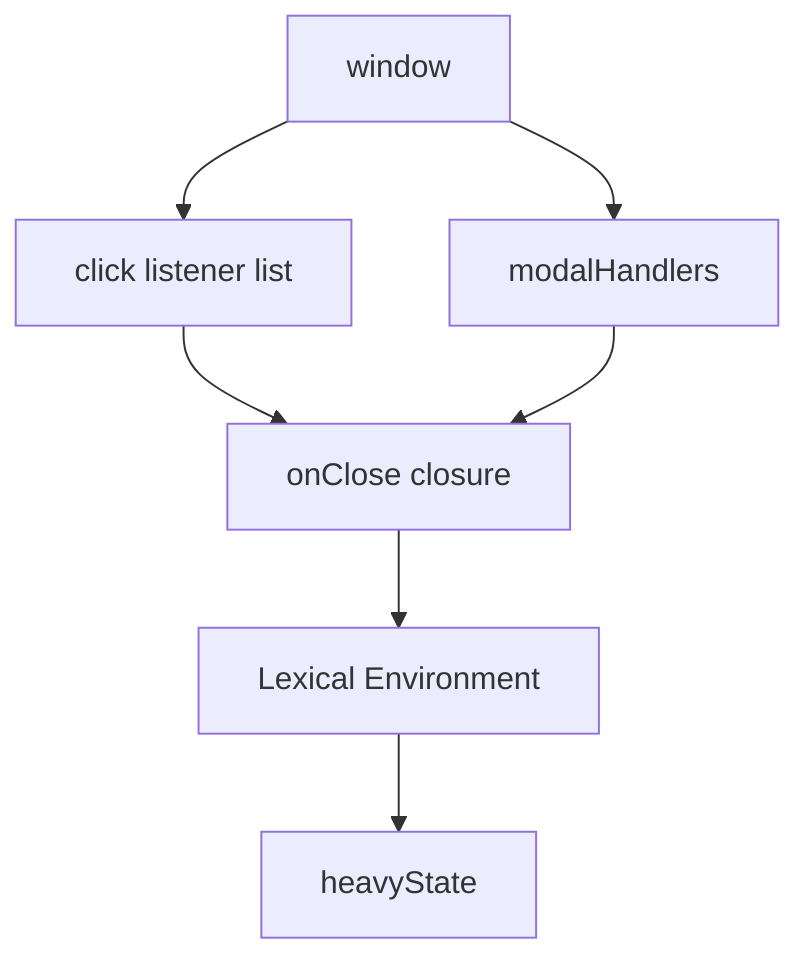
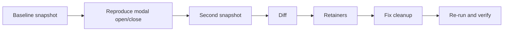

# 10. Memory Leak Lab

Цей лаб збирає все разом: references, closures, GC roots, retained paths і DevTools workflow. Це не окрема теорія, а практичний сценарій, у якому компонент має витік пам'яті, а ви проходите повний шлях від підозри до доказу виправлення.

---

## I. Leak Scenario: Modal With Forgotten Cleanup

**Теза:** Типовий UI leak з'являється не тому, що DOM "не видаляється", а тому, що десь лишається strong retained path до callback або detached node.

### Приклад
```javascript
const modalHandlers = [];

function mountModal() {
  const modalNode = document.createElement("div");
  const heavyState = new Array(100000).fill("modal");

  function onClose() {
    console.log(heavyState.length);
  }

  document.body.appendChild(modalNode);
  window.addEventListener("click", onClose);
  modalHandlers.push(onClose);

  return () => {
    modalNode.remove();
    // leak:
    // window.removeEventListener("click", onClose);
    // modalHandlers.length = 0;
  };
}
```

### Просте пояснення
Modal може зникнути з екрана, але `onClose` усе ще висить у listener-списку або в глобальному масиві. А значить, разом із ним живе і `heavyState`.

### Технічне пояснення
Retained path тут виглядає так:
`window -> listener list -> onClose -> lexical environment -> heavyState`
або
`window -> modalHandlers -> onClose -> lexical environment -> heavyState`

Поки існує будь-який із цих шляхів, GC не має права прибрати дані.

### Візуалізація


### Edge Cases / Підводні камені
> [!WARNING]
> Видалити DOM-вузол недостатньо, якщо JS все ще тримає closure або масив callback-ів.

---

## II. Investigation Workflow

**Теза:** У memory bug потрібен не "здогад", а відтворюваний сценарій і повторюваний профіль.

### Практичні кроки

1. Відкрийте сторінку у чистому стані.
2. Зніміть baseline snapshot.
3. Відкрийте і закрийте modal 5-10 разів.
4. Зніміть другий snapshot.
5. Порівняйте diff.
6. Знайдіть `Detached DOM` або survivor closures.
7. Відкрийте retainers.
8. Виправте cleanup.
9. Повторіть той самий сценарій і переконайтесь, що survivor objects більше не накопичуються.

### Візуалізація


> [!TIP]
> **[▶ Запустити інтерактивний симулятор DevTools (Leak Detection)](../../visualisation/memory-and-data-structures/devtools-simulator/index.html)**

> [!TIP]
> **[▶ Запустити інтерактивний візуалізатор (Memory Profiling Workflow)](../../visualisation/memory-and-data-structures/09-memory-profiling-in-devtools/profiling-workflow/index.html)**

### Edge Cases / Підводні камені
> [!CAUTION]
> Один snapshot без baseline і без сценарію майже ніколи не дає достатнього доказу наявності саме leak, а не нормального кешу.

---

## III. Expected Findings in DevTools

**Теза:** Ви шукаєте не абстрактно "щось велике", а конкретний survivor object, який не мав пережити cleanup.

### Що шукати

- `Detached HTMLDivElement`
- `Array` або `Map`, які тримають callbacks
- closure function objects
- `Retained Size`, який росте після кожного циклу mount/unmount
- retained path до `window`, `document`, listener list, module singleton або global cache

### Приклад Retained Path
```javascript
window
  -> modalHandlers
    -> onClose
      -> heavyState
```

### Просте пояснення
Якщо ви бачите такий шлях, проблема вже не в здогадках. Ви знаєте, хто саме тримає пам'ять.

### Технічне пояснення
У DevTools важливо дивитися одночасно на:
- **constructor type**
- **count delta**
- **retained size**
- **retainers / retaining path**

Саме їх комбінація відрізняє реальний leak від harmless allocation churn.

---

## IV. Fix and Verification

**Теза:** Виправлення memory leak це правка ownership і cleanup, а не "прохання до GC попрацювати краще".

### Приклад
```javascript
return () => {
  modalNode.remove();
  window.removeEventListener("click", onClose);
  const idx = modalHandlers.indexOf(onClose);
  if (idx !== -1) modalHandlers.splice(idx, 1);
};
```

### Просте пояснення
Ви не "видаляєте важкий масив". Ви прибираєте всі шляхи, через які програма тримала його живим.

### Технічне пояснення
Після fix той самий сценарій повинен показати:
- менший або нульовий `count delta` для survivor objects
- відсутність detached nodes у diff
- відсутність шляху `window -> callback list -> closure -> heavyState`

### Edge Cases / Підводні камені
> [!IMPORTANT]
> Якщо ви не повторили той самий сценарій і не зняли повторний profile, ви не довели виправлення.

---

## V. Common Misconceptions

> [!IMPORTANT]
> **"Якщо DOM-вузол прибраний, leak закінчився."** Ні. JS references можуть утримувати detached tree далі.

> [!IMPORTANT]
> **"GC не прибрав об'єкт, отже GC поганий."** Ні. Найчастіше це означає, що retained path все ще існує.

> [!IMPORTANT]
> **"Досить побачити великий retained size один раз."** Ні. Потрібен сценарій, baseline і повторна перевірка після fix.

---

## VI. Self-Check Questions

1. Який саме retained path робить modal leak можливим у цьому лабі?
2. Чому `heavyState` не зникає одразу після `modalNode.remove()`?
3. Який інструмент дає відповідь на питання "хто саме тримає об'єкт живим?".
4. Чому baseline snapshot обов'язковий?
5. Який результат має підтвердити, що fix спрацював?
6. Чому closure у listener це не автоматично баг, але часто джерело leak?
7. Що небезпечніше в цьому сценарії: detached DOM node чи глобальний масив callback-ів? Поясніть.
8. Як відрізнити leak від transient allocation churn?
9. Чому memory debugging без reproducible scenario майже завжди слабкий підхід?
10. Якщо після fix retained size не зменшився, які два класи причин ви перевірите першими?
