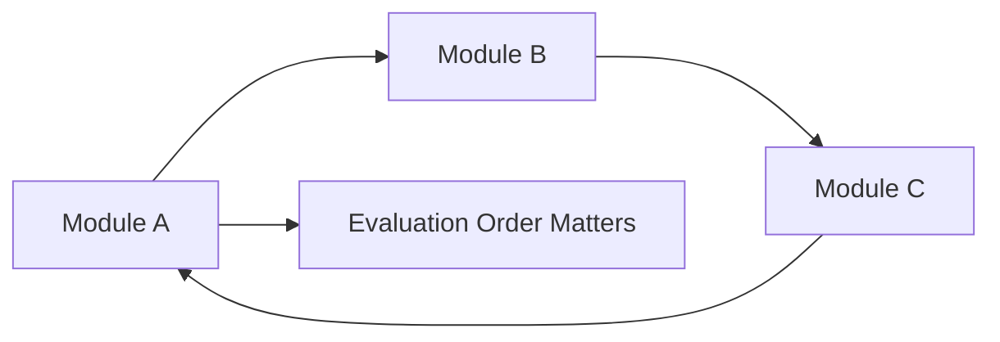

# Module System Internals

Ця тема пояснює, що модулі в JavaScript — це не просто спосіб розбити код по файлах. Це **loading model**, **binding model** і **evaluation order**, які визначають, коли значення доступні, чому з'являються цикли і чому `CJS` та `ESM` поводяться по-різному.

---

## I. Core Mechanism

**Теза:** `CommonJS` і `ESM` відрізняються не лише синтаксисом. Вони відрізняються тим, **коли** й **як** модулі зв'язуються між собою, як працює cache і чи import бачить **snapshot** або **live binding**.

### Приклад
```javascript
// counter.js
export let count = 0;
export function inc() {
  count += 1;
}

// app.js
import { count, inc } from './counter.js';
console.log(count); // 0
inc();
console.log(count); // 1
```

### Просте пояснення
У `ESM` import дивиться не на “копію значення”, а на exported binding модуля. Тому після `inc()` імпортований `count` теж змінюється. У `CJS` картина інша: там типово працюють через `module.exports` object і runtime snapshot semantics часто виглядає інакше.

### Технічне пояснення
Ключові відмінності:

| Властивість | CJS | ESM |
| :--- | :--- | :--- |
| **Loading** | Переважно sync | Link + evaluation model, часто async-capable host integration |
| **Bindings** | Через exported object/value access | Live bindings |
| **Syntax** | `require`, `module.exports` | `import`, `export` |
| **Cycles** | Часто partial object during execution | Uninitialized / TDZ-like availability issues depending on timing |
| **Top-Level** | Execution during `require()` | Linking before evaluation |

Ментально `ESM` проходить щонайменше три фази:

1. **Parse** imports/exports.
2. **Link** module graph.
3. **Evaluate** module bodies у визначеному порядку.

Саме тому cyclic dependency в `ESM` не зводиться до “файл A завантажив файл B”. Там важливий момент, **чи вже ініціалізований binding** на момент звернення.

### Mental Model
Модулі — це граф залежностей, а не список файлів. Проблеми з ними майже завжди — це проблеми **graph order**, **initialization timing** або **binding semantics**.

### Покроковий Walkthrough
1. Host збирає module graph.
2. Imports/exports зв'язуються до виконання тіла модулів.
3. Runtime обчислює порядок evaluation.
4. Якщо є cycle, частина binding-ів може ще не бути доступною в безпечному стані.
5. Module cache запобігає повторній повній ініціалізації того самого модуля.

> [!TIP]
> **[▶ Відкрити Module Graph Cycle Board](../../visualisation/modules-ecosystem-and-meta-programming/01-module-system-internals/module-graph-cycle-board/index.html)**

### Візуалізація


### Edge Cases / Підводні камені
- Cyclic imports можуть давати не “просту помилку”, а частково ініціалізований стан.
- `ESM` imports не є звичайними локальними snapshot variables.
- Module cache не означає, що код “ніколи не виконається знову” в усіх host-сценаріях; це означає, що той самий resolved module record зазвичай reuse-иться.
- Змішування `CJS` і `ESM` часто створює interop confusion, а не просто синтаксичний шум.

---

## II. Common Misconceptions

> [!IMPORTANT]
> `ESM` не дорівнює просто “новіший import syntax”. Це інший execution model.

> [!IMPORTANT]
> `CJS` cycle і `ESM` cycle можуть ламатися по-різному.

> [!IMPORTANT]
> `import` не “копіює значення” як звичайне присвоєння.

---

## III. When This Matters / When It Doesn't

- **Важливо:** build tools, Node/browser interop, cyclic dependencies, library design, large codebases.
- **Менш важливо:** маленькі isolated demo-проєкти без module graph complexity.

---

## IV. Self-Check Questions

1. Чим `CJS` і `ESM` відрізняються на execution-рівні?
2. Що таке live binding?
3. Чому cyclic dependency — це проблема порядку evaluation, а не лише синтаксису import?
4. Що таке module cache?
5. Чому import не варто уявляти як snapshot copy?
6. Які фази проходить `ESM` ментально?
7. Чому в cyclic import одна сторона може бачити неготовий binding?
8. Чому змішування `CJS` і `ESM` часто створює interop bugs?
9. Коли module graph стає важливішим за код усередині одного файла?
10. Чому порядок evaluation може бути критичним навіть без явного runtime error?
11. Що таке `Module Record` як mental model?
12. Коли проблема в import-системі, а не в бізнес-логіці?
13. Чому `export const x = ...` у циклі поводиться інакше, ніж відкладене читання цього самого значення всередині функції?
14. Яка різниця між “module loaded” і “binding safely initialized”?
15. Чому cache не скасовує проблеми поганого graph design?
16. Який smell у codebase підказує, що проблему треба шукати в architecture модуля, а не в одному конкретному файлі?

---

## V. Short Answers / Hints

1. Loading, bindings і evaluation.
2. Import дивиться на актуальний exported binding.
3. Бо важливо, чи вже ініціалізований export на момент читання.
4. Reuse already-loaded module instance/record.
5. Бо import пов'язаний із export binding.
6. Parse, link, evaluate.
7. Бо cycle порушує просту лінійну ініціалізацію.
8. Бо semantics різні.
9. У великих dependency graphs.
10. Бо код може читати ще неготовий стан.
11. Специфікаційна модель модуля й його зв'язків.
12. Коли значення “дивно” неготове або часткове через graph timing.
13. Бо відкладене читання зміщує момент доступу після evaluation-critical точки.
14. Loaded означає graph включений у runtime; safely initialized означає binding уже можна читати без timing-багу.
15. Бо поганий цикл і далі лишається поганим циклом, навіть якщо модуль reuse-иться.
16. Сильна взаємозалежність, import spaghetti і похідні значення на top-level.

---

## VI. Suggested Practice

1. Намалюй graph для трьох модулів із циклом.
2. Поясни різницю між `module.exports = x` і `export let x` на ментальному рівні.
3. Після цього переходь до [02 Iterators & Generators](../02-iterators-and-generators/README.md), бо там теж усе будується навколо protocol semantics, а не синтаксичних трюків.
